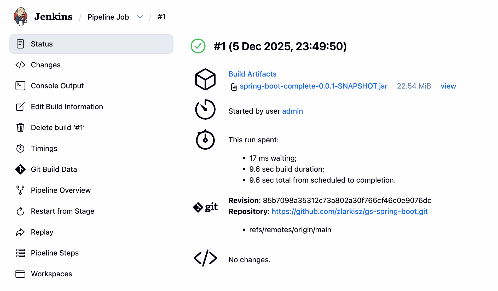
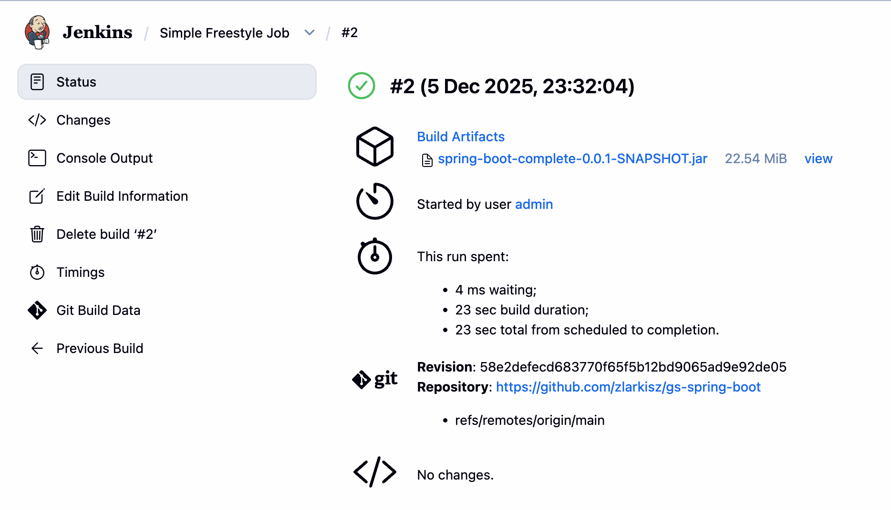
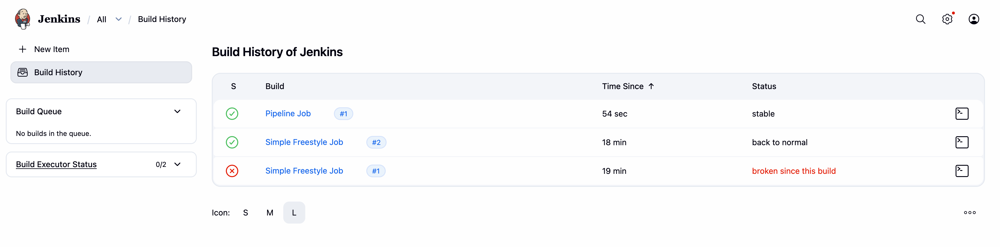
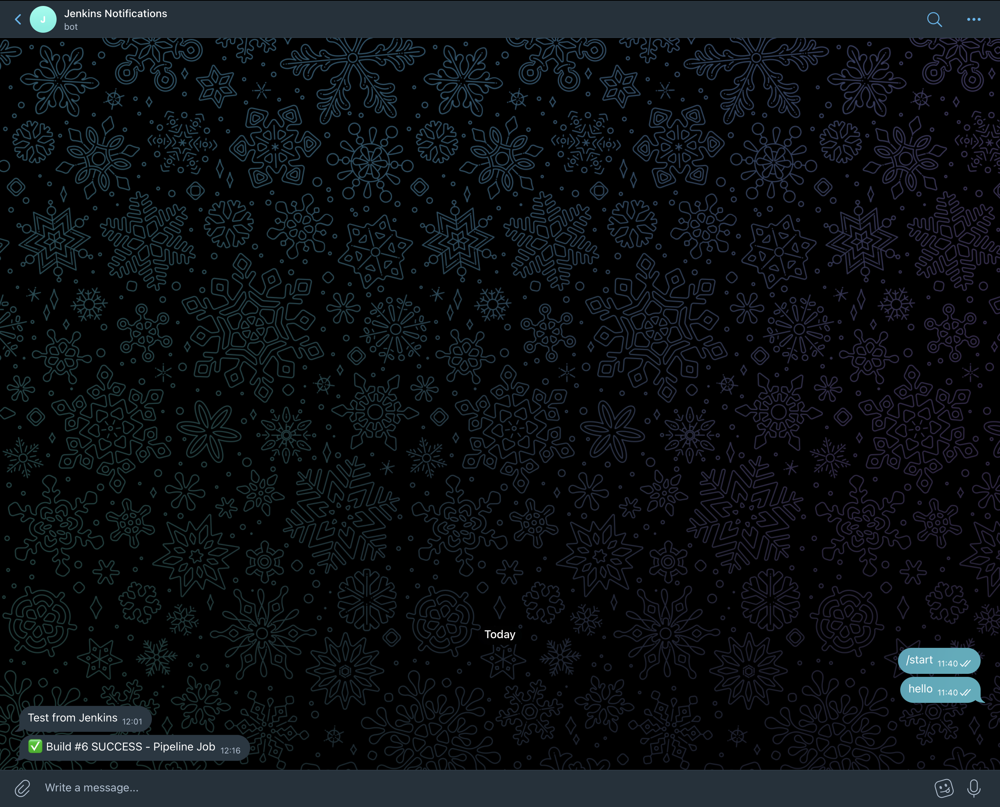

# Homework 01 — Jenkins CI/CD для Java-проєкту

## Мета завдання

1. Ознайомитися з основами Jenkins
2. Налаштувати Freestyle Job для автоматизації
3. Використати декларативний пайплайн (Jenkinsfile)
4. Додати нотифікації в Telegram (опційно)

---

## Архітектура

### Як працює Docker + Jenkins

```
┌─────────────────────────────────────────────────────────┐
│                    Локальна машина                      │
│                                                         │
│  Docker Daemon                                          │
│       │                                                 │
│       │ створює і запускає                              │
│       ▼                                                 │
│  ┌────────────────────────────────────────────────┐     │
│  │           Мережа "jenkins" (ізольована)        │     │
│  │                                                │     │
│  │  ┌─────────────────┐    ┌──────────────────┐   │     │
│  │  │    jenkins      │    │  jenkins-docker  │   │     │
│  │  │    :8080        │    │     (dind)       │   │     │
│  │  │                 │    │                  │   │     │
│  │  │  Jenkins app    │───▶│  Docker Daemon   │   │     │
│  │  │  (Web UI)       │TCP │  (для білдів)    │   │     │
│  │  │                 │2376│                  │   │     │
│  │  └─────────────────┘    └──────────────────┘   │     │
│  │                                                │     │
│  │         Shared Volumes:                        │     │
│  │         - jenkins-data                         │     │
│  │         - jenkins-docker-certs                 │     │
│  └────────────────────────────────────────────────┘     │
│                                                         │
└─────────────────────────────────────────────────────────┘
          │
          ▼
    localhost:8080 → Jenkins UI
```

### Навіщо Docker-in-Docker?

Jenkins сам працює в контейнері, але йому потрібно виконувати Docker-команди (будувати імеджі, пушити). Для цього піднімається окремий Docker Daemon в контейнері `jenkins-docker`, до якого Jenkins звертається по TCP.

---

## Кроки виконання

### 1. Підготовка

1. Форкнути репозиторій [gs-spring-boot](https://github.com/spring-guides/gs-spring-boot)
2. Створити папку для домашки
3. Створити `docker-compose.yml`

### 2. Запуск Jenkins

```bash
docker compose up -d
```

Перевірка:

```bash
docker ps
```

### 3. Початкова конфігурація Jenkins

1. Відкрити http://localhost:8080
2. Отримати initial password:

```bash
   docker exec jenkins cat /var/jenkins_home/secrets/initialAdminPassword
```

3. Встановити suggested plugins
4. Створити admin користувача

### 4. Налаштування Maven

1. Manage Jenkins → Tools
2. Maven installations → Add Maven
3. Name: `Maven 3.9`
4. ✅ Install automatically
5. Save

### 5. Freestyle Job

1. New Item → `Simple Freestyle Job` → Freestyle project
2. Source Code Management → Git → URL форку
3. Branch: `*/main`
4. Build Steps → Invoke top-level Maven targets:
   - Maven Version: `Maven 3.9`
   - Goals: `clean install`
   - POM: `complete/pom.xml`
5. Post-build Actions → Archive artifacts: `complete/target/*.jar`
6. Save → Build Now

### 6. Pipeline Job (Jenkinsfile)

Створити `Jenkinsfile` в корені форку:

```groovy
pipeline {
    agent any

    tools {
        maven 'Maven 3.9'
    }

    stages {
        stage('Build') {
            steps {
                dir('complete') {
                    sh 'mvn clean install'
                }
            }
        }
    }

    post {
        success {
            archiveArtifacts artifacts: 'complete/target/*.jar'
            sh '''
                curl -s -X POST https://api.telegram.org/bot${TELEGRAM_TOKEN}/sendMessage \
                -d chat_id=${TELEGRAM_CHAT_ID} \
                -d text="✅ Build #${BUILD_NUMBER} SUCCESS - ${JOB_NAME}"
            '''
        }
        failure {
            sh '''
                curl -s -X POST https://api.telegram.org/bot${TELEGRAM_TOKEN}/sendMessage \
                -d chat_id=${TELEGRAM_CHAT_ID} \
                -d text="❌ Build #${BUILD_NUMBER} FAILED - ${JOB_NAME}"
            '''
        }
    }
}
```

В Jenkins:

1. New Item → `Pipeline Job` → Pipeline
2. Pipeline → Definition: Pipeline script from SCM
3. SCM: Git → URL форку
4. Branch: `*/main`
5. Save → Build Now

### 7. Telegram нотифікації

#### Створення бота

1. Відкрити Telegram → знайти @BotFather
2. Написати `/newbot`
3. Ввести ім'я та username бота
4. Зберегти токен

#### Отримання Chat ID

1. Написати боту будь-яке повідомлення
2. Відкрити `https://api.telegram.org/bot<TOKEN>/getUpdates`
3. Знайти `chat.id` в JSON

#### Налаштування Jenkins Credentials

1. Manage Jenkins → Credentials → System → Global credentials
2. Add Credentials:
   - Kind: Secret text
   - Secret: `<bot token>`
   - ID: `telegram-token`
3. Add Credentials:
   - Kind: Secret text
   - Secret: `<chat id>`
   - ID: `telegram-chat-id`

#### Примітка про Telegram Bot Plugin

Плагін `Telegram Bot Plugin` було встановлено, але він має баг — не відправляє повідомлення реально, хоча виводить їх в консоль. Плагін не оновлювався 5+ років.

Альтернативне рішення — використання `curl` напряму в Jenkinsfile, що є більш надійним підходом.

---

## Результати

### Freestyle Job



### Pipeline Job



### Build History



**Simple Freestyle Job:**

- **#1** — ❌ Failed. Причина: гілка була вказана як `*/master`, а в репозиторії — `*/main`
- **#2** — ✅ Success. Виправлено назву гілки

**Pipeline Job:**

- **#1** — ✅ Success. Перший запуск з Jenkinsfile
- **#2** — ✅ Success. Додано telegramSend (плагін не працював)
- **#3** — ❌ Failed. Спроба виправити chatId в лапках — помилка типу
- **#4** — ✅ Success. Повернуто chatId без лапок
- **#5** — ❌ Failed. Credentials не знайдено (неправильні ID)
- **#6** — ✅ Success. Виправлено ID credentials, Telegram нотифікації працюють

### Telegram нотифікації



---

## Файли

- `docker-compose.yml` — конфігурація для запуску Jenkins
- `Jenkinsfile` — знаходиться в [форку gs-spring-boot](https://github.com/zlarkisz/gs-spring-boot)

---

## Корисні команди

```bash
# Запуск
docker compose up -d

# Зупинка
docker compose down

# Логи Jenkins
docker logs jenkins

# Логи Docker-in-Docker
docker logs jenkins-docker

# Initial password
docker exec jenkins cat /var/jenkins_home/secrets/initialAdminPassword

# Тест Telegram API
docker exec jenkins curl -s "https://api.telegram.org/bot/getMe"
```
