# Homework 03: Linux System Administration

## Зміст

- [Частина 1: Nginx та репозиторії](#частина-1-nginx-та-репозиторії)
  - [1.1 Встановлення Nginx](#11-встановлення-nginx)
  - [1.2 Офіційний репозиторій Nginx](#12-офіційний-репозиторій-nginx)
  - [1.3 PPA та ppa-purge](#13-ppa-та-ppa-purge)
- [Частина 2: Власний systemd сервіс](#частина-2-власний-systemd-сервіс)
  - [2.1 Створення скрипта](#21-створення-скрипта)
  - [2.2 Створення systemd unit](#22-створення-systemd-unit)
  - [2.3 Активація сервісу](#23-активація-сервісу)
- [Частина 3: Брандмауер UFW](#частина-3-брандмауер-ufw)
  - [3.1 Базове налаштування](#31-базове-налаштування)
  - [3.2 Правила по IP](#32-правила-по-ip)
- [Частина 4: Fail2Ban](#частина-4-fail2ban)
  - [4.1 Встановлення та налаштування](#41-встановлення-та-налаштування)
  - [4.2 Перевірка статусу](#42-перевірка-статусу)
- [Частина 5: Монтування диска (Додаткове)](#частина-5-монтування-диска-додаткове)
  - [5.1 Додавання диска у VirtualBox](#51-додавання-диска-у-virtualbox)
  - [5.2 Створення розділу](#52-створення-розділу)
  - [5.3 Форматування та монтування](#53-форматування-та-монтування)
  - [5.4 Автоматичне монтування](#54-автоматичне-монтування)

---

## Середовище

| Параметр | Значення |
|----------|----------|
| VM | VirtualBox на Apple Silicon (M1 Pro) |
| OS | Ubuntu Server 24.04.3 LTS (ARM64) |
| Доступ | SSH з Mac Terminal |
| IP | 192.168.1.138 |

---

## Частина 1: Nginx та репозиторії

### 1.1 Встановлення Nginx

Встановлено Nginx з Ubuntu репозиторію:

```bash
sudo apt update
sudo apt install nginx -y
nginx -v
```

**Результат:** Nginx працює, сторінка доступна у браузері.

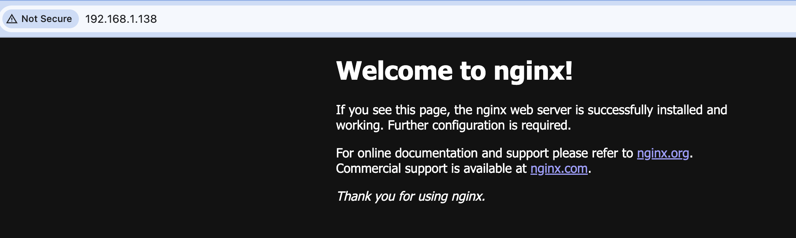

---

### 1.2 Офіційний репозиторій Nginx

**Що таке репозиторії?**

| Джерело | Опис | Версія Nginx |
|---------|------|--------------|
| Ubuntu Main | Стабільні, перевірені пакети | 1.24.0 |
| Nginx Official | Від розробників Nginx | 1.28.0 |
| PPA | Персональні архіви (third-party) | різні |

**Додавання офіційного репозиторію:**

```bash
# Встановлення інструментів
sudo apt install curl gnupg2 ca-certificates lsb-release ubuntu-keyring -y

# Додавання GPG ключа (для перевірки автентичності пакетів)
curl https://nginx.org/keys/nginx_signing.key | gpg --dearmor | sudo tee /usr/share/keyrings/nginx-archive-keyring.gpg >/dev/null

# Додавання репозиторію
echo "deb [signed-by=/usr/share/keyrings/nginx-archive-keyring.gpg] http://nginx.org/packages/ubuntu noble nginx" | sudo tee /etc/apt/sources.list.d/nginx.list

# Оновлення та встановлення
sudo apt update
sudo apt install nginx -y
```

**Версія після оновлення:**

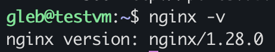

---

### 1.3 PPA та ppa-purge

**PPA (Personal Package Archive)** — персональні репозиторії на Launchpad. Корисні для отримання новіших версій, але можуть бути нестабільними.

**Додавання PPA:**

```bash
sudo add-apt-repository ppa:ondrej/nginx -y
sudo apt update
apt policy nginx
```

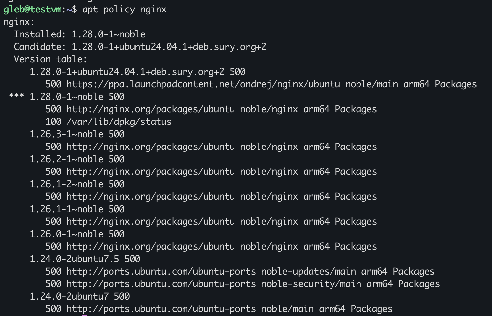

**Видалення PPA через ppa-purge:**

`ppa-purge` — інструмент для "чистого" видалення PPA. Він не просто видаляє репозиторій, а ще й повертає пакети до попередніх версій.

```bash
sudo apt install ppa-purge -y
sudo ppa-purge ppa:ondrej/nginx
```

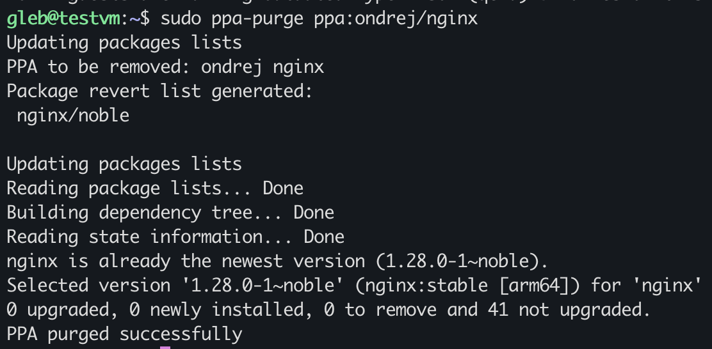

**Перевірка після видалення:**

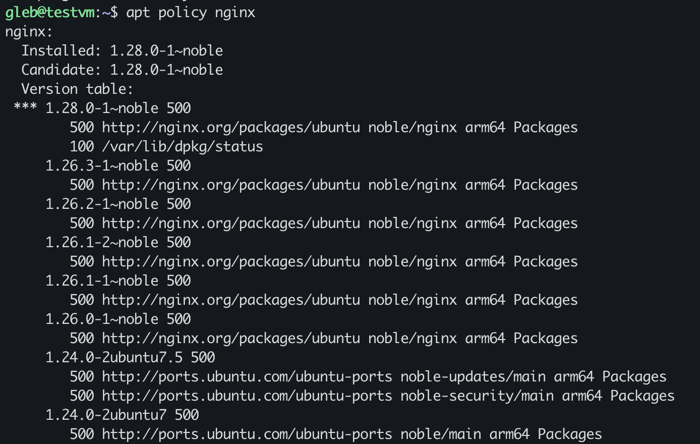

PPA (`ppa.launchpadcontent.net/ondrej/nginx`) зникло зі списку джерел.

✅ **Nginx встановлено з офіційного репозиторію (версія 1.28.0)**

---

## Частина 2: Власний systemd сервіс

### 2.1 Створення скрипта

**Що таке systemd?**

systemd — це система ініціалізації Linux, яка керує всіма сервісами. Аналогія: PM2 для Node.js, але на рівні всієї ОС.

**Створення скрипта:**

```bash
sudo nano /usr/local/bin/datetime-logger.sh
```

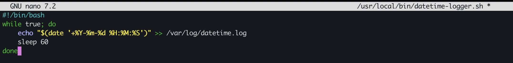

**Вміст скрипта:**

```bash
#!/bin/bash
while true; do
    echo "$(date '+%Y-%m-%d %H:%M:%S')" >> /var/log/datetime.log
    sleep 60
done
```

Скрипт щохвилини записує поточну дату і час у файл `/var/log/datetime.log`.

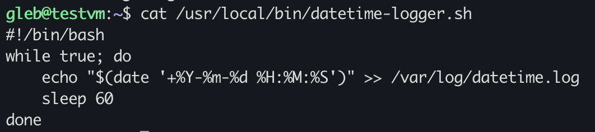

**Надання прав на виконання:**

```bash
sudo chmod +x /usr/local/bin/datetime-logger.sh
ls -l /usr/local/bin/datetime-logger.sh
```

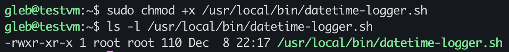

Права `-rwxr-xr-x` означають: власник може читати, писати, виконувати; інші — читати і виконувати.

---

### 2.2 Створення systemd unit

**Unit файл** — це конфігурація сервісу для systemd.

```bash
sudo nano /etc/systemd/system/datetime-logger.service
```

**Вміст:**

```ini
[Unit]
Description=DateTime Logger Service
After=network.target

[Service]
Type=simple
ExecStart=/usr/local/bin/datetime-logger.sh
Restart=always

[Install]
WantedBy=multi-user.target
```

| Секція | Параметр | Опис |
|--------|----------|------|
| [Unit] | Description | Опис сервісу |
| [Unit] | After | Запускати після мережі |
| [Service] | Type | Тип сервісу (simple = звичайний процес) |
| [Service] | ExecStart | Що запускати |
| [Service] | Restart | Перезапускати якщо впаде |
| [Install] | WantedBy | Запускати при звичайному завантаженні |

---

### 2.3 Активація сервісу

```bash
sudo systemctl daemon-reload    # Перечитати конфігурації
sudo systemctl start datetime-logger    # Запустити
sudo systemctl status datetime-logger   # Перевірити статус
```


Сервіс `active (running)`, але `disabled` — не запуститься після перезавантаження.

**Увімкнення автозапуску:**

```bash
sudo systemctl enable datetime-logger
sudo systemctl status datetime-logger
```

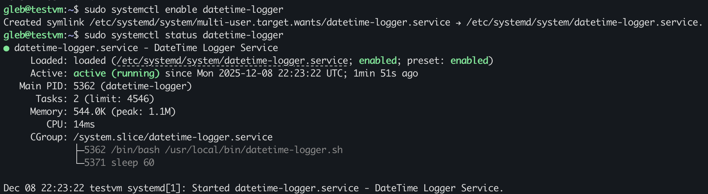

Тепер `enabled` — сервіс запускатиметься автоматично при старті системи.

✅ **systemd сервіс працює і записує дату щохвилини**

---

## Частина 3: Брандмауер UFW

### 3.1 Базове налаштування

**UFW (Uncomplicated Firewall)** — це "охоронець" сервера, який вирішує кого пускати, а кого ні.

```bash
# Дозволити SSH перед увімкненням (щоб не втратити доступ!)
sudo ufw allow ssh

# Увімкнути брандмауер
sudo ufw enable

# Перевірити статус
sudo ufw status
```

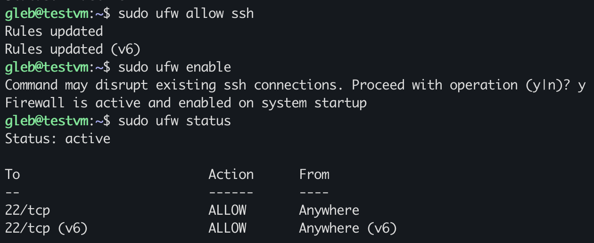

---

### 3.2 Правила по IP

Завдання: дозволити SSH тільки з певного IP, заборонити з іншого.

```bash
# Видалити загальне правило SSH
sudo ufw delete allow ssh

# Дозволити SSH тільки з мого Mac (192.168.1.133)
sudo ufw allow from 192.168.1.133 to any port 22

# Заборонити SSH з "поганого" IP
sudo ufw deny from 192.168.1.200 to any port 22

# Дозволити HTTP для Nginx
sudo ufw allow 80

# Перевірити правила
sudo ufw status
```

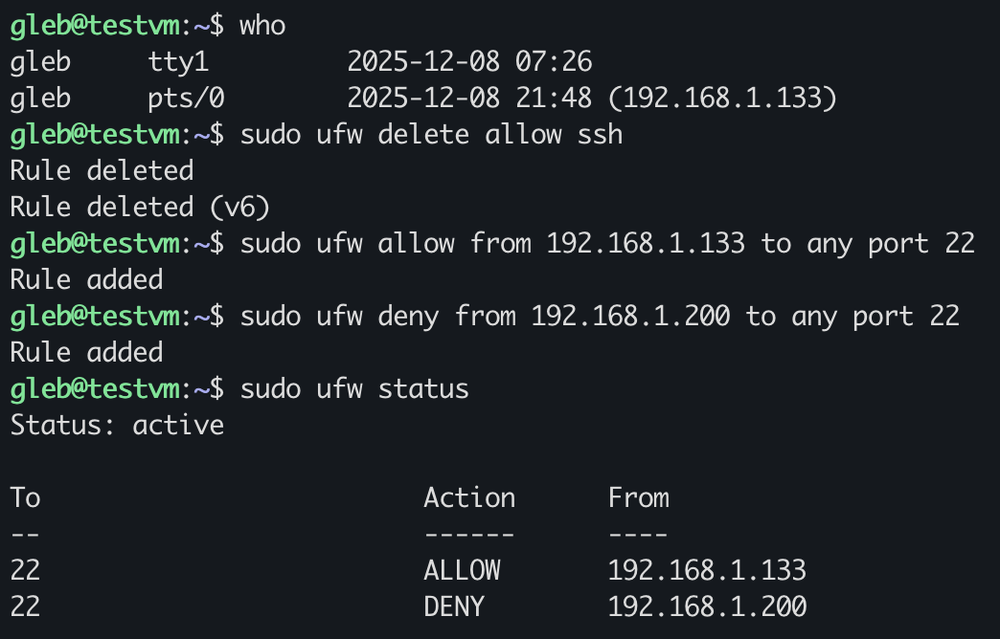

**Фінальні правила:**

| Порт | Дія | Звідки | Призначення |
|------|-----|--------|-------------|
| 22 | ALLOW | 192.168.1.133 | SSH з мого Mac |
| 22 | DENY | 192.168.1.200 | Блокування "поганого" IP |
| 80 | ALLOW | Anywhere | HTTP для Nginx |

✅ **Брандмауер налаштовано з правилами по IP**

---

## Частина 4: Fail2Ban

### 4.1 Встановлення та налаштування

**Fail2Ban** — автоматично блокує IP-адреси, які намагаються вгадати пароль. Після кількох невдалих спроб — бан.

```bash
sudo apt install fail2ban -y
sudo nano /etc/fail2ban/jail.local
```

**Конфігурація:**

```ini
[DEFAULT]
bantime = 10m      # Блокувати на 10 хвилин
findtime = 10m     # Рахувати спроби за 10 хвилин
maxretry = 3       # Після 3 невдалих спроб — бан

[sshd]
enabled = true
port = ssh
filter = sshd
logpath = /var/log/auth.log
backend = systemd
```

**Активація:**

```bash
sudo systemctl restart fail2ban
sudo systemctl enable fail2ban
sudo systemctl status fail2ban
```

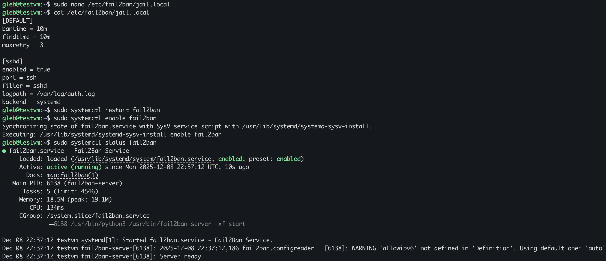

---

### 4.2 Перевірка статусу

```bash
sudo fail2ban-client status sshd
```

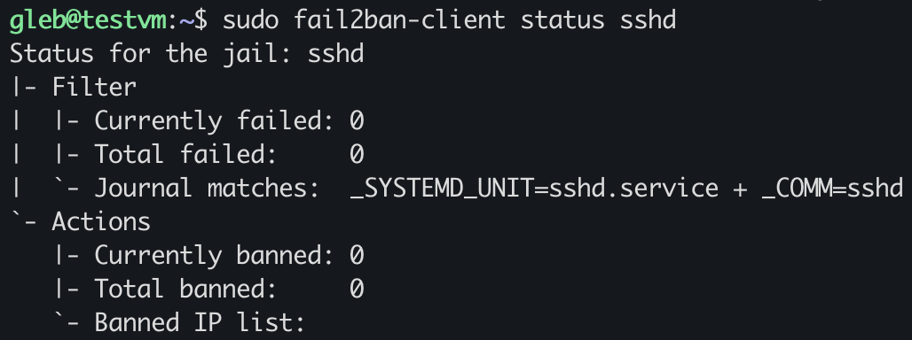

| Параметр | Значення | Опис |
|----------|----------|------|
| Currently failed | 0 | Невдалих спроб зараз |
| Total banned | 0 | Заблокованих IP |
| Banned IP list | (empty) | Список заблокованих |

Якщо хтось спробує вгадати пароль 3 рази — його IP з'явиться у списку.

✅ **Fail2Ban захищає SSH від брутфорсу**

---

## Частина 5: Монтування диска (Додаткове)

### 5.1 Додавання диска у VirtualBox

**Концепція:**

- **Диск** — фізичний носій (як SSD/HDD)
- **Розділ (partition)** — частина диска для зберігання файлів
- **Монтування** — "підключення" диска до папки в системі
- **fstab** — автоматичне монтування при завантаженні

**Створення диска:**

1. Вимкнути VM
2. Settings → Storage → Add Hard Disk
3. Create VDI, Dynamically allocated, 2 GB

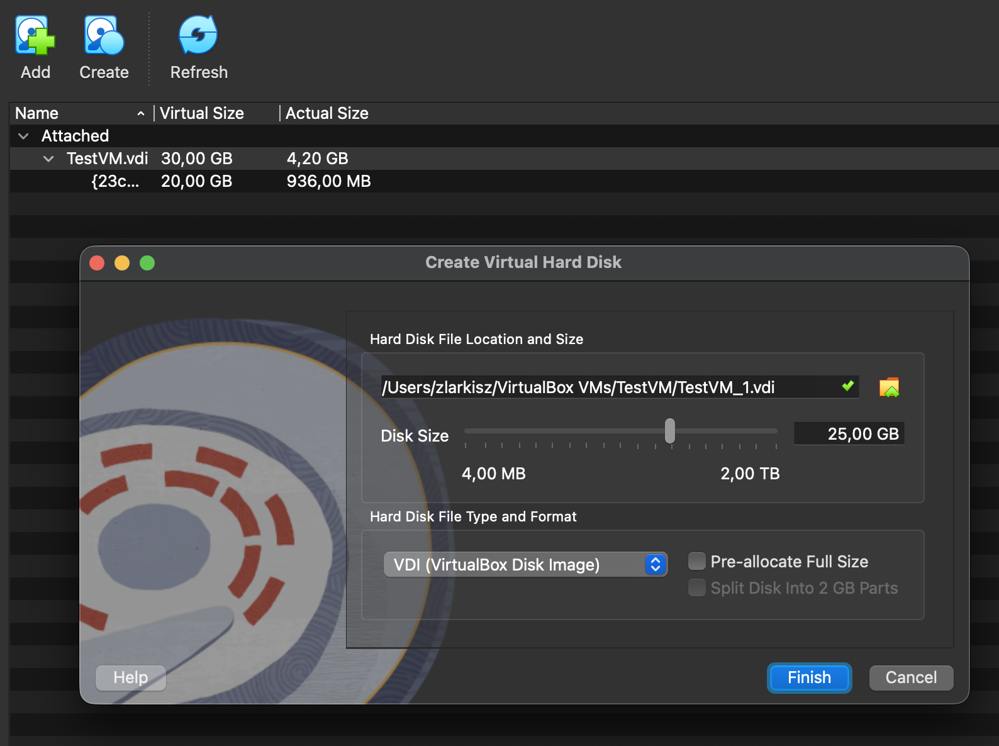

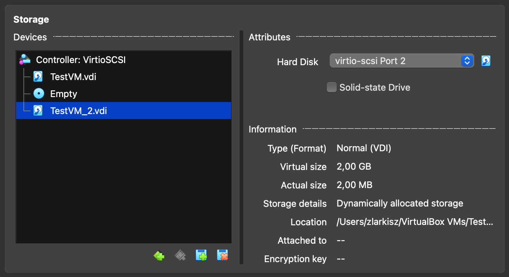

---

### 5.2 Створення розділу

```bash
# Перевірка нового диска
lsblk
# sdb                8:16   0    2G  0 disk  ← новий диск (без розділів)

# Створення розділу через fdisk
sudo fdisk /dev/sdb
```

**Команди в fdisk:**

| Команда | Дія |
|---------|-----|
| n | New — створити розділ |
| p | Primary — тип розділу |
| 1 | Номер розділу |
| Enter | Перший сектор (за замовчуванням) |
| Enter | Останній сектор (весь диск) |
| w | Write — зберегти і вийти |

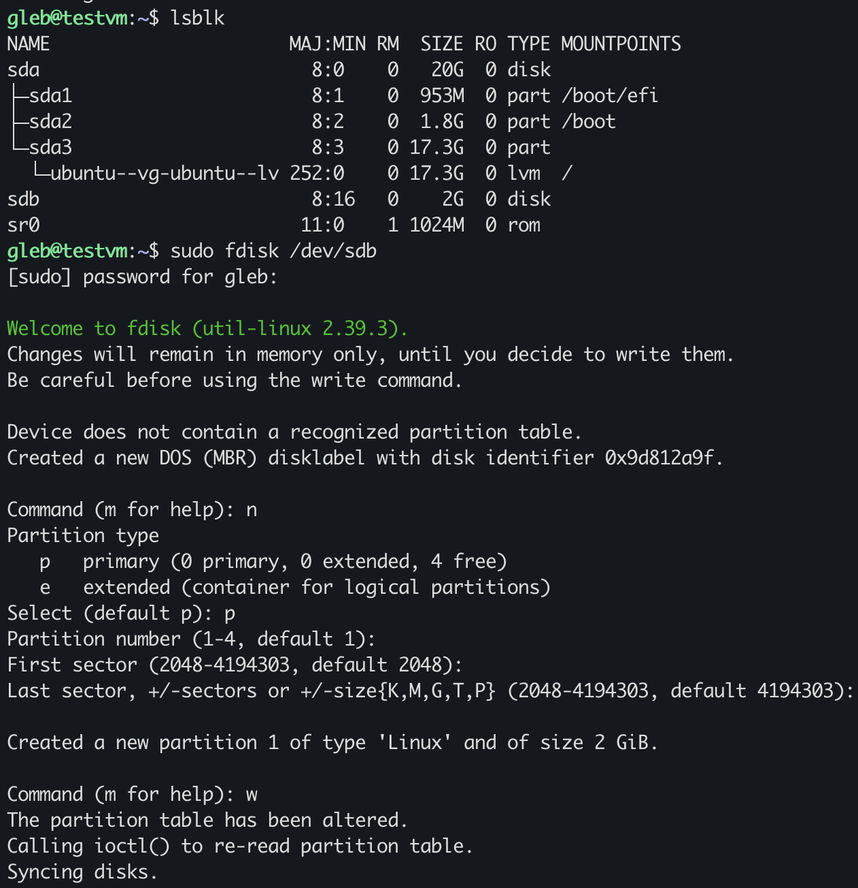

---

### 5.3 Форматування та монтування

**Форматування у ext4:**

```bash
sudo mkfs.ext4 /dev/sdb1
```

ext4 — стандартна файлова система Linux (стабільна, швидка, з журналюванням).

**Монтування:**

```bash
# Створити точку монтування
sudo mkdir /mnt/data

# Змонтувати
sudo mount /dev/sdb1 /mnt/data

# Перевірити
lsblk
```

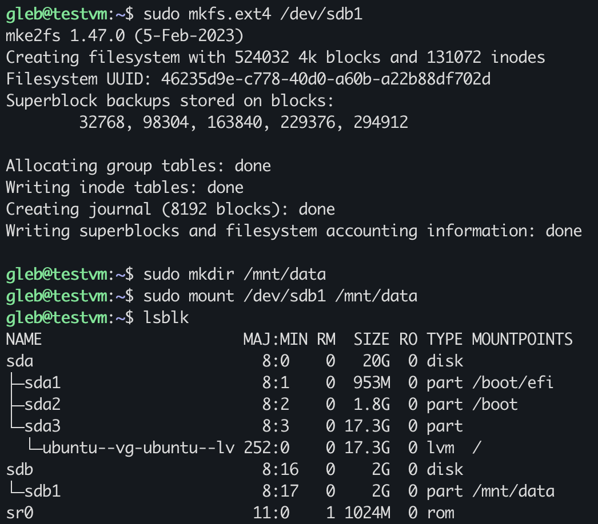

Тепер `sdb1` має MOUNTPOINT `/mnt/data` — диск доступний!

---

### 5.4 Автоматичне монтування

Без налаштування fstab після перезавантаження диск не змонтується автоматично.

```bash
# Отримати UUID диска
sudo blkid /dev/sdb1
# UUID="46235d9e-c778-40d0-a60b-a22b88df702d"

# Додати запис у fstab
echo "UUID=46235d9e-c778-40d0-a60b-a22b88df702d /mnt/data ext4 defaults 0 2" | sudo tee -a /etc/fstab

# Перевірити
cat /etc/fstab
```

**Формат запису fstab:**

```
UUID=...          /mnt/data    ext4    defaults    0    2
   │                  │         │         │        │    │
   │                  │         │         │        │    └─ порядок перевірки
   │                  │         │         │        └─ dump (backup)
   │                  │         │         └─ опції монтування
   │                  │         └─ тип файлової системи
   │                  └─ куди монтувати
   └─ який диск (по UUID)
```

**Перевірка після перезавантаження:**

```bash
sudo reboot
# ...
lsblk
# sdb1 має бути змонтовано на /mnt/data
```

✅ **Диск змонтовано з автомонтуванням при завантаженні**

---

## Висновки

| Завдання | Статус |
|----------|--------|
| Nginx + репозиторії | ✅ |
| PPA + ppa-purge | ✅ |
| systemd сервіс | ✅ |
| UFW брандмауер | ✅ |
| Fail2Ban | ✅ |
| Монтування диска (*) | ✅ |

### Ключові концепції

1. **Репозиторії** — різні джерела пакетів з різними версіями (Ubuntu, Official, PPA)
2. **systemd** — центральна система керування сервісами в сучасному Linux
3. **UFW** — простий інтерфейс для налаштування брандмауера
4. **Fail2Ban** — автоматичний захист від брутфорс-атак
5. **fstab** — конфігурація автоматичного монтування дисків

### Корисні команди

```bash
# Пакети
apt policy <package>          # Показати доступні версії
sudo ppa-purge ppa:name       # Видалити PPA і відкатити пакети

# Сервіси
sudo systemctl status <name>  # Статус сервісу
sudo systemctl enable <name>  # Автозапуск при старті

# Брандмауер
sudo ufw status               # Показати правила
sudo ufw allow from <IP>      # Дозволити з IP

# Диски
lsblk                         # Показати диски і розділи
sudo fdisk /dev/sdX           # Керування розділами
sudo blkid                    # Показати UUID дисків
```

---

## Використані технології

- VirtualBox 7.x (Apple Silicon)
- Ubuntu Server 24.04.3 LTS (ARM64)
- Nginx 1.28.0 (Official Repository)
- systemd
- UFW (Uncomplicated Firewall)
- Fail2Ban
- ext4 filesystem