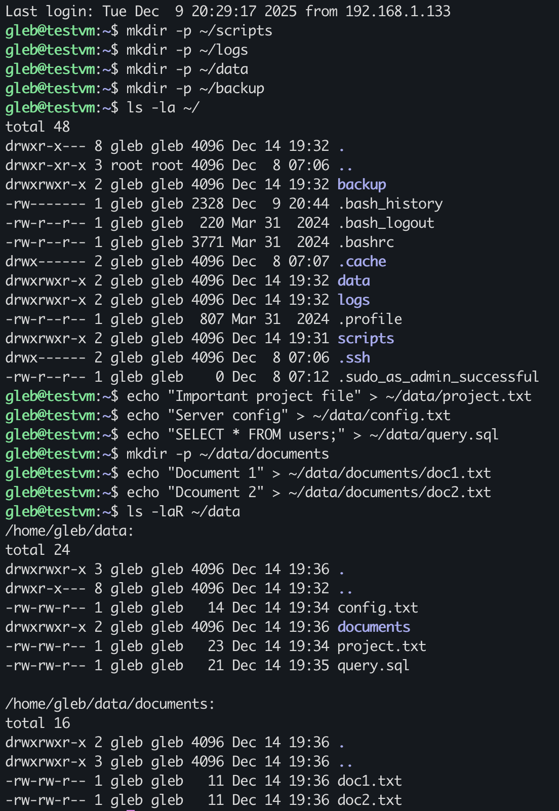
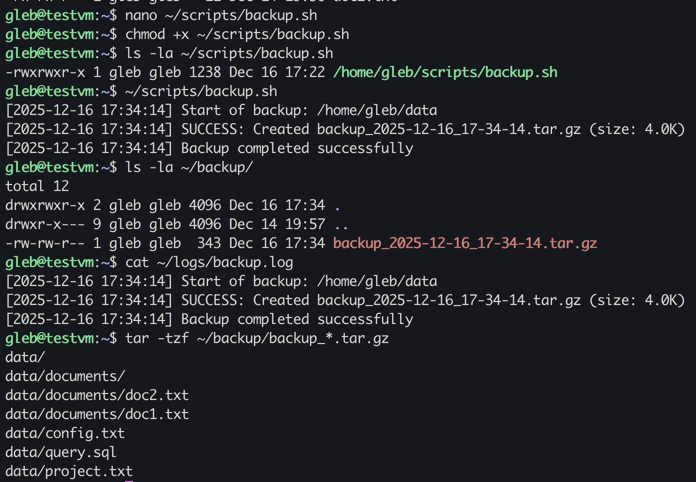
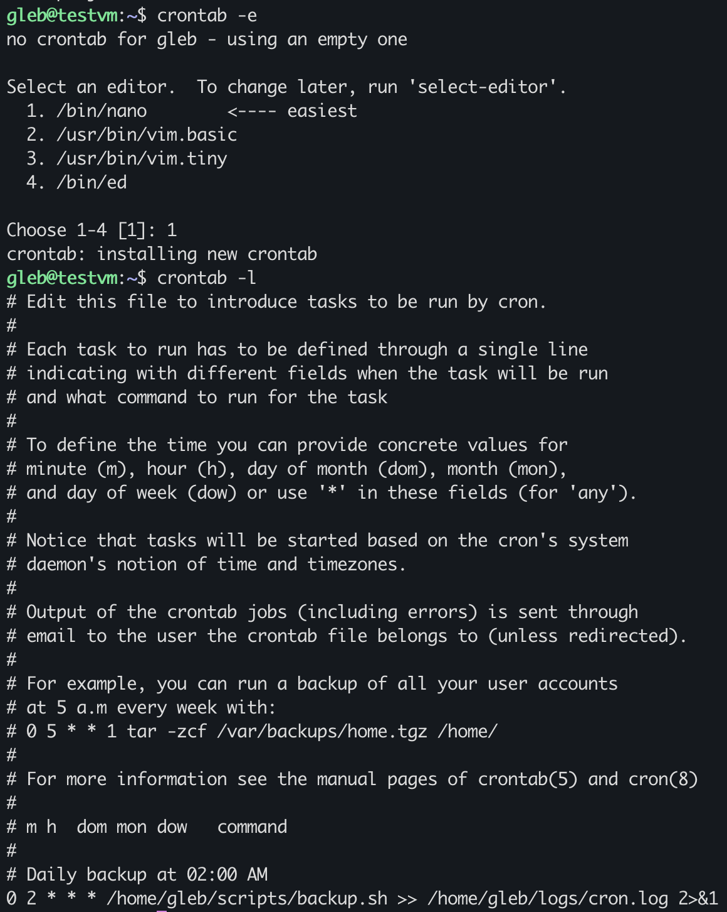
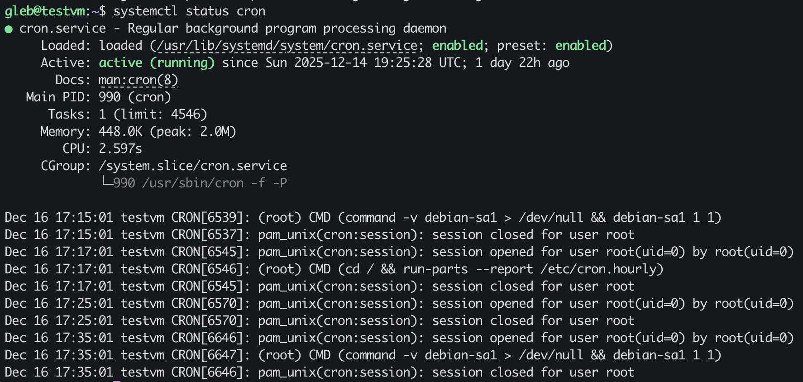
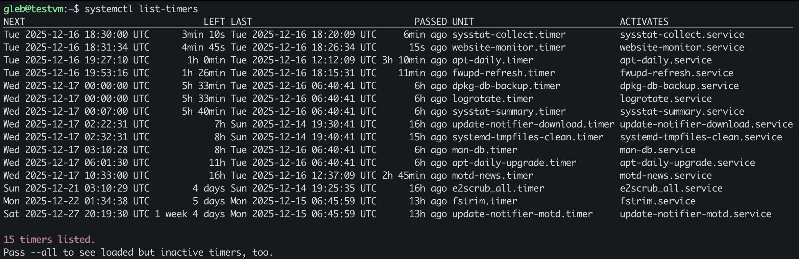
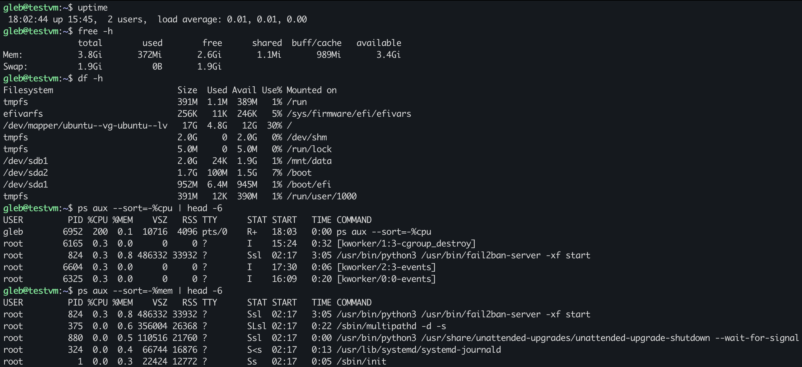
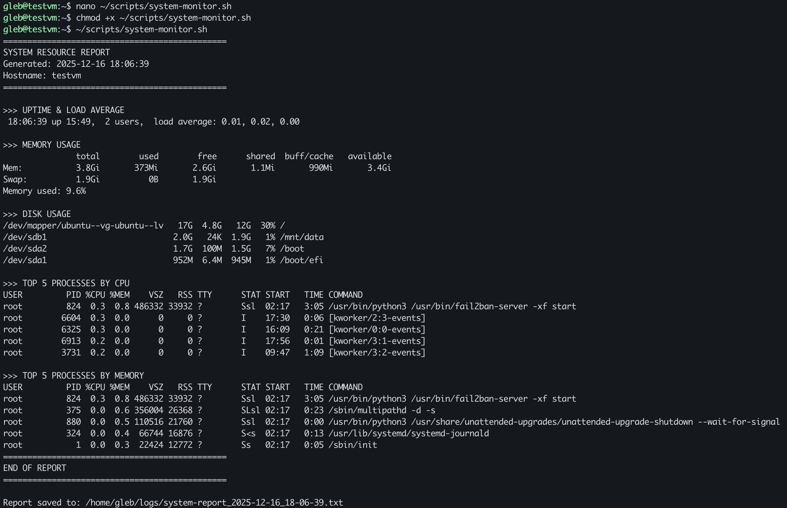

# Homework 04: Bash Scripting

## Зміст

- [Завдання 1: Backup скрипт + Cron](#завдання-1-backup-скрипт--cron)
  - [1.1 Підготовка середовища](#11-підготовка-середовища)
  - [1.2 Створення backup скрипта](#12-створення-backup-скрипта)
  - [1.3 Тестування скрипта](#13-тестування-скрипта)
  - [1.4 Налаштування Cron](#14-налаштування-cron)
- [Завдання 2: Systemd сервіс моніторингу](#завдання-2-systemd-сервіс-моніторингу)
  - [2.1 Скрипт перевірки веб-сайту](#21-скрипт-перевірки-веб-сайту)
  - [2.2 Systemd сервіс та таймер](#22-systemd-сервіс-та-таймер)
- [Завдання 3: Моніторинг системних ресурсів](#завдання-3-моніторинг-системних-ресурсів)
  - [3.1 Команди моніторингу](#31-команди-моніторингу)
  - [3.2 Скрипт моніторингу](#32-скрипт-моніторингу)
- [Завдання 4: Ротація логів Nginx](#завдання-4-ротація-логів-nginx)
- [Висновки](#висновки)

---

## Завдання 1: Backup скрипт + Cron

### 1.1 Підготовка середовища

Створено структуру директорій для роботи:

```bash
mkdir -p ~/scripts    # Директорія для скриптів
mkdir -p ~/logs       # Директорія для логів
mkdir -p ~/data       # Дані для бекапу
mkdir -p ~/backup     # Куди зберігати бекапи
```

Створено тестові файли для бекапу:

```bash
echo "Important project file" > ~/data/project.txt
echo "Server config" > ~/data/config.txt
echo "SELECT * FROM users;" > ~/data/query.sql
mkdir -p ~/data/documents
echo "Document 1" > ~/data/documents/doc1.txt
echo "Document 2" > ~/data/documents/doc2.txt
```



---

### 1.2 Створення backup скрипта

Створено скрипт `/home/gleb/scripts/backup.sh`:

```bash
#!/bin/bash
#===============================================
# Backup script
# Author: Gleb Bufin
# Homework: 04-bash
#===============================================

# === CONFIG ===
SOURCE_DIR="/home/$USER/data"
BACKUP_DIR="/home/$USER/backup"
LOG_FILE="/home/$USER/logs/backup.log"
DATE=$(date +%Y-%m-%d_%H-%M-%S)
BACKUP_NAME="backup_$DATE.tar.gz"

# === LOG FUNCTION ===
log_message() {
  echo "[$(date '+%Y-%m-%d %H:%M:%S')] $1" | tee -a "$LOG_FILE"
}

# === CHECKS ===
if [ ! -d "$SOURCE_DIR" ]; then
  log_message "ERROR: Directory $SOURCE_DIR does not exists!"
  exit 1
fi

mkdir -p "$BACKUP_DIR"

# === CREATING A BACKUP ===
log_message "Start of backup: $SOURCE_DIR"

if tar -czf "$BACKUP_DIR/$BACKUP_NAME" -C "$(dirname $SOURCE_DIR)" "$(basename $SOURCE_DIR)" 2>> "$LOG_FILE"; then
  BACKUP_SIZE=$(du -h "$BACKUP_DIR/$BACKUP_NAME" | cut -f1)
  log_message "SUCCESS: Created $BACKUP_NAME (size: $BACKUP_SIZE)"
else
  log_message "ERROR: Failed to create backup!"
  exit 1
fi

# === CLEANING OLD BACKUPS ===
DELETED=$(find "$BACKUP_DIR" -name "backup_*.tar.gz" -mtime +7 -delete -print | wc -l)
if [ "$DELETED" -gt 0 ]; then
    log_message "Old backups deleted: $DELETED"
fi

log_message "Backup completed successfully"
exit 0
```

**Ключові елементи скрипта:**

| Елемент | Призначення |
|---------|-------------|
| `#!/bin/bash` | Shebang — вказує інтерпретатор |
| `$(date +%Y-%m-%d_%H-%M-%S)` | Command substitution для унікального імені |
| `log_message()` | Функція логування з timestamp |
| `tar -czf` | Створення стиснутого архіву (gzip) |
| `find ... -mtime +7 -delete` | Видалення бекапів старших 7 днів |

---

### 1.3 Тестування скрипта

```bash
chmod +x ~/scripts/backup.sh
~/scripts/backup.sh
```

**Результат виконання:**



- Архів створено: `backup_2025-12-16_17-34-14.tar.gz`
- Розмір: 4.0K
- Лог записано з часовими мітками

**Перевірка вмісту архіву:**

```bash
tar -tzf ~/backup/backup_*.tar.gz
```

```
data/
data/documents/
data/documents/doc2.txt
data/documents/doc1.txt
data/config.txt
data/query.sql
data/project.txt
```

---

### 1.4 Налаштування Cron

Додано задачу в crontab для щоденного виконання о 2:00:

```bash
crontab -e
```

```
# Daily backup at 02:00 AM
0 2 * * * /home/gleb/scripts/backup.sh >> /home/gleb/logs/cron.log 2>&1
```

**Формат cron:**

```
┌───────────── хвилина (0-59)
│ ┌───────────── година (0-23)
│ │ ┌───────────── день місяця (1-31)
│ │ │ ┌───────────── місяць (1-12)
│ │ │ │ ┌───────────── день тижня (0-7)
│ │ │ │ │
0 2 * * * команда
```



**Перевірка статусу cron:**

```bash
systemctl status cron
```



✅ Cron сервіс активний і працює.

---

## Завдання 2: Systemd сервіс моніторингу

### 2.1 Скрипт перевірки веб-сайту

Створено скрипт `/home/gleb/scripts/website-monitor.sh`:

```bash
#!/bin/bash
#===============================================
# Website availability monitor
# Author: Gleb Bufin
# Homework: 04-bash
#===============================================

# === CONFIG ===
WEBSITE_URL="${1:-http://localhost}"
LOG_FILE="/home/$USER/logs/website-monitor.log"
TIMEOUT=10

mkdir -p "$(dirname $LOG_FILE)"

# === LOG FUNCTION ===
log_message() {
    echo "[$(date '+%Y-%m-%d %H:%M:%S')] $1" >> "$LOG_FILE"
}

# === CHECK WEBSITE ===
HTTP_CODE=$(curl -o /dev/null -s -w "%{http_code}" --connect-timeout "$TIMEOUT" "$WEBSITE_URL" 2>/dev/null)
CURL_EXIT=$?

# === ANALYZE RESULT ===
if [ $CURL_EXIT -ne 0 ]; then
    log_message "DOWN | $WEBSITE_URL | Connection failed (curl exit code: $CURL_EXIT)"
    echo "Website $WEBSITE_URL is DOWN"
    exit 1
elif [ "$HTTP_CODE" -ge 200 ] && [ "$HTTP_CODE" -lt 400 ]; then
    log_message "UP   | $WEBSITE_URL | HTTP $HTTP_CODE"
    echo "Website $WEBSITE_URL is UP (HTTP $HTTP_CODE)"
    exit 0
else
    log_message "WARN | $WEBSITE_URL | HTTP $HTTP_CODE"
    echo "Website $WEBSITE_URL returned HTTP $HTTP_CODE"
    exit 1
fi
```

**Тестування скрипта:**

```bash
~/scripts/website-monitor.sh                        # localhost
~/scripts/website-monitor.sh https://google.com    # зовнішній сайт
~/scripts/website-monitor.sh http://fake-site.com  # неіснуючий сайт
```


**Результати:**
- `localhost` — UP (HTTP 200)
- `google.com` — UP (HTTP 301)
- `fake-site` — DOWN (Connection failed)

---

### 2.2 Systemd сервіс та таймер

**Створено сервіс** `/etc/systemd/system/website-monitor.service`:

```ini
[Unit]
Description=Website Availability Monitor
After=network-online.target
Wants=network-online.target

[Service]
Type=oneshot
User=gleb
ExecStart=/home/gleb/scripts/website-monitor.sh http://localhost
StandardOutput=journal
StandardError=journal

[Install]
WantedBy=multi-user.target
```

**Створено таймер** `/etc/systemd/system/website-monitor.timer`:

```ini
[Unit]
Description=Run website monitor every 5 minutes

[Timer]
OnBootSec=1min
OnUnitActiveSec=5min
AccuracySec=1s

[Install]
WantedBy=timers.target
```

**Активація:**

```bash
sudo systemctl daemon-reload
sudo systemctl enable website-monitor.timer
sudo systemctl start website-monitor.timer
```



**Перевірка активних таймерів:**

```bash
systemctl list-timers
```

| Параметр | Значення |
|----------|----------|
| Timer | `website-monitor.timer` |
| Status | `active (waiting)` |
| Next run | Кожні 5 хвилин |

---

## Завдання 3: Моніторинг системних ресурсів

### 3.1 Команди моніторингу

Ознайомлення з базовими командами:

| Команда | Призначення |
|---------|-------------|
| `uptime` | Час роботи системи та Load Average |
| `free -h` | Використання RAM |
| `df -h` | Використання дисків |
| `ps aux --sort=-%cpu` | Топ процесів по CPU |
| `ps aux --sort=-%mem` | Топ процесів по RAM |



---

### 3.2 Скрипт моніторингу

Створено скрипт `/home/gleb/scripts/system-monitor.sh`:

```bash
#!/bin/bash
#===============================================
# System Resource Monitor
# Author: Gleb Bufin
# Homework: 04-bash
#===============================================

# === CONFIG ===
LOG_DIR="/home/$USER/logs"
REPORT_FILE="$LOG_DIR/system-report_$(date +%Y-%m-%d_%H-%M-%S).txt"

mkdir -p "$LOG_DIR"

# === FUNCTIONS ===
separator() {
    echo "=============================================="
}

# === GENERATE REPORT ===
{
    separator
    echo "SYSTEM RESOURCE REPORT"
    echo "Generated: $(date '+%Y-%m-%d %H:%M:%S')"
    echo "Hostname: $(hostname)"
    separator

    echo ""
    echo ">>> UPTIME & LOAD AVERAGE"
    uptime

    echo ""
    echo ">>> MEMORY USAGE"
    free -h
    
    TOTAL_MEM=$(free | awk '/^Mem:/ {print $2}')
    USED_MEM=$(free | awk '/^Mem:/ {print $3}')
    MEM_PERCENT=$(awk "BEGIN {printf \"%.1f\", $USED_MEM/$TOTAL_MEM*100}")
    echo "Memory used: ${MEM_PERCENT}%"

    echo ""
    echo ">>> DISK USAGE"
    df -h | grep -E '^/dev/'

    echo ""
    echo ">>> TOP 5 PROCESSES BY CPU"
    ps aux --sort=-%cpu | head -6

    echo ""
    echo ">>> TOP 5 PROCESSES BY MEMORY"
    ps aux --sort=-%mem | head -6

    separator
    echo "END OF REPORT"
    separator

} | tee "$REPORT_FILE"

echo ""
echo "Report saved to: $REPORT_FILE"
```

**Результат виконання:**



**Зібрані метрики:**
- Memory used: 9.6%
- Disk usage: 30% (головний розділ)
- Top процес: fail2ban-server

---

## Завдання 4: Ротація логів Nginx

### Що таке ротація логів?

**Проблема:** Логи постійно ростуть і можуть заповнити диск.

**Рішення:** Logrotate періодично:
1. Перейменовує поточний лог → `.1`
2. Стискає старі логи → `.gz`
3. Видаляє найстаріші

**Створено конфігурацію** `/etc/logrotate.d/nginx-custom`:

```
/var/log/nginx/access.log {
    daily
    rotate 14
    compress
    delaycompress
    missingok
    notifempty
    create 0640 nginx adm
    postrotate
        if [ -f /run/nginx.pid ]; then
            kill -USR1 $(cat /run/nginx.pid)
        fi
    endscript
}
```

**Параметри:**

| Параметр | Значення |
|----------|----------|
| `daily` | Ротація щодня |
| `rotate 14` | Зберігати 14 архівів |
| `compress` | Стискати gzip |
| `delaycompress` | Не стискати останній |
| `postrotate` | Сигнал nginx перевідкрити логи |

**Тестування:**

```bash
# Перевірка синтаксису
sudo logrotate -d /etc/logrotate.d/nginx-custom

# Примусова ротація
sudo logrotate -f /etc/logrotate.d/nginx-custom

# Результат
ls -la /var/log/nginx/
```

**Результат:**

```
-rw-r----- 1 nginx adm    0 Dec 16 18:12 access.log      # новий порожній
-rw-r----- 1 nginx adm  622 Dec 16 18:11 access.log.1    # попередній
-rw-r----- 1 www-data adm 258 Dec  8 22:01 access.log.2.gz  # стиснутий
```

✅ Ротація працює коректно!

---

## Висновки

### Що було зроблено:

| Завдання | Результат |
|----------|-----------|
| 1. Backup + Cron | ✅ Автоматичний бекап о 2:00 щодня |
| 2. Systemd сервіс | ✅ Моніторинг веб-сайту кожні 5 хв |
| 3. System monitor | ✅ Звіт CPU/RAM/Disk у файл |
| 4. Logrotate | ✅ Ротація логів Nginx |

### Вивчені концепції:

- **Bash scripting** — змінні, функції, умови, цикли
- **Cron** — планування задач за розкладом
- **Systemd** — управління сервісами та таймерами
- **Logrotate** — автоматична ротація логів

### Корисні команди:

```bash
# Cron
crontab -e          # редагувати задачі
crontab -l          # переглянути задачі

# Systemd
systemctl status    # статус сервісу
systemctl list-timers  # список таймерів
journalctl -u       # логи сервісу

# Logrotate
logrotate -d        # debug (перевірка)
logrotate -f        # примусова ротація
```

---

## Використані технології

- Ubuntu Server 24.04 LTS
- Bash 5.x
- Systemd
- Cron
- Logrotate
- Nginx
