# Homework 05: Networking Basics

## Зміст

- [Завдання 1: Netcat (TCP/UDP)](#завдання-1-netcat-tcpudp)
  - [1.1 Підготовка середовища](#11-підготовка-середовища)
  - [1.2 TCP з'єднання](#12-tcp-зєднання)
  - [1.3 UDP з'єднання](#13-udp-зєднання)
  - [1.4 Різниця між TCP та UDP](#14-різниця-між-tcp-та-udp)
  - [1.5 Блокування порту брандмауером](#15-блокування-порту-брандмауером)
- [Завдання 2: Конфігурація DNS](#завдання-2-конфігурація-dns)
  - [2.1 Встановлення dnsmasq](#21-встановлення-dnsmasq)
  - [2.2 Налаштування DNS-зони](#22-налаштування-dns-зони)
  - [2.3 Перевірка резолюції](#23-перевірка-резолюції)
  - [2.4 Процес резолюції доменних імен](#24-процес-резолюції-доменних-імен)
- [Завдання 3: Розбивання на підмережі](#завдання-3-розбивання-на-підмережі)
  - [3.1 Аналіз вимог](#31-аналіз-вимог)
  - [3.2 Зайняті підмережі](#32-зайняті-підмережі)
  - [3.3 Вибір маски](#33-вибір-маски)
  - [3.4 Результат: 10 підмереж](#34-результат-10-підмереж)

---

## Середовище

| Параметр | Значення |
|----------|----------|
| VM | VirtualBox на Apple Silicon (M1 Pro) |
| OS | Ubuntu Server 24.04.3 LTS (ARM64) |
| VM IP | 192.168.1.138 |
| Host (MacBook) IP | 192.168.1.133 |
| Доступ | SSH з Mac Terminal |

---

## Завдання 1: Netcat (TCP/UDP)

### 1.1 Підготовка середовища

**Що таке Netcat?**

Netcat (nc) — це "швейцарський ніж" для мережі. Проста утиліта, яка вміє надсилати та отримувати дані по мережі через TCP або UDP протоколи.

**Перевірка зв'язку між машинами:**

```bash
# З MacBook пінгуємо VM
ping -c 3 192.168.1.138
```

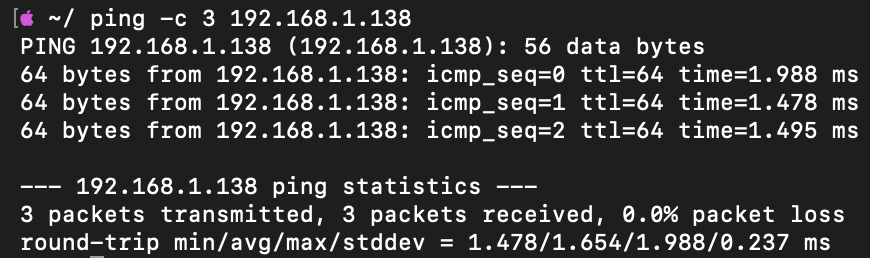

**Відкриття порту на брандмауері VM:**

```bash
sudo ufw allow 12345
```

---

### 1.2 TCP з'єднання

**TCP (Transmission Control Protocol)** — надійний протокол з гарантією доставки.

**На VM (сервер):**

```bash
nc -l -v 12345
```

| Параметр | Опис |
|----------|------|
| -l | Listen — режим прослуховування |
| -v | Verbose — детальний вивід |
| 12345 | Порт для прослуховування |

**На MacBook (клієнт):**

```bash
nc -v 192.168.1.138 12345
```

**Результат — двостороння комунікація:**

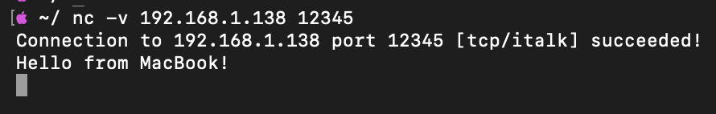

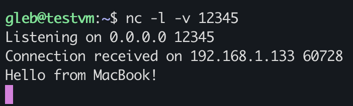

**Обмін повідомленнями в обидва боки:**

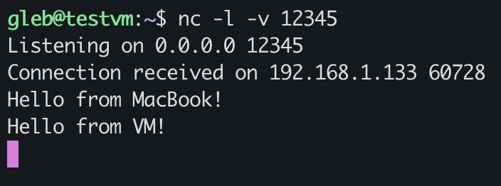

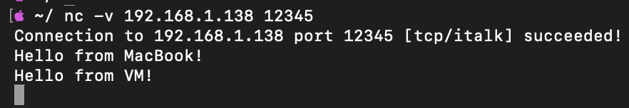

✅ **TCP з'єднання працює — повідомлення доставляються в обидва боки**

---

### 1.3 UDP з'єднання

**UDP (User Datagram Protocol)** — швидкий протокол без гарантії доставки.

**На VM (сервер):**

```bash
nc -l -u -v 12345
```

| Параметр | Опис |
|----------|------|
| -u | UDP режим (замість TCP) |

**На MacBook (клієнт):**

```bash
nc -u -v 192.168.1.138 12345
```

**Результат:**

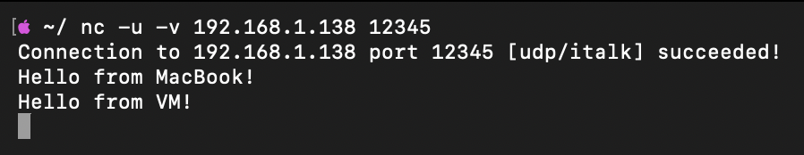


**Зверни увагу на різницю:**
- TCP: `Listening on 0.0.0.0 12345`
- UDP: `Bound on 0.0.0.0 12345`

✅ **UDP з'єднання працює**

---

### 1.4 Різниця між TCP та UDP

| Характеристика | TCP | UDP |
|----------------|-----|-----|
| З'єднання | Встановлює перед передачею | Без з'єднання |
| Надійність | Гарантує доставку | Не гарантує |
| Порядок пакетів | Зберігає | Може змінитись |
| Швидкість | Повільніший | Швидший |
| Використання | Веб, email, SSH, файли | Відео, ігри, DNS, стрімінг |

**Аналогія:**
- **TCP** = Рекомендований лист з повідомленням про вручення
- **UDP** = Звичайна листівка без відстеження

---

### 1.5 Блокування порту брандмауером

**Блокування порту:**

```bash
sudo ufw deny 12345
sudo ufw status
```

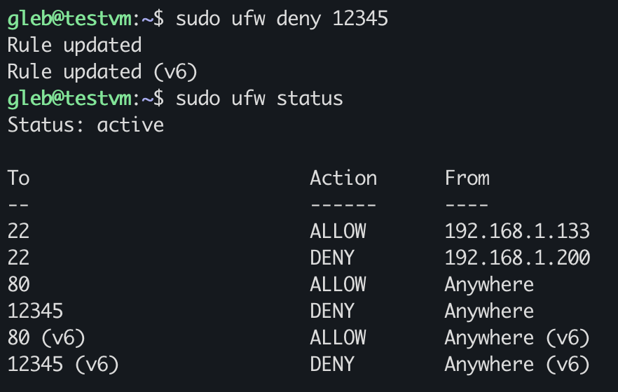

**Спроба підключення (з VM слухає, MacBook підключається):**


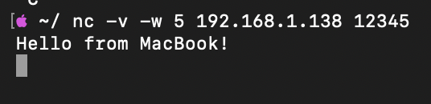

**Результат:** З'єднання зависає (timeout). Фаєрвол "викидає" пакети без відповіді — клієнт чекає, але нічого не отримує.

**Як блокування впливає на протоколи:**

| Протокол | Поведінка при блокуванні |
|----------|-------------------------|
| TCP | Timeout — клієнт чекає відповіді, не отримує |
| UDP | Тиша — пакети просто зникають, клієнт не знає чи доставлено |

**Відновлення доступу:**

```bash
sudo ufw allow 12345
```

✅ **Продемонстровано вплив брандмауера на мережеві з'єднання**

---

## Завдання 2: Конфігурація DNS

### 2.1 Встановлення dnsmasq

**Що таке DNS?**

DNS (Domain Name System) — це "телефонна книга" інтернету. Перетворює зрозумілі людям імена (google.com) в IP-адреси (142.250.186.142).

**Встановлення:**

```bash
sudo apt update
sudo apt install dnsmasq -y
```

**Вирішення конфлікту портів:**

systemd-resolved за замовчуванням займає порт 53. Вимикаємо його:

```bash
sudo systemctl stop systemd-resolved
sudo systemctl disable systemd-resolved
sudo systemctl start dnsmasq
```

**Перевірка статусу:**

```bash
sudo systemctl status dnsmasq
```

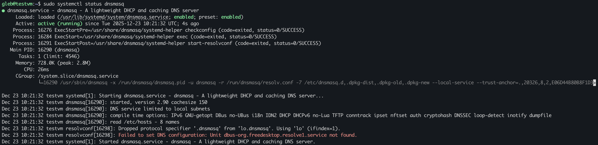

---

### 2.2 Налаштування DNS-зони

**Створення конфігурації:**

```bash
sudo nano /etc/dnsmasq.d/myconfig.conf
```

**Вміст файлу:**

```
address=/mysite.local/192.168.1.138
address=/testserver.local/192.168.1.138
```

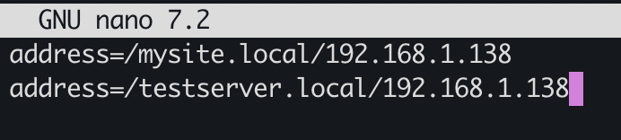

| Параметр | Опис |
|----------|------|
| address= | Директива для створення DNS-запису |
| /mysite.local/ | Доменне ім'я |
| 192.168.1.138 | IP-адреса, яку повертати |

**Перезапуск сервісу:**

```bash
sudo systemctl restart dnsmasq
```

**Відкриття порту DNS:**

```bash
sudo ufw allow 53
```

---

### 2.3 Перевірка резолюції

**Локальна перевірка (на VM):**

```bash
dig @127.0.0.1 mysite.local
```

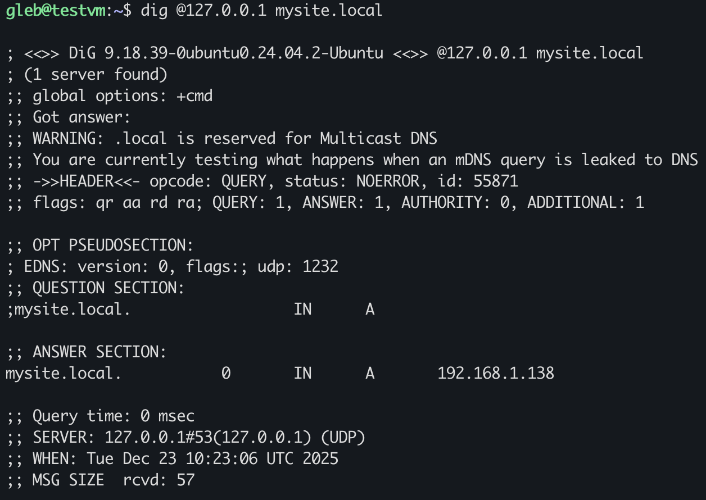

**Перевірка з іншої машини (MacBook):**

```bash
dig @192.168.1.138 mysite.local
dig @192.168.1.138 testserver.local
```

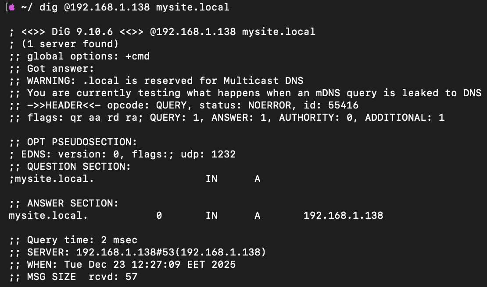

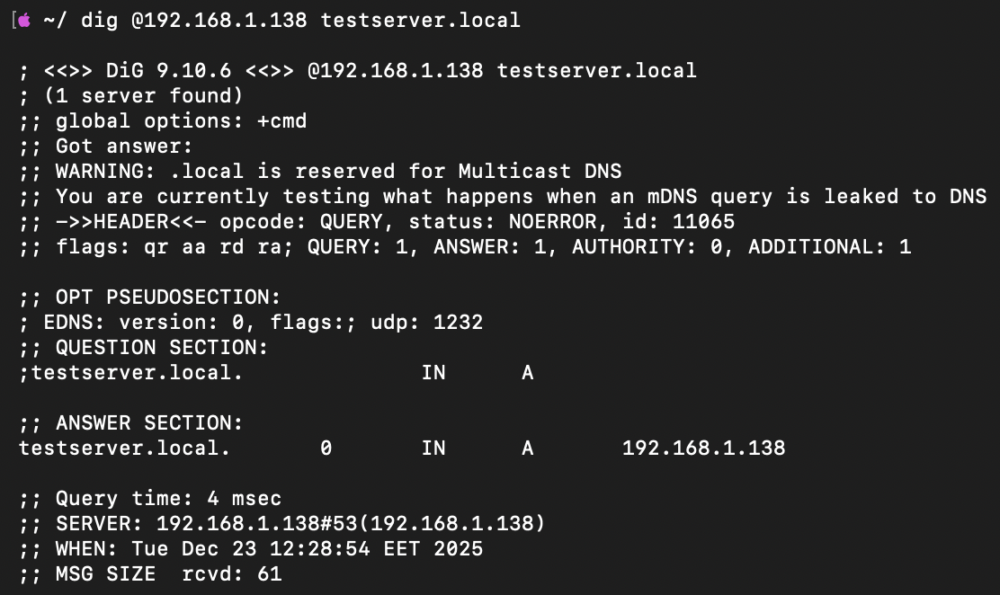

**Результат:**

```
;; ANSWER SECTION:
mysite.local.		0	IN	A	192.168.1.138
testserver.local.	0	IN	A	192.168.1.138
```

✅ **DNS-сервер працює — резолюція успішна з віддаленої машини**

---

### 2.4 Процес резолюції доменних імен

**Як працює DNS-запит:**

```
1. Користувач вводить: mysite.local
           ↓
2. Комп'ютер питає DNS-сервер: "Яка IP у mysite.local?"
           ↓
3. DNS-сервер (dnsmasq) шукає у своїй конфігурації
           ↓
4. Знаходить запис: mysite.local → 192.168.1.138
           ↓
5. Повертає відповідь клієнту
           ↓
6. Комп'ютер підключається до 192.168.1.138
```

**Команда dig пояснення:**

```bash
dig @192.168.1.138 mysite.local
     │              │
     │              └─ яке ім'я шукаємо
     └─ який DNS-сервер питаємо
```

---

## Завдання 3: Розбивання на підмережі

### 3.1 Аналіз вимог

**Умова задачі:**

> Компанія використовує мережу 10.0.0.0/8.
> Колеги забрали: 10.0.1.0/24 та 10.0.0.32/26.
> Потрібно: 10 підмереж по 5–11 хостів кожна.

---

### 3.2 Зайняті підмережі

| Підмережа | Маска | Діапазон | Кількість адрес |
|-----------|-------|----------|-----------------|
| 10.0.1.0/24 | /24 | 10.0.1.0 – 10.0.1.255 | 256 |
| 10.0.0.32/26 | /26 | 10.0.0.32 – 10.0.0.95 | 64 |

**Розрахунок діапазону для /26:**

```
/26 = 32 - 26 = 6 біт на хости
2^6 = 64 адреси
Початок: 32
Кінець: 32 + 64 - 1 = 95
```

---

### 3.3 Вибір маски

**Скільки хостів потрібно?** Від 5 до 11.

**Формула:** Кількість хостів = 2^(біти на хости) - 2

| Маска | Біт на хости | Всього адрес | Доступно хостів | Підходить? |
|-------|--------------|--------------|-----------------|------------|
| /29 | 3 | 8 | 6 | ❌ (замало для 11) |
| /28 | 4 | 16 | 14 | ✅ (достатньо) |
| /27 | 5 | 32 | 30 | ✅ (але марнотратно) |

**Вибір: /28** — найменша маска, що вміщує 11 хостів.

**Чому -2?** Дві адреси зарезервовані:
- Перша (.0) — адреса мережі
- Остання (.15) — broadcast

---

### 3.4 Результат: 10 підмереж

**Підмережа /28 = 16 адрес, починається з числа кратного 16.**

**Аналіз вільних блоків у 10.0.0.X:**

| Блок | Діапазон | Статус |
|------|----------|--------|
| 0–15 | 10.0.0.0/28 | ✅ вільно |
| 16–31 | 10.0.0.16/28 | ✅ вільно |
| 32–47 | 10.0.0.32/28 | ❌ зайнято (колега 2) |
| 48–63 | 10.0.0.48/28 | ❌ зайнято (колега 2) |
| 64–79 | 10.0.0.64/28 | ❌ зайнято (колега 2) |
| 80–95 | 10.0.0.80/28 | ❌ зайнято (колега 2) |
| 96–111 | 10.0.0.96/28 | ✅ вільно |
| 112–127 | 10.0.0.112/28 | ✅ вільно |
| 128–255 | ... | ✅ вільно |

**Обрані 10 підмереж:**

| # | Підмережа | Адреса мережі | Діапазон хостів | Broadcast | Хостів |
|---|-----------|---------------|-----------------|-----------|--------|
| 1 | 10.0.0.0/28 | 10.0.0.0 | 10.0.0.1 – 10.0.0.14 | 10.0.0.15 | 14 |
| 2 | 10.0.0.16/28 | 10.0.0.16 | 10.0.0.17 – 10.0.0.30 | 10.0.0.31 | 14 |
| 3 | 10.0.0.96/28 | 10.0.0.96 | 10.0.0.97 – 10.0.0.110 | 10.0.0.111 | 14 |
| 4 | 10.0.0.112/28 | 10.0.0.112 | 10.0.0.113 – 10.0.0.126 | 10.0.0.127 | 14 |
| 5 | 10.0.0.128/28 | 10.0.0.128 | 10.0.0.129 – 10.0.0.142 | 10.0.0.143 | 14 |
| 6 | 10.0.0.144/28 | 10.0.0.144 | 10.0.0.145 – 10.0.0.158 | 10.0.0.159 | 14 |
| 7 | 10.0.0.160/28 | 10.0.0.160 | 10.0.0.161 – 10.0.0.174 | 10.0.0.175 | 14 |
| 8 | 10.0.0.176/28 | 10.0.0.176 | 10.0.0.177 – 10.0.0.190 | 10.0.0.191 | 14 |
| 9 | 10.0.0.192/28 | 10.0.0.192 | 10.0.0.193 – 10.0.0.206 | 10.0.0.207 | 14 |
| 10 | 10.0.0.208/28 | 10.0.0.208 | 10.0.0.209 – 10.0.0.222 | 10.0.0.223 | 14 |

**Чому саме ці підмережі?**

1. **Маска /28** — найекономніша для 5–11 хостів (14 доступно)
2. **Не перетинаються** з зайнятими діапазонами колег
3. **Вирівняні** по границях (кратні 16)
4. **Залишають простір** для майбутнього розширення

✅ **10 підмереж /28 виділено без конфліктів**

---

## Висновки

| Завдання | Статус |
|----------|--------|
| Netcat TCP з'єднання | ✅ |
| Netcat UDP з'єднання | ✅ |
| Блокування порту UFW | ✅ |
| DNS-сервер (dnsmasq) | ✅ |
| Розбивання на підмережі | ✅ |

### Ключові концепції

1. **TCP vs UDP** — надійність vs швидкість
2. **Netcat** — універсальний інструмент для тестування мережі
3. **DNS** — перетворення доменних імен в IP-адреси
4. **Subnetting** — поділ мережі на менші частини для ефективного використання
5. **UFW** — керування мережевим доступом через брандмауер

### Корисні команди

```bash
# Netcat
nc -l -v 12345              # Слухати TCP на порту
nc -l -u -v 12345           # Слухати UDP на порту
nc -v <IP> 12345            # Підключитись до TCP
nc -u -v <IP> 12345         # Підключитись до UDP

# DNS
dig @<DNS_IP> <domain>      # DNS-запит
sudo systemctl status dnsmasq   # Статус DNS-сервера

# Брандмауер
sudo ufw allow <port>       # Відкрити порт
sudo ufw deny <port>        # Заблокувати порт
sudo ufw status             # Показати правила
```

---

## Використані технології

- VirtualBox 7.x (Apple Silicon)
- Ubuntu Server 24.04.3 LTS (ARM64)
- Netcat (OpenBSD)
- dnsmasq 2.90
- UFW (Uncomplicated Firewall)
- dig (DNS lookup utility)
