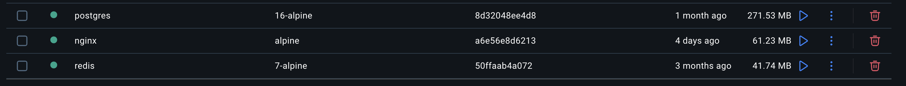
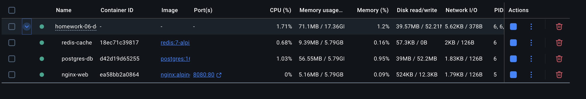
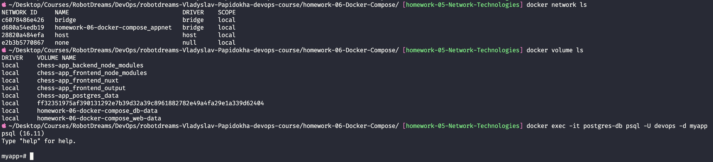
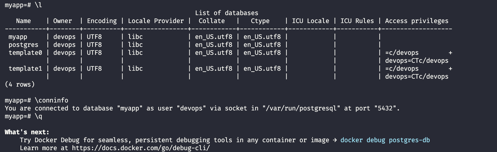
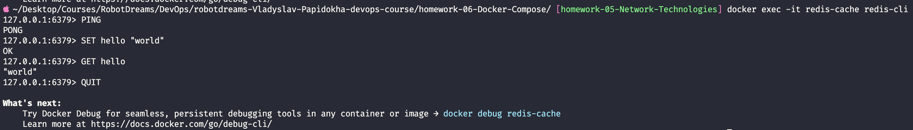
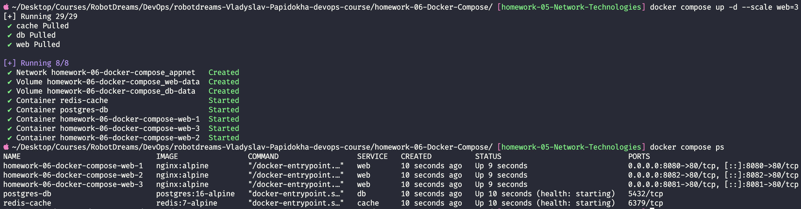

# Homework 06: Docker Compose 🐳

## Зміст

- [Огляд завдання](#огляд-завдання)
- [Архітектура застосунку](#архітектура-застосунку)
- [Завдання 1: Встановлення Docker](#завдання-1-встановлення-docker)
  - [1.1 Перевірка версій](#11-перевірка-версій)
  - [1.2 Docker Images](#12-docker-images)
- [Завдання 2: Створення docker-compose.yml](#завдання-2-створення-docker-composeyml)
  - [2.1 Структура проєкту](#21-структура-проєкту)
  - [2.2 Пояснення конфігурації](#22-пояснення-конфігурації)
- [Завдання 3: Запуск застосунку](#завдання-3-запуск-застосунку)
  - [3.1 Команди запуску](#31-команди-запуску)
  - [3.2 Перевірка веб-сервера](#32-перевірка-веб-сервера)
- [Завдання 4: Мережі та томи](#завдання-4-мережі-та-томи)
  - [4.1 Дослідження мереж](#41-дослідження-мереж)
  - [4.2 Дослідження томів](#42-дослідження-томів)
  - [4.3 Підключення до PostgreSQL](#43-підключення-до-postgresql)
  - [4.4 Перевірка Redis](#44-перевірка-redis)
- [Завдання 5: Масштабування](#завдання-5-масштабування)
  - [5.1 Горизонтальне масштабування](#51-горизонтальне-масштабування)
  - [5.2 Результат масштабування](#52-результат-масштабування)
- [Висновки](#висновки)
- [Корисні команди](#корисні-команди)

---

## Огляд завдання

Створення багатоконтейнерного застосунку з використанням Docker Compose, який включає:

| Сервіс    | Образ              | Призначення                        |
| --------- | ------------------ | ---------------------------------- |
| **web**   | nginx:alpine       | Веб-сервер для статичного контенту |
| **db**    | postgres:16-alpine | Реляційна база даних               |
| **cache** | redis:7-alpine     | In-memory кеш-сервер               |

---

## Архітектура застосунку

```
┌─────────────────────────────────────────────────────────────────┐
│                         Docker Host                             │
│                                                                 │
│  ┌────────────────────── appnet (bridge) ──────────────────────┐│
│  │                      172.18.0.0/16                          ││
│  │                                                             ││
│  │   ┌─────────────┐   ┌─────────────┐   ┌─────────────┐       ││
│  │   │    nginx    │   │  postgres   │   │    redis    │       ││
│  │   │     :80     │   │    :5432    │   │    :6379    │       ││
│  │   │   (web)     │   │    (db)     │   │   (cache)   │       ││
│  │   └──────┬──────┘   └──────┬──────┘   └─────────────┘       ││
│  │          │                 │                                ││
│  └──────────┼─────────────────┼────────────────────────────────┘│
│             │                 │                                 │
│        ┌────┴────┐       ┌────┴────┐                            │
│        │web-data │       │ db-data │                            │
│        │ volume  │       │ volume  │                            │
│        └─────────┘       └─────────┘                            │
│             │                                                   │
└─────────────┼───────────────────────────────────────────────────┘
              │
         Port 8080
              │
         localhost:8080
              │
         🌐 Браузер
```

---

## Середовище

| Параметр       | Значення                   |
| -------------- | -------------------------- |
| Host           | MacBook Pro (Apple M1 Pro) |
| OS             | macOS                      |
| Docker         | Docker Desktop v29.1.3     |
| Docker Compose | v2.40.3-desktop.1          |

---

## Завдання 1: Встановлення Docker

### 1.1 Перевірка версій

```bash
docker --version
# Docker version 29.1.3, build f52814d

docker compose version
# Docker Compose version v2.40.3-desktop.1
```

> **Примітка:** Починаючи з Docker Compose V2, використовується `docker compose` (з пробілом) замість `docker-compose` (з дефісом).

### 1.2 Docker Images

Образи, що використовуються в проєкті:



| Image    | Tag       | Розмір | Опис                            |
| -------- | --------- | ------ | ------------------------------- |
| postgres | 16-alpine | 271 MB | PostgreSQL на базі Alpine Linux |
| nginx    | alpine    | 61 MB  | Веб-сервер на базі Alpine Linux |
| redis    | 7-alpine  | 42 MB  | Redis кеш на базі Alpine Linux  |

**Чому Alpine?**

- Мінімальний розмір (~5MB базовий образ)
- Менша поверхня атаки (безпека)
- Швидше завантаження

---

## Завдання 2: Створення docker-compose.yml

### 2.1 Структура проєкту

```
homework-06-Docker-Compose/
├── docker-compose.yml          # Головний файл конфігурації
├── nginx/
│   └── index.html              # Статична HTML-сторінка
├── screenshots/                # Скріншоти виконання
└── README.md                   # Документація
```

### 2.2 Пояснення конфігурації

**docker-compose.yml:**

```yaml
services:
  # ═══════════════════════════════════════════
  # WEB SERVER - Nginx
  # ═══════════════════════════════════════════
  web:
    image: nginx:alpine
    container_name: nginx-web
    ports:
      - "8080:80" # Хост:Контейнер
    volumes:
      - web-data:/usr/share/nginx/html:ro
      - ./nginx/index.html:/usr/share/nginx/html/index.html:ro
    networks:
      - appnet
    depends_on:
      - db
      - cache
    restart: unless-stopped

  # ═══════════════════════════════════════════
  # DATABASE - PostgreSQL
  # ═══════════════════════════════════════════
  db:
    image: postgres:16-alpine
    container_name: postgres-db
    environment:
      POSTGRES_USER: devops
      POSTGRES_PASSWORD: devops123
      POSTGRES_DB: myapp
    volumes:
      - db-data:/var/lib/postgresql/data
    networks:
      - appnet
    restart: unless-stopped
    healthcheck:
      test: ["CMD-SHELL", "pg_isready -U devops -d myapp"]
      interval: 10s
      timeout: 5s
      retries: 5

  # ═══════════════════════════════════════════
  # CACHE - Redis
  # ═══════════════════════════════════════════
  cache:
    image: redis:7-alpine
    container_name: redis-cache
    networks:
      - appnet
    restart: unless-stopped
    healthcheck:
      test: ["CMD", "redis-cli", "ping"]
      interval: 10s
      timeout: 5s
      retries: 5

volumes:
  db-data:
    driver: local
  web-data:
    driver: local

networks:
  appnet:
    driver: bridge
```

**Ключові концепції:**

| Директива        | Опис                                 |
| ---------------- | ------------------------------------ |
| `image`          | Docker образ з Docker Hub            |
| `container_name` | Явне ім'я контейнера                 |
| `ports`          | Прокидання портів (хост:контейнер)   |
| `volumes`        | Монтування томів для персистентності |
| `networks`       | Підключення до віртуальної мережі    |
| `depends_on`     | Порядок запуску сервісів             |
| `healthcheck`    | Перевірка "живості" сервісу          |
| `restart`        | Політика перезапуску                 |

---

## Завдання 3: Запуск застосунку

### 3.1 Команди запуску

```bash
# Запуск всіх сервісів у фоновому режимі
docker compose up -d

# Перевірка стану контейнерів
docker compose ps
```

**Результат:**



```
NAME          IMAGE                STATUS                    PORTS
nginx-web     nginx:alpine         Up                        0.0.0.0:8080->80/tcp
postgres-db   postgres:16-alpine   Up (healthy)              5432/tcp
redis-cache   redis:7-alpine       Up (healthy)              6379/tcp
```

**Що означає кожен статус:**

- `Up` — контейнер запущений
- `healthy` — healthcheck пройшов успішно
- `0.0.0.0:8080->80/tcp` — порт прокинутий назовні
- `5432/tcp` (без 0.0.0.0) — порт доступний тільки всередині мережі

### 3.2 Перевірка веб-сервера

Відкриваємо в браузері: **http://localhost:8080**


✅ **Nginx працює — сторінка "Hello from Docker!" відображається**

---

## Завдання 4: Мережі та томи

### 4.1 Дослідження мереж

```bash
docker network ls
```



| Network                             | Driver | Опис                           |
| ----------------------------------- | ------ | ------------------------------ |
| `bridge`                            | bridge | Стандартна мережа Docker       |
| `homework-06-docker-compose_appnet` | bridge | **Наша мережа** для застосунку |
| `host`                              | host   | Мережа хоста                   |
| `none`                              | null   | Без мережі                     |

**Як працює bridge network:**

```
┌──────────── appnet (172.18.0.0/16) ────────────┐
│                                                │
│  web ◄─────────► db ◄─────────► cache          │
│  DNS: "web"      DNS: "db"      DNS: "cache"   │
│                                                │
│  Контейнери звертаються один до одного         │
│  по імені сервісу, НЕ по IP!                   │
└────────────────────────────────────────────────┘
```

### 4.2 Дослідження томів

```bash
docker volume ls
```

| Volume                                | Призначення          |
| ------------------------------------- | -------------------- |
| `homework-06-docker-compose_db-data`  | Дані PostgreSQL      |
| `homework-06-docker-compose_web-data` | Статичні файли Nginx |

**Навіщо томи?**

- Контейнери ефемерні — при видаленні дані втрачаються
- Томи зберігають дані незалежно від життєвого циклу контейнера
- `docker compose down` → дані в томах залишаються
- `docker compose down -v` → томи видаляються разом з даними

### 4.3 Підключення до PostgreSQL

```bash
docker exec -it postgres-db psql -U devops -d myapp
```

**Всередині PostgreSQL:**

```sql
\l              -- Список баз даних
\conninfo       -- Інформація про з'єднання
\q              -- Вихід
```



**Результат:**

```
List of databases:
   Name    | Owner  | Encoding
-----------+--------+----------
 myapp     | devops | UTF8
 postgres  | devops | UTF8
 template0 | devops | UTF8
 template1 | devops | UTF8

You are connected to database "myapp" as user "devops" at port "5432".
```

✅ **PostgreSQL працює — база даних `myapp` створена автоматично**

### 4.4 Перевірка Redis

```bash
docker exec -it redis-cache redis-cli
```

**Всередині Redis:**

```
PING                    # Перевірка з'єднання
SET hello "world"       # Записати значення
GET hello               # Прочитати значення
QUIT                    # Вихід
```



**Результат:**

```
127.0.0.1:6379> PING
PONG
127.0.0.1:6379> SET hello "world"
OK
127.0.0.1:6379> GET hello
"world"
```

✅ **Redis працює — PING/PONG, SET/GET успішні**

---

## Завдання 5: Масштабування

### 5.1 Горизонтальне масштабування

**Що таке горизонтальне масштабування?**

```
Вертикальне (Scale UP):          Горизонтальне (Scale OUT):
┌─────────────────┐              ┌─────┐ ┌─────┐ ┌─────┐
│   MEGA SERVER   │              │ web │ │ web │ │ web │
│   більше CPU    │      vs      │  1  │ │  2  │ │  3  │
│   більше RAM    │              └─────┘ └─────┘ └─────┘
└─────────────────┘
     Дорого                           Дешево
     Є межа                           Нескінченно
     Якщо впаде — все впаде           Відмовостійкість
```

**Підготовка до масштабування:**

Для масштабування потрібно:

1. Прибрати `container_name` (імена мають бути унікальними)
2. Змінити порти на діапазон: `"8080-8082:80"`

```bash
# Зупинити поточні контейнери
docker compose down

# Запустити з масштабуванням
docker compose up -d --scale web=3

# Перевірити статус
docker compose ps
```

### 5.2 Результат масштабування



```
NAME                               IMAGE           STATUS    PORTS
homework-06-docker-compose-web-1   nginx:alpine    Up        0.0.0.0:8080->80/tcp
homework-06-docker-compose-web-2   nginx:alpine    Up        0.0.0.0:8082->80/tcp
homework-06-docker-compose-web-3   nginx:alpine    Up        0.0.0.0:8081->80/tcp
postgres-db                        postgres:16     Up        5432/tcp
redis-cache                        redis:7         Up        6379/tcp
```

**Тепер доступні 3 інстанси nginx:**

- http://localhost:8080
- http://localhost:8081
- http://localhost:8082

✅ **Масштабування працює — 3 інстанси web-сервера запущені**

---

## Висновки

| Завдання                              | Статус |
| ------------------------------------- | ------ |
| Встановлення Docker                   | ✅     |
| Створення docker-compose.yml          | ✅     |
| Запуск багатоконтейнерного застосунку | ✅     |
| Дослідження мереж і томів             | ✅     |
| Підключення до PostgreSQL             | ✅     |
| Перевірка Redis                       | ✅     |
| Масштабування веб-сервера             | ✅     |

### Ключові концепції

1. **Docker Compose** — декларативний опис інфраструктури в YAML
2. **Services** — абстракція над контейнерами з можливістю масштабування
3. **Volumes** — персистентне зберігання даних
4. **Networks** — ізольовані мережі з DNS по імені сервісу
5. **Healthcheck** — автоматична перевірка готовності сервісів
6. **Scaling** — горизонтальне масштабування для відмовостійкості

### Порівняння з попередніми темами

| Тема          | Зв'язок з Docker Compose                                  |
| ------------- | --------------------------------------------------------- |
| Linux/Systemd | `restart: unless-stopped` — аналог systemd restart policy |
| Networking    | `networks: appnet` — віртуальна bridge мережа             |
| DNS           | Docker автоматично створює DNS для контейнерів            |
| Ports         | `ports: "8080:80"` — прокидання як в UFW/iptables         |

---

## Корисні команди

```bash
# ═══════════════════════════════════════════
# LIFECYCLE
# ═══════════════════════════════════════════
docker compose up -d              # Запустити у фоновому режимі
docker compose down               # Зупинити та видалити контейнери
docker compose down -v            # + видалити томи
docker compose restart            # Перезапустити всі сервіси

# ═══════════════════════════════════════════
# MONITORING
# ═══════════════════════════════════════════
docker compose ps                 # Статус контейнерів
docker compose logs -f            # Логи в реальному часі
docker compose logs web           # Логи конкретного сервісу
docker compose top                # Процеси в контейнерах

# ═══════════════════════════════════════════
# DEBUGGING
# ═══════════════════════════════════════════
docker compose exec web sh        # Shell в контейнері
docker compose exec db psql -U devops -d myapp  # PostgreSQL CLI
docker compose exec cache redis-cli             # Redis CLI

# ═══════════════════════════════════════════
# SCALING
# ═══════════════════════════════════════════
docker compose up -d --scale web=3    # Масштабувати web до 3 інстансів
docker compose up -d --scale web=1    # Повернути до 1 інстансу

# ═══════════════════════════════════════════
# INSPECTION
# ═══════════════════════════════════════════
docker network ls                 # Список мереж
docker volume ls                  # Список томів
docker compose config             # Валідація конфігурації
```

---

## Використані технології

| Технологія     | Версія    | Призначення             |
| -------------- | --------- | ----------------------- |
| Docker Desktop | 29.1.3    | Контейнеризація         |
| Docker Compose | v2.40.3   | Оркестрація контейнерів |
| Nginx          | alpine    | Веб-сервер              |
| PostgreSQL     | 16-alpine | База даних              |
| Redis          | 7-alpine  | Кеш-сервер              |

---
