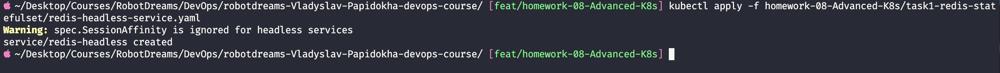
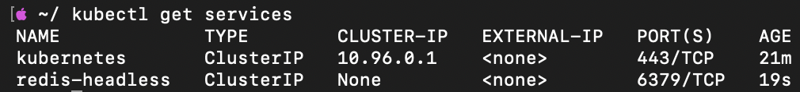
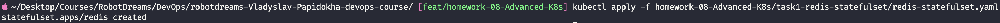
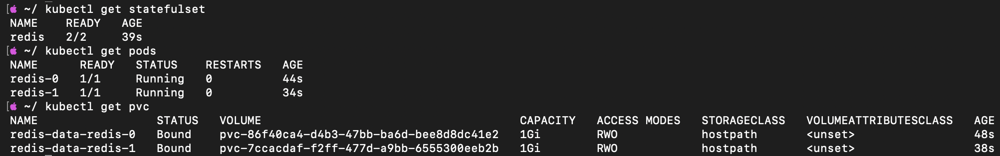
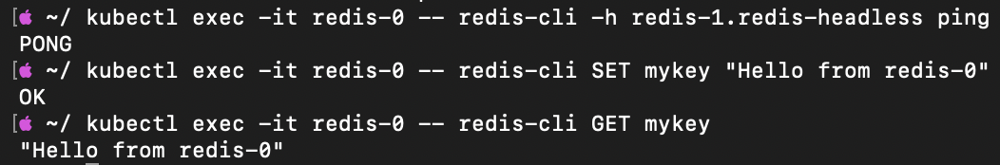
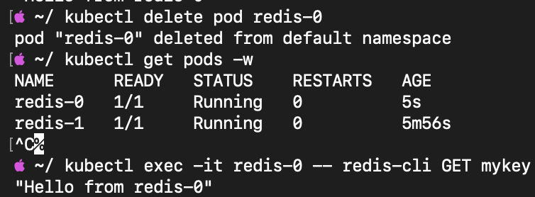
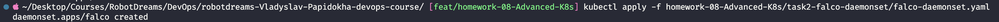
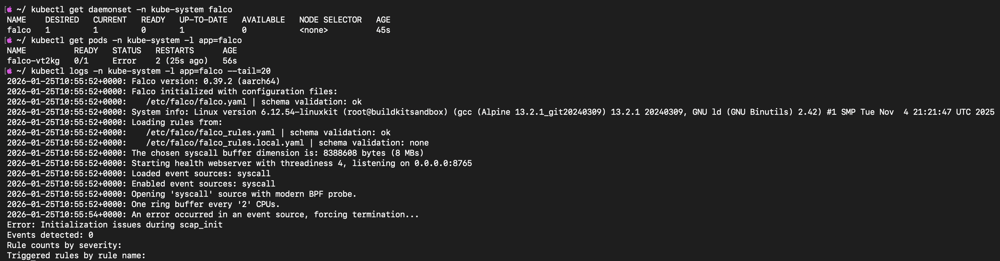
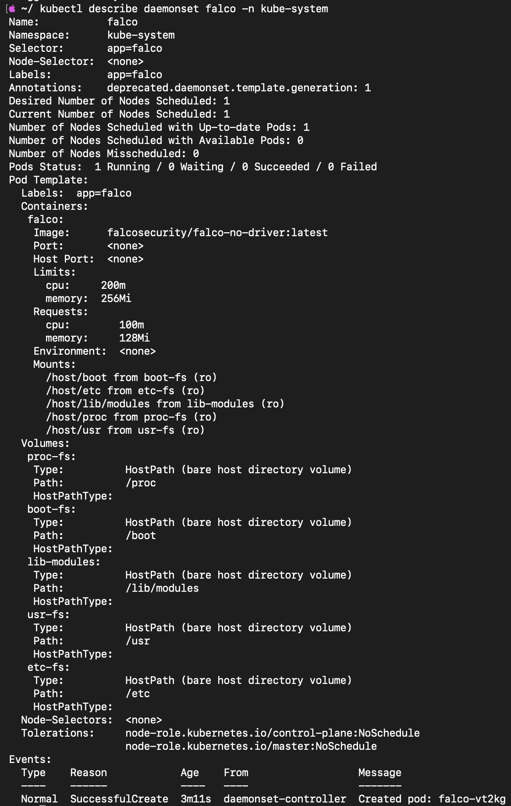

# Homework 08: Advanced Kubernetes (StatefulSet & DaemonSet)

## Зміст

- [Завдання 1: Redis StatefulSet](#завдання-1-redis-statefulset)
  - [1.1 Що таке StatefulSet?](#11-що-таке-statefulset)
  - [1.2 Створення Headless Service](#12-створення-headless-service)
  - [1.3 Створення StatefulSet](#13-створення-statefulset)
  - [1.4 Перевірка роботи](#14-перевірка-роботи)
  - [1.5 Тест збереження даних](#15-тест-збереження-даних)
- [Завдання 2: Falco DaemonSet](#завдання-2-falco-daemonset)
  - [2.1 Що таке DaemonSet?](#21-що-таке-daemonset)
  - [2.2 Що таке Falco?](#22-що-таке-falco)
  - [2.3 Створення DaemonSet](#23-створення-daemonset)
  - [2.4 Перевірка роботи](#24-перевірка-роботи)
- [Порівняння контролерів Kubernetes](#порівняння-контролерів-kubernetes)
- [Корисні команди](#корисні-команди)

---

## Середовище

| Параметр   | Значення                     |
| ---------- | ---------------------------- |
| OS         | macOS (Apple Silicon M1)     |
| Kubernetes | Docker Desktop v1.34.1       |
| kubectl    | v1.34.1                      |
| Cluster    | docker-desktop (single node) |

---

## Завдання 1: Redis StatefulSet

### 1.1 Що таке StatefulSet?

**StatefulSet** — це контролер Kubernetes для stateful додатків (баз даних, кешів), який забезпечує:

| Характеристика     | Опис                                                         |
| ------------------ | ------------------------------------------------------------ |
| Стабільні імена    | Поди мають послідовні імена: redis-0, redis-1, redis-2       |
| Порядок запуску    | Поди запускаються послідовно (0 → 1 → 2)                     |
| Персистентні диски | Кожен под має власний PVC, який зберігається при перезапуску |
| Стабільна мережа   | Кожен под має унікальний DNS-запис                           |

**Порівняння з Deployment:**

```
Deployment (для stateless):           StatefulSet (для stateful):
┌─────────────────────────┐           ┌─────────────────────────┐
│  pod-7f8d9 (випадкове)  │           │  redis-0 (стабільне)    │
│  pod-abc12 (випадкове)  │           │  redis-1 (стабільне)    │
│  Спільний/тимчасовий    │           │  Окремий PVC для кожного│
│  диск або без диска     │           │  пода                   │
└─────────────────────────┘           └─────────────────────────┘
```

---

### 1.2 Створення Headless Service

**Headless Service** (clusterIP: None) потрібен для того, щоб кожен под StatefulSet отримав власний DNS-запис.

**Файл:** `task1-redis-statefulset/redis-headless-service.yaml`

```yaml
apiVersion: v1
kind: Service
metadata:
  name: redis-headless
  labels:
    app: redis
spec:
  clusterIP: None # Headless — без балансувальника
  selector:
    app: redis
  ports:
    - port: 6379
      targetPort: 6379
      name: redis
```

**Різниця між звичайним Service та Headless:**

| Тип Service | ClusterIP | DNS повертає           |
| ----------- | --------- | ---------------------- |
| Звичайний   | 10.96.x.x | IP балансувальника     |
| Headless    | None      | IP кожного пода окремо |

**Застосування:**

```bash
kubectl apply -f task1-redis-statefulset/redis-headless-service.yaml
```



**Перевірка:**

```bash
kubectl get services
```



✅ **Headless Service створено** — бачимо `CLUSTER-IP: None`

---

### 1.3 Створення StatefulSet

**Файл:** `task1-redis-statefulset/redis-statefulset.yaml`

```yaml
apiVersion: apps/v1
kind: StatefulSet
metadata:
  name: redis
spec:
  serviceName: redis-headless # Зв'язок з Headless Service
  replicas: 2 # Кількість подів
  selector:
    matchLabels:
      app: redis
  template:
    metadata:
      labels:
        app: redis
    spec:
      containers:
        - name: redis
          image: redis:7-alpine
          ports:
            - containerPort: 6379
              name: redis
          volumeMounts:
            - name: redis-data
              mountPath: /data # Куди монтувати диск
  volumeClaimTemplates: # Шаблон для PVC
    - metadata:
        name: redis-data
      spec:
        accessModes:
          - ReadWriteOnce
        resources:
          requests:
            storage: 1Gi
```

**Ключові моменти:**

| Поле                 | Значення       | Пояснення                                |
| -------------------- | -------------- | ---------------------------------------- |
| serviceName          | redis-headless | Створює DNS: redis-0.redis-headless      |
| replicas             | 2              | Створить redis-0 та redis-1              |
| volumeClaimTemplates | redis-data     | Автоматично створює PVC для кожного пода |

**Застосування:**

```bash
kubectl apply -f task1-redis-statefulset/redis-statefulset.yaml
```



---

### 1.4 Перевірка роботи

**Перевірка всіх ресурсів:**

```bash
kubectl get statefulset
kubectl get pods
kubectl get pvc
```



**Результат:**

| Ресурс                 | Статус    | Опис                                  |
| ---------------------- | --------- | ------------------------------------- |
| StatefulSet redis      | 2/2 Ready | Обидві репліки працюють               |
| Pod redis-0            | Running   | Перший под (запустився першим)        |
| Pod redis-1            | Running   | Другий под (запустився після redis-0) |
| PVC redis-data-redis-0 | Bound     | Персональний диск для redis-0         |
| PVC redis-data-redis-1 | Bound     | Персональний диск для redis-1         |

**Тест DNS — поди знаходять один одного:**

```bash
kubectl exec -it redis-0 -- redis-cli -h redis-1.redis-headless ping
```

**Тест запису та читання даних:**

```bash
kubectl exec -it redis-0 -- redis-cli SET mykey "Hello from redis-0"
kubectl exec -it redis-0 -- redis-cli GET mykey
```



✅ **StatefulSet працює:**

- Поди мають стабільні імена (redis-0, redis-1)
- DNS резолюція працює (redis-1.redis-headless)
- Дані записуються та читаються

---

### 1.5 Тест збереження даних

**Головна перевага StatefulSet** — дані зберігаються після перезапуску пода.

**Сценарій тесту:**

```
1. Записали дані в redis-0
2. Видалили под redis-0
3. StatefulSet автоматично створив новий redis-0
4. Перевірили — дані залишились!
```

**Виконання:**

```bash
# Видаляємо под
kubectl delete pod redis-0

# Спостерігаємо за відновленням
kubectl get pods -w

# Перевіряємо дані
kubectl exec -it redis-0 -- redis-cli GET mykey
```



**Результат:**

| Етап            | Стан                            | Дані                            |
| --------------- | ------------------------------- | ------------------------------- |
| До видалення    | redis-0 працює, AGE: 5m         | mykey = "Hello from redis-0"    |
| Після видалення | redis-0 перезапустився, AGE: 5s | mykey = "Hello from redis-0" ✅ |

**Чому дані збереглись?**

```
┌─────────────────────────────────────────────────────────────┐
│                                                             │
│  1. Pod redis-0 видалено                                    │
│     ┌─────────┐                                             │
│     │ redis-0 │ ──→ 💥 deleted                              │
│     └────┬────┘                                             │
│          │                                                  │
│          ▼                                                  │
│  2. PVC залишився!                                          │
│     ┌─────────────────┐                                     │
│     │ PVC redis-data- │                                     │
│     │ redis-0         │ ← Дані тут!                         │
│     │ [mykey=Hello]   │                                     │
│     └────────┬────────┘                                     │
│              │                                              │
│              ▼                                              │
│  3. StatefulSet створив новий pod                           │
│     ┌─────────┐                                             │
│     │ redis-0 │ ← Той самий PVC підключено                  │
│     │ (новий) │                                             │
│     └─────────┘                                             │
│                                                             │
└─────────────────────────────────────────────────────────────┘
```

✅ **Персистентність даних підтверджена**

---

## Завдання 2: Falco DaemonSet

### 2.1 Що таке DaemonSet?

**DaemonSet** — контролер, який гарантує, що **на кожній ноді** кластера запущена **одна копія** пода.

```
┌─────────────────────────────────────────────────────────────┐
│                    Kubernetes Cluster                       │
├─────────────────────────────────────────────────────────────┤
│                                                             │
│  Node 1              Node 2              Node 3             │
│  ┌─────────┐        ┌─────────┐        ┌─────────┐          │
│  │ Falco   │        │ Falco   │        │ Falco   │          │
│  │ (auto)  │        │ (auto)  │        │ (auto)  │          │
│  ├─────────┤        ├─────────┤        ├─────────┤          │
│  │ app-1   │        │ app-2   │        │ app-3   │          │
│  │ app-4   │        │ app-5   │        │ app-6   │          │
│  └─────────┘        └─────────┘        └─────────┘          │
│                                                             │
│  DaemonSet автоматично додає Falco на кожну ноду            │
│                                                             │
└─────────────────────────────────────────────────────────────┘
```

**Типові використання DaemonSet:**

| Категорія  | Приклади                |
| ---------- | ----------------------- |
| Моніторинг | Node Exporter, cAdvisor |
| Логування  | Fluentd, Filebeat       |
| Безпека    | Falco, антивіруси       |
| Мережа     | kube-proxy, CNI plugins |

---

### 2.2 Що таке Falco?

**Falco** — це runtime security tool для Kubernetes, який моніторить системні виклики (syscalls) і виявляє підозрілу активність.

**Що Falco виявляє:**

| Тип загрози               | Приклад                             |
| ------------------------- | ----------------------------------- |
| Shell в контейнері        | Хтось запустив bash (можлива атака) |
| Доступ до чутливих файлів | Читання /etc/shadow                 |
| Підозрілі з'єднання       | Вихідне з'єднання на невідомий IP   |
| Привілейовані операції    | Зміна прав, ескалація привілеїв     |

**Як Falco працює:**

```
┌─────────────────────────────────────────────────────────────┐
│                         Node                                │
├─────────────────────────────────────────────────────────────┤
│  Контейнери:                                                │
│  ┌─────────┐ ┌─────────┐ ┌─────────┐                        │
│  │ nginx   │ │ redis   │ │ app     │                        │
│  └────┬────┘ └────┬────┘ └────┬────┘                        │
│       │           │           │                             │
│       ▼           ▼           ▼                             │
│  ┌─────────────────────────────────────────────────────┐    │
│  │                  Linux Kernel                       │    │
│  │   syscalls: open(), exec(), connect()...            │    │
│  │                         ▲                           │    │
│  │                         │                           │    │
│  │                    ┌────┴────┐                      │    │
│  │                    │  Falco  │ ← Аналізує syscalls  │    │
│  │                    │  (eBPF) │   та генерує алерти  │    │
│  │                    └─────────┘                      │    │
│  └─────────────────────────────────────────────────────┘    │
└─────────────────────────────────────────────────────────────┘
```

---

### 2.3 Створення DaemonSet

**Файл:** `task2-falco-daemonset/falco-daemonset.yaml`

```yaml
apiVersion: apps/v1
kind: DaemonSet
metadata:
  name: falco
  namespace: kube-system
  labels:
    app: falco
spec:
  selector:
    matchLabels:
      app: falco
  template:
    metadata:
      labels:
        app: falco
    spec:
      hostPID: true # Доступ до процесів хоста
      hostNetwork: true # Доступ до мережі хоста
      containers:
        - name: falco
          image: falcosecurity/falco-no-driver:latest
          securityContext:
            privileged: true # Привілейований режим
          resources:
            requests:
              cpu: 100m
              memory: 128Mi
            limits:
              cpu: 200m
              memory: 256Mi
          volumeMounts:
            - name: proc-fs
              mountPath: /host/proc
              readOnly: true
            - name: boot-fs
              mountPath: /host/boot
              readOnly: true
            - name: lib-modules
              mountPath: /host/lib/modules
              readOnly: true
            - name: usr-fs
              mountPath: /host/usr
              readOnly: true
            - name: etc-fs
              mountPath: /host/etc
              readOnly: true
      volumes:
        - name: proc-fs
          hostPath:
            path: /proc
        - name: boot-fs
          hostPath:
            path: /boot
        - name: lib-modules
          hostPath:
            path: /lib/modules
        - name: usr-fs
          hostPath:
            path: /usr
        - name: etc-fs
          hostPath:
            path: /etc
      tolerations:
        - key: node-role.kubernetes.io/control-plane
          effect: NoSchedule
        - key: node-role.kubernetes.io/master
          effect: NoSchedule
```

**Пояснення ключових налаштувань:**

| Налаштування                   | Пояснення                                            |
| ------------------------------ | ---------------------------------------------------- |
| namespace: kube-system         | Системний namespace для інфраструктурних компонентів |
| hostPID: true                  | Falco бачить всі процеси на ноді                     |
| privileged: true               | Доступ до ядра для моніторингу syscalls              |
| volumeMounts /proc, /boot, etc | Доступ до системних директорій хоста                 |
| tolerations                    | Дозволяє запуск на master-нодах                      |

**Застосування:**

```bash
kubectl apply -f task2-falco-daemonset/falco-daemonset.yaml
```



---

### 2.4 Перевірка роботи

**Перевірка DaemonSet та подів:**

```bash
kubectl get daemonset -n kube-system falco
kubectl get pods -n kube-system -l app=falco
kubectl logs -n kube-system -l app=falco --tail=20
```



**Результат:**

| Метрика | Значення | Опис                         |
| ------- | -------- | ---------------------------- |
| DESIRED | 1        | Очікується 1 под (бо 1 нода) |
| CURRENT | 1        | Запущено 1 под               |
| READY   | 0        | Под не повністю готовий\*    |

**Детальний опис DaemonSet:**

```bash
kubectl describe daemonset falco -n kube-system
```



**⚠️ Примітка про Docker Desktop:**

Falco показує помилку `Error: Initialization issues during scap_init` — це **очікувано** для Docker Desktop.

Docker Desktop використовує легку VM, яка не підтримує eBPF/kernel module повноцінно. В реальному кластері (AWS EKS, GCP GKE, bare-metal Linux) Falco працював би повністю.

**Що важливо для домашки:**

- ✅ DaemonSet створено правильно
- ✅ Конфігурація валідна
- ✅ Pod запущено на ноді
- ⚠️ Обмеження середовища Docker Desktop

---

## Порівняння контролерів Kubernetes

| Характеристика        | Deployment        | StatefulSet        | DaemonSet       |
| --------------------- | ----------------- | ------------------ | --------------- |
| **Призначення**       | Stateless додатки | Stateful додатки   | Системні агенти |
| **Кількість подів**   | N (вказуєш)       | N (вказуєш)        | = кількість нод |
| **Імена подів**       | Випадкові         | Послідовні (0,1,2) | Випадкові       |
| **Персональний диск** | Ні                | Так                | Зазвичай ні     |
| **Порядок запуску**   | Будь-який         | Послідовний        | Будь-який       |
| **Приклад**           | nginx, API        | Redis, PostgreSQL  | Falco, Fluentd  |

```
┌─────────────────────────────────────────────────────────────┐
│                    KUBERNETES CLUSTER                       │
├─────────────────────────────────────────────────────────────┤
│                                                             │
│  Deployment (nginx):     StatefulSet (redis):               │
│  ┌───────┐ ┌───────┐    ┌─────────┐ ┌─────────┐             │
│  │nginx- │ │nginx- │    │ redis-0 │ │ redis-1 │             │
│  │abc123 │ │xyz789 │    │ [PVC-0] │ │ [PVC-1] │             │
│  └───────┘ └───────┘    └─────────┘ └─────────┘             │
│                                                             │
│  DaemonSet (falco):                                         │
│  Node1: [falco]    Node2: [falco]    Node3: [falco]         │
│                                                             │
└─────────────────────────────────────────────────────────────┘
```

---

## Корисні команди

### StatefulSet

```bash
# Створення
kubectl apply -f statefulset.yaml

# Перегляд
kubectl get statefulset
kubectl get pods
kubectl get pvc

# Масштабування
kubectl scale statefulset redis --replicas=3

# Видалення (PVC залишаються!)
kubectl delete statefulset redis
```

### DaemonSet

```bash
# Створення
kubectl apply -f daemonset.yaml

# Перегляд
kubectl get daemonset -n kube-system
kubectl get pods -n kube-system -l app=falco

# Логи
kubectl logs -n kube-system -l app=falco

# Детальна інформація
kubectl describe daemonset falco -n kube-system
```

### Загальні

```bash
# Виконання команди в поді
kubectl exec -it redis-0 -- redis-cli ping

# DNS тест
kubectl exec -it redis-0 -- redis-cli -h redis-1.redis-headless ping

# Видалення пода (StatefulSet відновить)
kubectl delete pod redis-0

# Перегляд подій
kubectl get events --sort-by='.lastTimestamp'
```

---

## Висновки

| Завдання                               | Статус |
| -------------------------------------- | ------ |
| Headless Service для Redis             | ✅     |
| StatefulSet з 2 репліками              | ✅     |
| PersistentVolumeClaim для кожного пода | ✅     |
| DNS резолюція між подами               | ✅     |
| Збереження даних при перезапуску       | ✅     |
| DaemonSet для Falco                    | ✅     |
| Монтування системних директорій        | ✅     |
| Resource limits                        | ✅     |

### Ключові концепції

1. **StatefulSet** — для додатків зі станом (бази даних), забезпечує стабільні імена та персистентні диски
2. **Headless Service** — дає кожному поду унікальний DNS-запис
3. **PersistentVolumeClaim** — диск, який переживає перезапуск пода
4. **DaemonSet** — запускає по одному поду на кожній ноді кластера
5. **Falco** — інструмент runtime security для моніторингу syscalls

---

## Структура файлів

```
homework-08-Advanced-K8s/
├── README.md
├── task1-redis-statefulset/
│   ├── redis-headless-service.yaml
│   └── redis-statefulset.yaml
├── task2-falco-daemonset/
│   └── falco-daemonset.yaml
└── screenshots/
    ├── 01-headless-service-created.png
    ├── 02-services-list.png
    ├── 03-statefulset-created.png
    ├── 04-statefulset-pods-pvc.png
    ├── 05-dns-ping-redis-operations.png
    ├── 06-data-persistence-test.png
    ├── 07-falco-daemonset-created.png
    ├── 08-falco-pods-logs.png
    └── 09-falco-describe.png
```

---

## Використані технології

| Технологія     | Версія   |
| -------------- | -------- |
| Kubernetes     | v1.34.1  |
| Docker Desktop | Latest   |
| Redis          | 7-alpine |
| Falco          | 0.39.2   |
| kubectl        | v1.34.1  |
