# Homework 09: MySQL - SchoolDB

## Зміст

- [Опис завдання](#опис-завдання)
- [Середовище](#середовище)
- [Швидкий старт](#швидкий-старт)
- [Частина 1: Створення бази даних](#частина-1-створення-бази-даних)
  - [1.1 Запуск MySQL](#11-запуск-mysql)
  - [1.2 Створення таблиць](#12-створення-таблиць)
  - [1.3 Схема бази даних](#13-схема-бази-даних)
- [Частина 2: Заповнення даними](#частина-2-заповнення-даними)
- [Частина 3: SQL запити](#частина-3-sql-запити)
  - [3.1 Діти з закладами та напрямами](#31-діти-з-закладами-та-напрямами)
  - [3.2 Батьки з дітьми та вартістю](#32-батьки-з-дітьми-та-вартістю)
  - [3.3 Заклади з кількістю дітей](#33-заклади-з-кількістю-дітей)
- [Частина 4: Backup та Restore](#частина-4-backup-та-restore)
- [Частина 5: Анонімізація даних](#частина-5-анонімізація-даних)
- [Висновки](#висновки)
- [Корисні команди](#корисні-команди)

---

## Опис завдання

Створення бази даних для шкіл та дитячих садочків з пов'язаними таблицями:

- **Institutions** — заклади освіти
- **Classes** — класи/групи
- **Children** — діти
- **Parents** — батьки

---

## Середовище

| Параметр | Значення                 |
| -------- | ------------------------ |
| OS       | macOS (Apple Silicon M1) |
| Docker   | 29.1.3                   |
| MySQL    | 8.0 (Docker container)   |
| Adminer  | 4.x (веб-інтерфейс)      |

---

## Швидкий старт

```bash
# Клонувати репозиторій та перейти в директорію
cd homework-09-mysql

# Запустити контейнери
docker compose up -d

# Перевірити статус
docker compose ps

# Підключитися до MySQL
docker exec -it school-mysql mysql -u root -prootpassword SchoolDB
```

**Веб-інтерфейс Adminer:** http://localhost:8080

- Server: `mysql`
- Username: `root`
- Password: `rootpassword`
- Database: `SchoolDB`

---

## Частина 1: Створення бази даних

### 1.1 Запуск MySQL

```bash
docker compose up -d
```

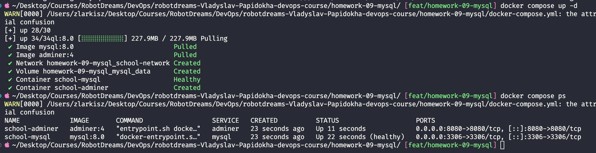

```bash
docker compose ps
```

**Результат:** Контейнери `school-mysql` (healthy) та `school-adminer` запущені.

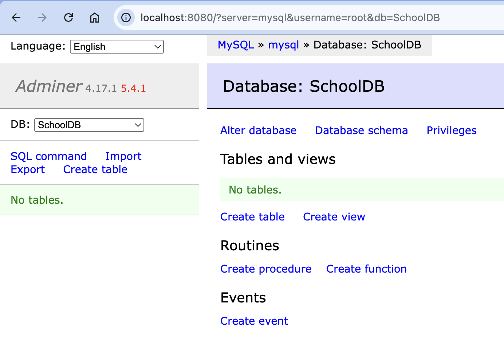

---

### 1.2 Створення таблиць

**Підключення до MySQL CLI:**

```bash
docker exec -it school-mysql mysql -u root -prootpassword SchoolDB
```

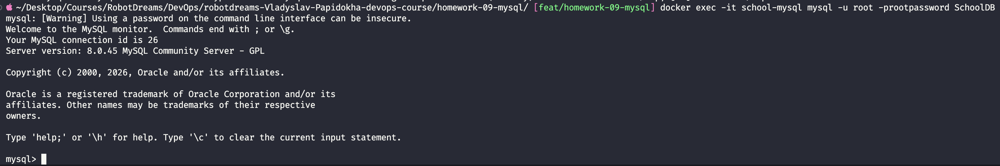

#### Таблиця Institutions

```sql
CREATE TABLE Institutions (
    institution_id INT AUTO_INCREMENT PRIMARY KEY,
    institution_name VARCHAR(100) NOT NULL,
    institution_type ENUM('School', 'Kindergarten') NOT NULL,
    address VARCHAR(255) NOT NULL
);
```

| Поле             | Тип                | Опис                           |
| ---------------- | ------------------ | ------------------------------ |
| institution_id   | INT AUTO_INCREMENT | Унікальний ID (первинний ключ) |
| institution_name | VARCHAR(100)       | Назва закладу                  |
| institution_type | ENUM               | Тип: School або Kindergarten   |
| address          | VARCHAR(255)       | Адреса                         |

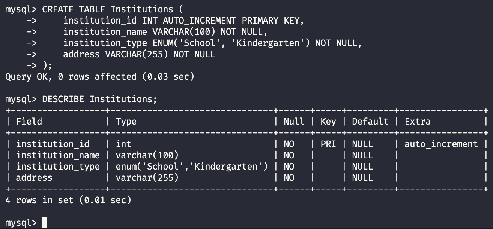

#### Таблиця Classes

```sql
CREATE TABLE Classes (
    class_id INT AUTO_INCREMENT PRIMARY KEY,
    class_name VARCHAR(50) NOT NULL,
    institution_id INT NOT NULL,
    direction ENUM('Mathematics', 'Biology and Chemistry', 'Language Studies') NOT NULL,
    FOREIGN KEY (institution_id) REFERENCES Institutions(institution_id)
);
```

| Поле           | Тип                | Опис                   |
| -------------- | ------------------ | ---------------------- |
| class_id       | INT AUTO_INCREMENT | Унікальний ID          |
| class_name     | VARCHAR(50)        | Назва класу            |
| institution_id | INT (FK)           | Зв'язок з Institutions |
| direction      | ENUM               | Напрям навчання        |

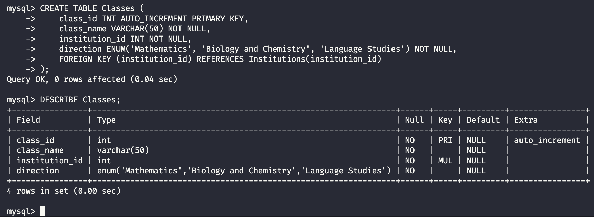

#### Таблиця Children

```sql
CREATE TABLE Children (
    child_id INT AUTO_INCREMENT PRIMARY KEY,
    first_name VARCHAR(50) NOT NULL,
    last_name VARCHAR(50) NOT NULL,
    birth_date DATE NOT NULL,
    year_of_entry INT NOT NULL,
    age INT NOT NULL,
    institution_id INT NOT NULL,
    class_id INT NOT NULL,
    FOREIGN KEY (institution_id) REFERENCES Institutions(institution_id),
    FOREIGN KEY (class_id) REFERENCES Classes(class_id)
);
```

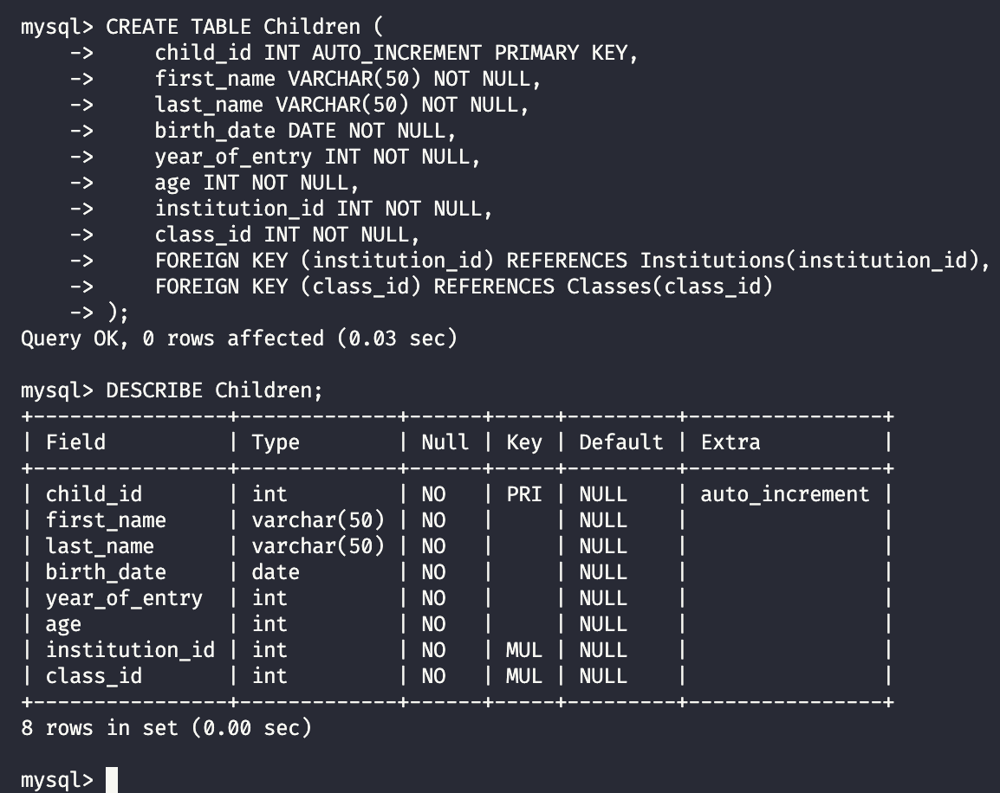

#### Таблиця Parents

```sql
CREATE TABLE Parents (
    parent_id INT AUTO_INCREMENT PRIMARY KEY,
    first_name VARCHAR(50) NOT NULL,
    last_name VARCHAR(50) NOT NULL,
    child_id INT NOT NULL,
    tuition_fee DECIMAL(10, 2) NOT NULL,
    FOREIGN KEY (child_id) REFERENCES Children(child_id)
);
```

| Поле        | Тип           | Опис                                            |
| ----------- | ------------- | ----------------------------------------------- |
| tuition_fee | DECIMAL(10,2) | Вартість навчання (точні обчислення для грошей) |

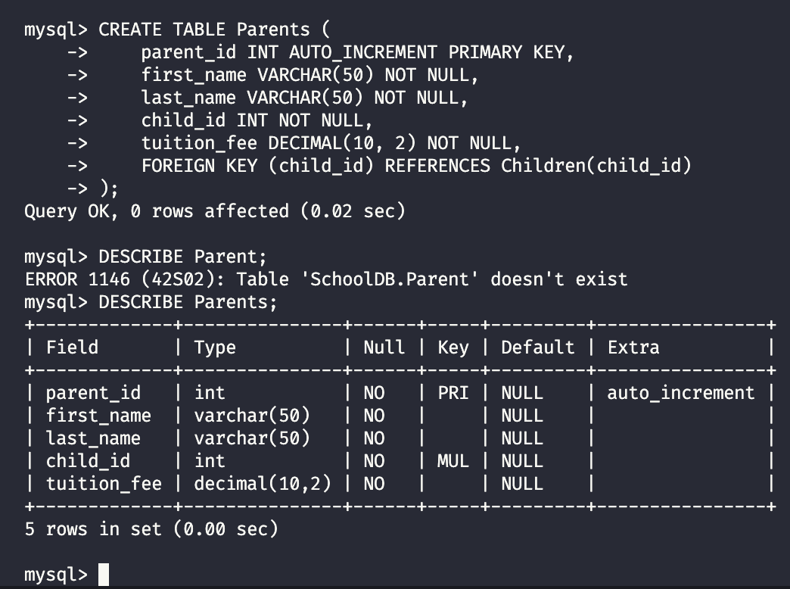

---

### 1.3 Схема бази даних

```
┌─────────────────┐       ┌─────────────────┐
│  Institutions   │       │     Classes     │
├─────────────────┤       ├─────────────────┤
│ institution_id  │◄──┐   │ class_id        │
│ institution_name│   │   │ class_name      │
│ institution_type│   └───│ institution_id  │ (FK)
│ address         │       │ direction       │
└─────────────────┘       └────────┬────────┘
        ▲                          │
        │                          │
        │    ┌─────────────────┐   │
        │    │    Children     │   │
        │    ├─────────────────┤   │
        │    │ child_id        │   │
        │    │ first_name      │   │
        │    │ last_name       │   │
        │    │ birth_date      │   │
        │    │ year_of_entry   │   │
        │    │ age             │   │
        └────│ institution_id  │ (FK)
             │ class_id        │◄──┘ (FK)
             └────────┬────────┘
                      │
                      ▼
             ┌─────────────────┐
             │    Parents      │
             ├─────────────────┤
             │ parent_id       │
             │ first_name      │
             │ last_name       │
             │ child_id        │ (FK)
             │ tuition_fee     │
             └─────────────────┘
```

**Типи зв'язків:**

- Institutions → Classes: **One-to-Many** (один заклад має багато класів)
- Institutions → Children: **One-to-Many**
- Classes → Children: **One-to-Many**
- Children → Parents: **One-to-Many** (одна дитина може мати кількох батьків)

---

## Частина 2: Заповнення даними

### Institutions

```sql
INSERT INTO Institutions (institution_name, institution_type, address) VALUES
('School No.15', 'School', '10 Main Street, Kyiv'),
('Intellect Lyceum', 'School', '25 Science Ave, Lviv'),
('Sunshine Kindergarten', 'Kindergarten', '5 Park Road, Odesa'),
('Gymnasium No.1', 'School', '100 Victory Blvd, Kharkiv');
```

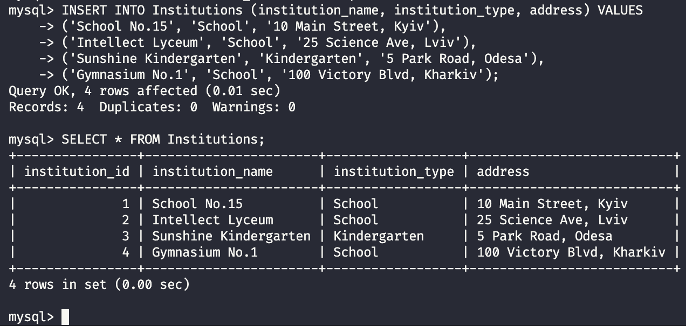

### Classes

```sql
INSERT INTO Classes (class_name, institution_id, direction) VALUES
('1-A', 1, 'Mathematics'),
('5-B', 1, 'Language Studies'),
('3-C', 2, 'Biology and Chemistry'),
('Bunnies Group', 3, 'Language Studies'),
('10-A', 4, 'Mathematics'),
('7-B', 4, 'Biology and Chemistry');
```

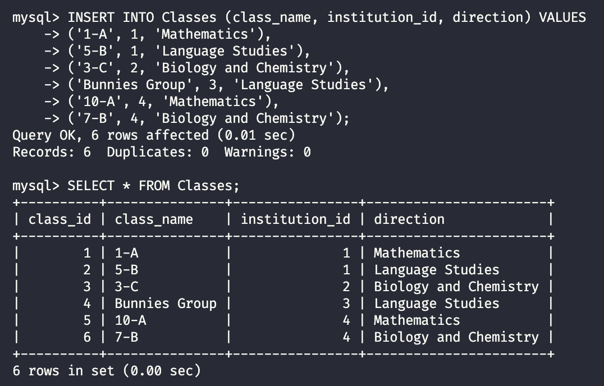

### Children

```sql
INSERT INTO Children (first_name, last_name, birth_date, year_of_entry, age, institution_id, class_id) VALUES
('Ivan', 'Petrenko', '2017-03-15', 2023, 7, 1, 1),
('Maria', 'Kovalenko', '2012-07-22', 2018, 12, 1, 2),
('Oleksandr', 'Shevchenko', '2014-01-10', 2020, 10, 2, 3),
('Anna', 'Bondarenko', '2020-11-05', 2024, 4, 3, 4),
('Dmytro', 'Melnyk', '2009-05-30', 2015, 15, 4, 5),
('Sofia', 'Kravchuk', '2011-09-18', 2017, 13, 4, 6);
```

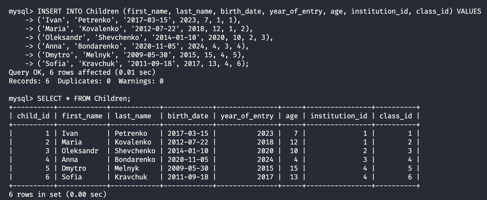

### Parents

```sql
INSERT INTO Parents (first_name, last_name, child_id, tuition_fee) VALUES
('Petro', 'Petrenko', 1, 5000.00),
('Olena', 'Petrenko', 1, 5000.00),
('Viktor', 'Kovalenko', 2, 4500.00),
('Natalia', 'Shevchenko', 3, 6000.00),
('Andriy', 'Bondarenko', 4, 3500.00),
('Iryna', 'Melnyk', 5, 7000.00),
('Serhiy', 'Kravchuk', 6, 7000.00);
```

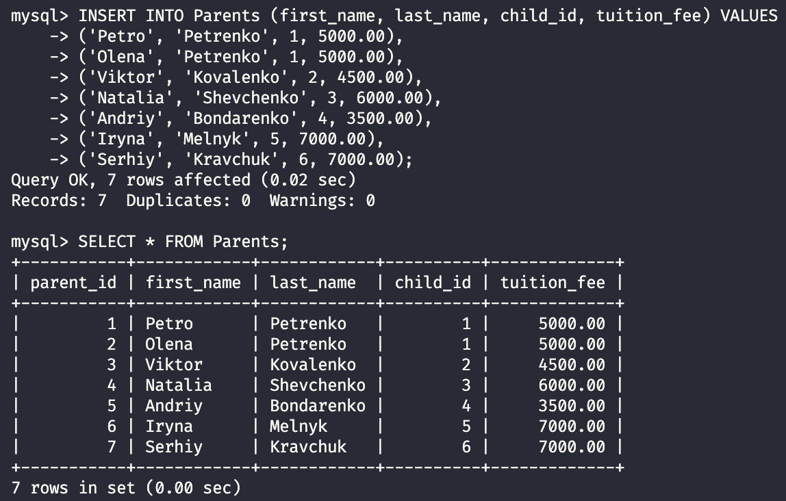

---

## Частина 3: SQL запити

### 3.1 Діти з закладами та напрямами

**Завдання:** Отримати список всіх дітей разом із закладом та напрямом навчання.

```sql
SELECT
    c.first_name,
    c.last_name,
    c.age,
    i.institution_name,
    i.institution_type,
    cl.class_name,
    cl.direction
FROM Children c
JOIN Institutions i ON c.institution_id = i.institution_id
JOIN Classes cl ON c.class_id = cl.class_id;
```

**Пояснення JOIN:**

- `FROM Children c` — основна таблиця (alias `c`)
- `JOIN Institutions i ON ...` — приєднуємо заклади по `institution_id`
- `JOIN Classes cl ON ...` — приєднуємо класи по `class_id`

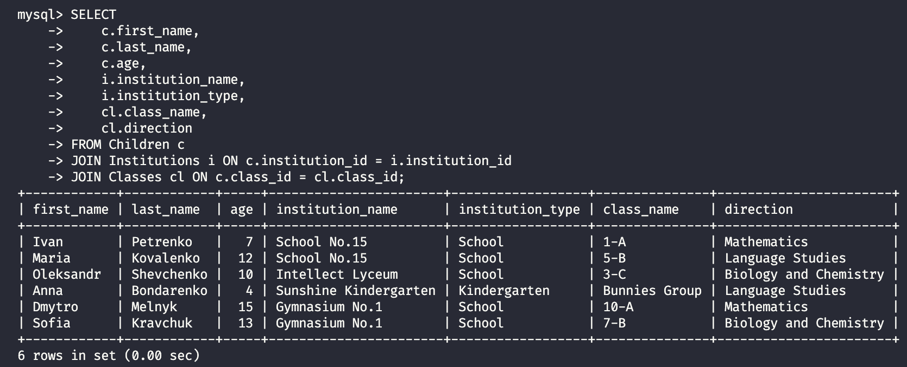

---

### 3.2 Батьки з дітьми та вартістю

**Завдання:** Отримати інформацію про батьків і їхніх дітей разом із вартістю навчання.

```sql
SELECT
    p.first_name AS parent_first_name,
    p.last_name AS parent_last_name,
    c.first_name AS child_first_name,
    c.last_name AS child_last_name,
    p.tuition_fee
FROM Parents p
JOIN Children c ON p.child_id = c.child_id;
```

**Пояснення:**

- `AS` — alias для перейменування колонок в результаті
- Ivan Petrenko з'являється двічі — у нього двоє батьків

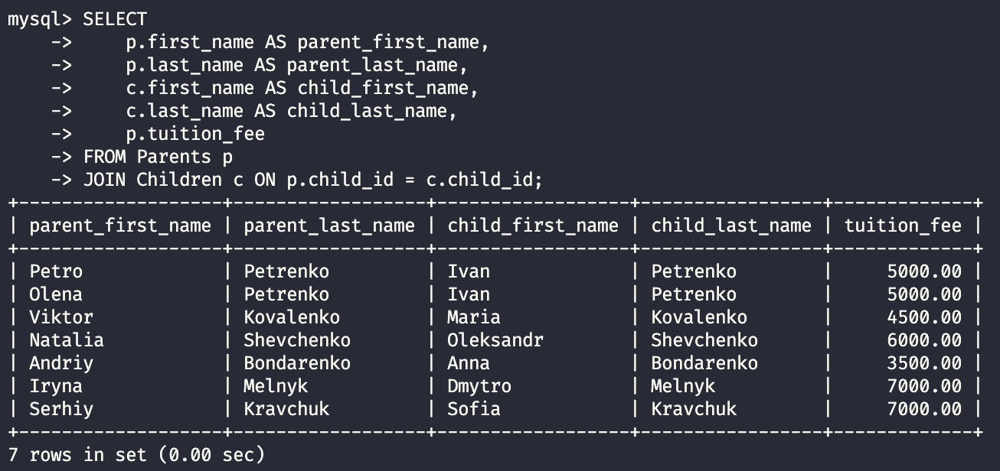

---

### 3.3 Заклади з кількістю дітей

**Завдання:** Отримати список всіх закладів з кількістю дітей.

```sql
SELECT
    i.institution_name,
    i.address,
    COUNT(c.child_id) AS children_count
FROM Institutions i
LEFT JOIN Children c ON i.institution_id = c.institution_id
GROUP BY i.institution_id, i.institution_name, i.address;
```

**Пояснення:**

- `COUNT()` — агрегатна функція для підрахунку
- `GROUP BY` — групування результатів по закладах
- `LEFT JOIN` — покаже заклади навіть з 0 дітей

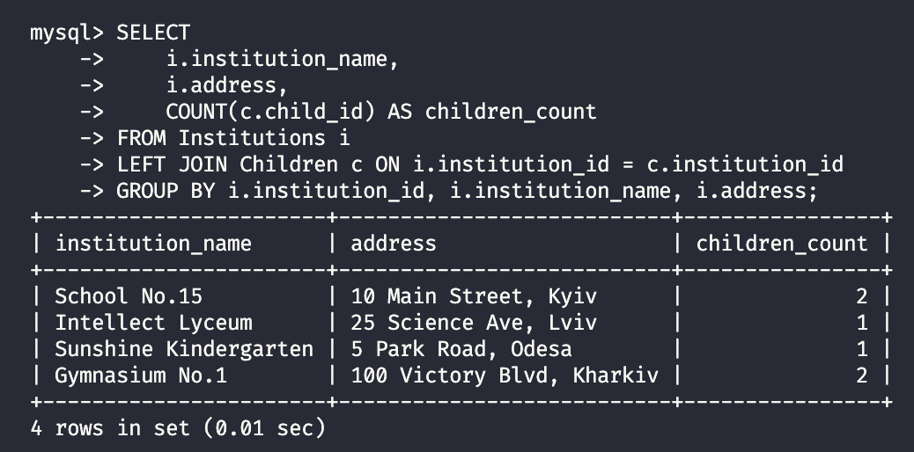

---

## Частина 4: Backup та Restore

### 4.1 Створення backup

```bash
docker exec school-mysql mysqldump -u root -prootpassword SchoolDB > backup_schooldb.sql
```

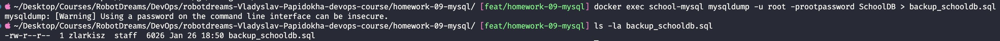

### 4.2 Restore в нову базу

```bash
# Створити нову базу даних
docker exec school-mysql mysql -u root -prootpassword -e "CREATE DATABASE SchoolDB_Restored;"

# Відновити дані з backup
docker exec -i school-mysql mysql -u root -prootpassword SchoolDB_Restored < backup_schooldb.sql
```

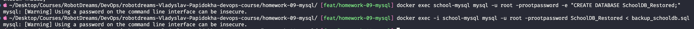

### 4.3 Перевірка цілісності

```bash
docker exec -it school-mysql mysql -u root -prootpassword SchoolDB_Restored
```

```sql
SHOW TABLES;
SELECT COUNT(*) FROM Children;
SELECT COUNT(*) FROM Parents;
```

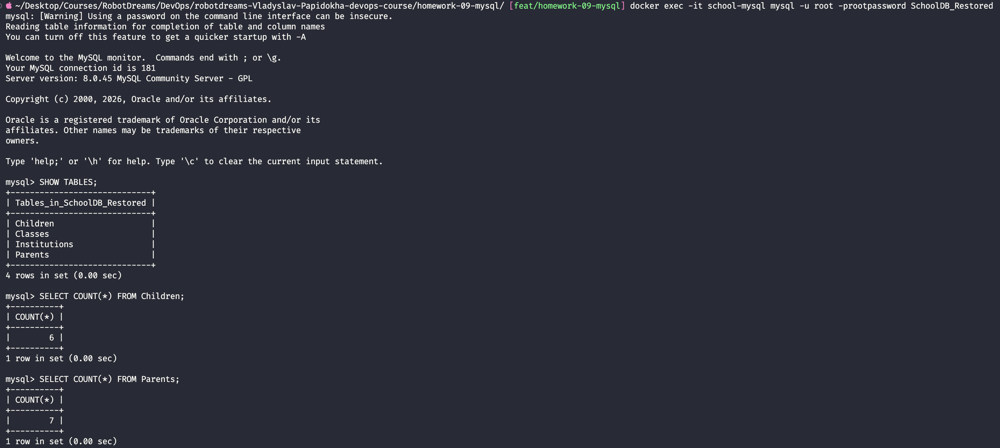

**Результат:** 4 таблиці, 6 дітей, 7 батьків — дані відновлено успішно!

---

## Частина 5: Анонімізація даних

### 5.1 Анонімізація Children

```sql
UPDATE Children
SET first_name = 'Child',
    last_name = CONCAT('Anonymous', child_id);
```

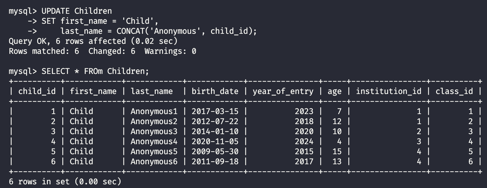

### 5.2 Анонімізація Parents

```sql
UPDATE Parents
SET first_name = CONCAT('Parent', parent_id),
    last_name = 'Anonymous';
```

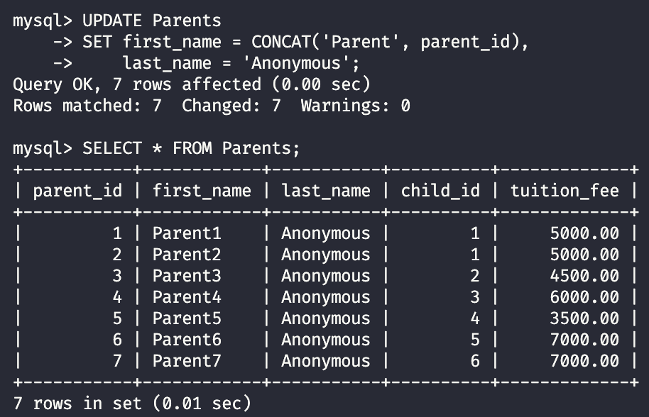

### 5.3 Анонімізація Institutions

```sql
UPDATE Institutions
SET institution_name = CONCAT('Institution', institution_id),
    address = CONCAT('Address ', institution_id);
```

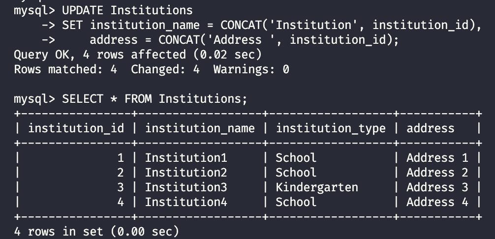

### 5.4 Анонімізація фінансових даних

```sql
UPDATE Parents
SET tuition_fee = ROUND(4000 + (RAND() * 2000), 2);
```

**Пояснення:**

- `RAND()` — випадкове число 0-1
- `RAND() * 2000` — випадкове число 0-2000
- `4000 + ...` — зміщення до діапазону 4000-6000
- `ROUND(..., 2)` — округлення до 2 знаків

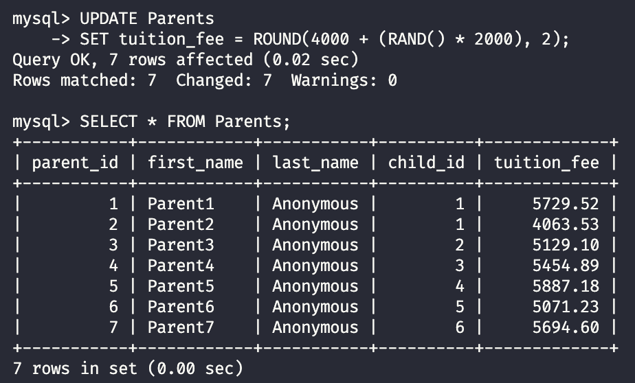

### 5.5 Фінальна перевірка

```sql
SELECT
    c.first_name AS child_name,
    c.last_name AS child_lastname,
    i.institution_name,
    p.first_name AS parent_name,
    p.tuition_fee
FROM Children c
JOIN Institutions i ON c.institution_id = i.institution_id
JOIN Parents p ON c.child_id = p.child_id;
```

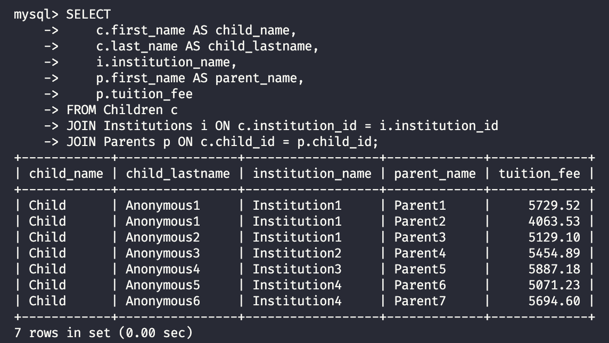

**Результат анонімізації:**

- ✅ Імена дітей → Child Anonymous1, Anonymous2...
- ✅ Імена батьків → Parent1, Parent2...
- ✅ Назви закладів → Institution1, Institution2...
- ✅ Фінансові дані → випадкові суми 4000-6000

---

## Висновки

| Завдання                                  | Статус |
| ----------------------------------------- | ------ |
| Створення бази даних SchoolDB             | ✅     |
| Створення 4 таблиць з FOREIGN KEY         | ✅     |
| Заповнення даними (3+ записів на таблицю) | ✅     |
| Запит 1: Діти з закладами                 | ✅     |
| Запит 2: Батьки з дітьми                  | ✅     |
| Запит 3: Заклади з кількістю дітей        | ✅     |
| Backup бази даних                         | ✅     |
| Restore в нову базу                       | ✅     |
| Анонімізація Children                     | ✅     |
| Анонімізація Parents                      | ✅     |
| Анонімізація Institutions                 | ✅     |
| Анонімізація фінансових даних             | ✅     |

### Ключові концепції

1. **PRIMARY KEY** — унікальний ідентифікатор рядка
2. **FOREIGN KEY** — зв'язок між таблицями, гарантує цілісність даних
3. **AUTO_INCREMENT** — автоматична генерація ID
4. **JOIN** — об'єднання даних з кількох таблиць
5. **GROUP BY + COUNT** — агрегація даних
6. **mysqldump** — створення backup бази даних
7. **UPDATE** — оновлення даних для анонімізації

---

## Корисні команди

```bash
# Docker
docker compose up -d              # Запустити контейнери
docker compose down               # Зупинити контейнери
docker compose down -v            # Зупинити та видалити volumes
docker compose ps                 # Статус контейнерів

# MySQL CLI
docker exec -it school-mysql mysql -u root -prootpassword SchoolDB

# Backup
docker exec school-mysql mysqldump -u root -prootpassword SchoolDB > backup.sql

# Restore
docker exec -i school-mysql mysql -u root -prootpassword DATABASE_NAME < backup.sql
```

### SQL команди

```sql
-- Структура
SHOW TABLES;
DESCRIBE table_name;

-- Вибірка
SELECT * FROM table_name;
SELECT column1, column2 FROM table_name WHERE condition;

-- JOIN
SELECT * FROM table1
JOIN table2 ON table1.id = table2.foreign_id;

-- Агрегація
SELECT column, COUNT(*) FROM table_name GROUP BY column;

-- Оновлення
UPDATE table_name SET column = value WHERE condition;
```

---

## Структура проекту

```
homework-09-mysql/
├── docker-compose.yml
├── scripts/
│   ├── 01-create-tables.sql
│   ├── 02-insert-data.sql
│   ├── 03-queries.sql
│   ├── 04-anonymization.sql
│   └── backup_schooldb.sql
├── screenshots/
│   ├── 01-docker-compose-up.png
│   ├── 02-adminer-empty.png
│   ├── ...
│   └── 22-final-anonymization.png
└── README.md
```

---

## Використані технології

- Docker 29.1.3
- MySQL 8.0
- Adminer 4.x
- macOS (Apple Silicon M1)
