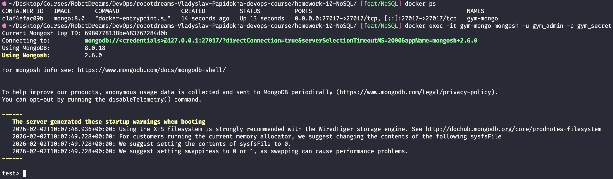
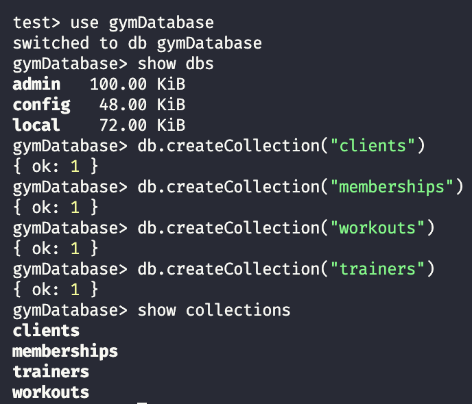
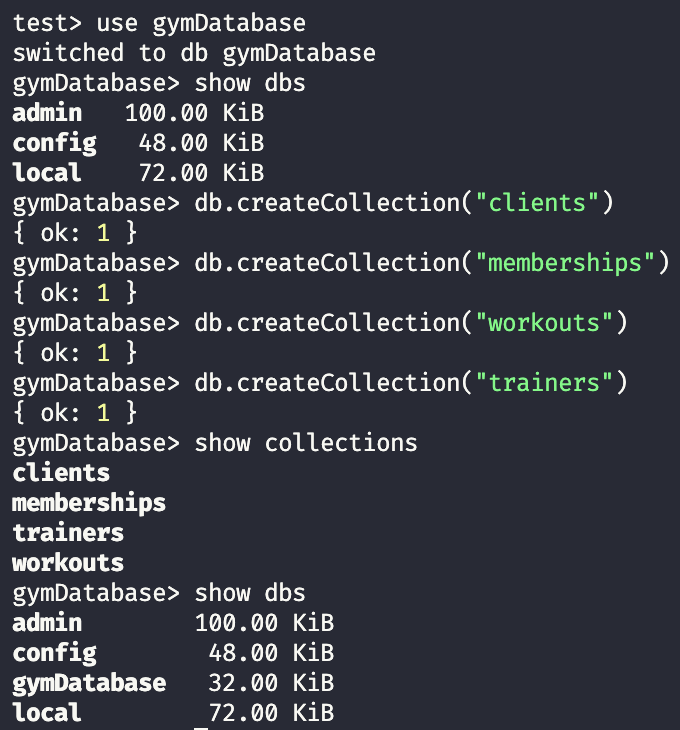
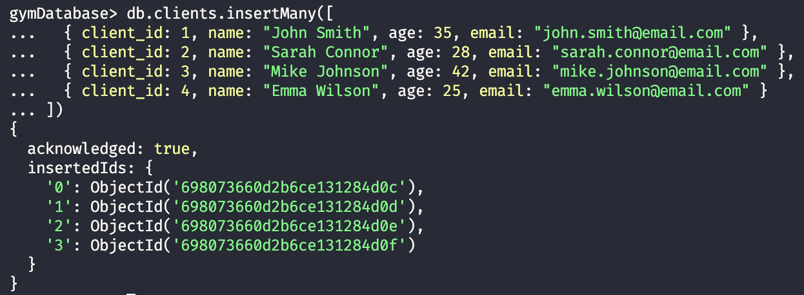
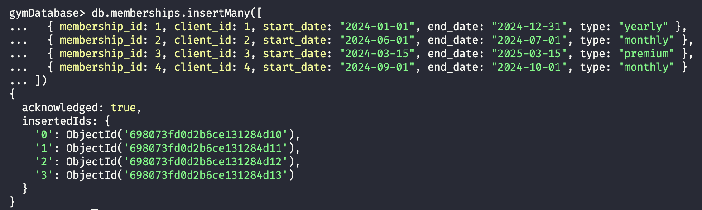
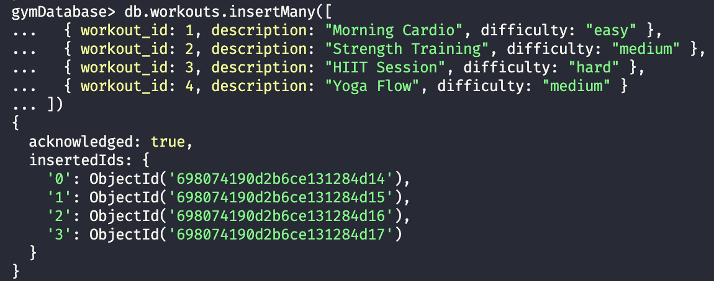
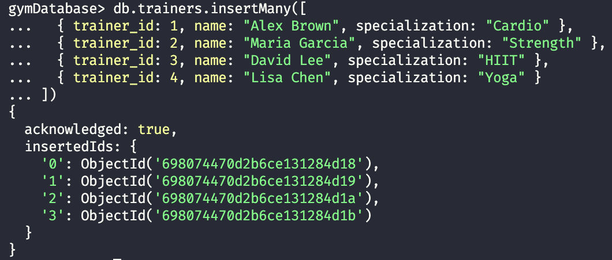
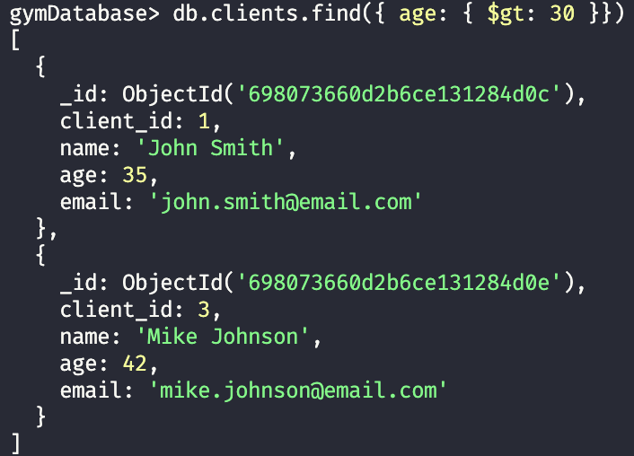
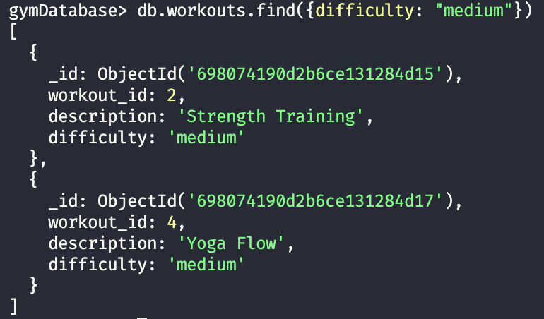
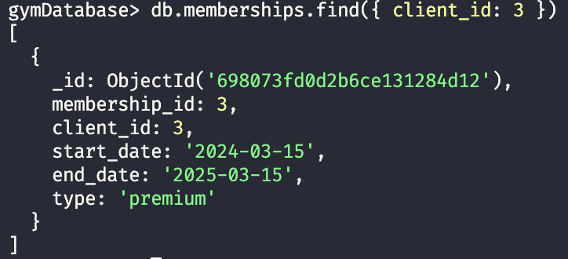

# Homework 10: MongoDB - GymDatabase

## Зміст

- [Опис завдання](#опис-завдання)
- [Середовище](#середовище)
- [Швидкий старт](#швидкий-старт)
- [Частина 1: Створення бази даних](#частина-1-створення-бази-даних)
  - [1.1 Запуск MongoDB](#11-запуск-mongodb)
  - [1.2 Підключення до MongoDB](#12-підключення-до-mongodb)
  - [1.3 Створення колекцій](#13-створення-колекцій)
- [Частина 2: Заповнення даними](#частина-2-заповнення-даними)
  - [2.1 Clients](#21-clients)
  - [2.2 Memberships](#22-memberships)
  - [2.3 Workouts](#23-workouts)
  - [2.4 Trainers](#24-trainers)
- [Частина 3: Запити](#частина-3-запити)
  - [3.1 Клієнти віком понад 30 років](#31-клієнти-віком-понад-30-років)
  - [3.2 Тренування із середньою складністю](#32-тренування-із-середньою-складністю)
  - [3.3 Членство клієнта за client_id](#33-членство-клієнта-за-client_id)
- [Порівняння MongoDB vs MySQL](#порівняння-mongodb-vs-mysql)
- [Висновки](#висновки)
- [Корисні команди](#корисні-команди)

---

## Опис завдання

Створення NoSQL бази даних для спортзалу з колекціями:

- **clients** — клієнти спортзалу
- **memberships** — абонементи клієнтів
- **workouts** — типи тренувань
- **trainers** — тренери

---

## Середовище

| Параметр | Значення                 |
| -------- | ------------------------ |
| OS       | macOS (Apple Silicon M1) |
| Docker   | 29.1.3                   |
| MongoDB  | 8.0 (Docker container)   |
| Shell    | mongosh 2.6.0            |

---

## Швидкий старт

```bash
# Клонувати репозиторій та перейти в директорію
cd homework-10-NoSQL

# Запустити контейнер
docker-compose up -d

# Перевірити статус
docker ps

# Підключитися до MongoDB
docker exec -it gym-mongo mongosh -u gym_admin -p gym_secret
```

---

## Частина 1: Створення бази даних

### 1.1 Запуск MongoDB

**docker-compose.yml:**

```yaml
services:
  mongodb:
    image: mongo:8.0
    container_name: gym-mongo
    ports:
      - "27017:27017"
    environment:
      MONGO_INITDB_ROOT_USERNAME: gym_admin
      MONGO_INITDB_ROOT_PASSWORD: gym_secret
    volumes:
      - mongo_data:/data/db

volumes:
  mongo_data:
```

```bash
docker-compose up -d
```



---

### 1.2 Підключення до MongoDB

```bash
docker exec -it gym-mongo mongosh -u gym_admin -p gym_secret
```



---

### 1.3 Створення колекцій

**Перемикання на базу даних:**

```javascript
use gymDatabase
```

**Створення колекцій:**

```javascript
db.createCollection("clients");
db.createCollection("memberships");
db.createCollection("workouts");
db.createCollection("trainers");
```

**Перевірка:**

```javascript
show collections
show dbs
```



**Результат:** 4 колекції створено, база `gymDatabase` з'явилась у списку баз даних.

---

## Частина 2: Заповнення даними

### 2.1 Clients

**Схема документа:** `client_id`, `name`, `age`, `email`

```javascript
db.clients.insertMany([
  { client_id: 1, name: "John Smith", age: 35, email: "john.smith@email.com" },
  {
    client_id: 2,
    name: "Sarah Connor",
    age: 28,
    email: "sarah.connor@email.com",
  },
  {
    client_id: 3,
    name: "Mike Johnson",
    age: 42,
    email: "mike.johnson@email.com",
  },
  {
    client_id: 4,
    name: "Emma Wilson",
    age: 25,
    email: "emma.wilson@email.com",
  },
]);
```



**Результат:** 4 клієнти додані (2 старші 30 років, 2 молодші).

---

### 2.2 Memberships

**Схема документа:** `membership_id`, `client_id`, `start_date`, `end_date`, `type`

```javascript
db.memberships.insertMany([
  {
    membership_id: 1,
    client_id: 1,
    start_date: "2024-01-01",
    end_date: "2024-12-31",
    type: "yearly",
  },
  {
    membership_id: 2,
    client_id: 2,
    start_date: "2024-06-01",
    end_date: "2024-07-01",
    type: "monthly",
  },
  {
    membership_id: 3,
    client_id: 3,
    start_date: "2024-03-15",
    end_date: "2025-03-15",
    type: "premium",
  },
  {
    membership_id: 4,
    client_id: 4,
    start_date: "2024-09-01",
    end_date: "2024-10-01",
    type: "monthly",
  },
]);
```



**Примітка:** `client_id` — посилання на документ у колекції `clients` (аналог FOREIGN KEY в SQL, але без автоматичної перевірки).

---

### 2.3 Workouts

**Схема документа:** `workout_id`, `description`, `difficulty`

```javascript
db.workouts.insertMany([
  { workout_id: 1, description: "Morning Cardio", difficulty: "easy" },
  { workout_id: 2, description: "Strength Training", difficulty: "medium" },
  { workout_id: 3, description: "HIIT Session", difficulty: "hard" },
  { workout_id: 4, description: "Yoga Flow", difficulty: "medium" },
]);
```



**Результат:** 4 тренування додані (2 з difficulty: "medium" для тестування запиту).

---

### 2.4 Trainers

**Схема документа:** `trainer_id`, `name`, `specialization`

```javascript
db.trainers.insertMany([
  { trainer_id: 1, name: "Alex Brown", specialization: "Cardio" },
  { trainer_id: 2, name: "Maria Garcia", specialization: "Strength" },
  { trainer_id: 3, name: "David Lee", specialization: "HIIT" },
  { trainer_id: 4, name: "Lisa Chen", specialization: "Yoga" },
]);
```



---

## Частина 3: Запити

### 3.1 Клієнти віком понад 30 років

```javascript
db.clients.find({ age: { $gt: 30 } });
```

**Пояснення:**

- `find({})` — метод пошуку документів
- `$gt` — оператор "greater than" (більше ніж)
- `{ age: { $gt: 30 } }` — знайти документи де age > 30



**Результат:** John Smith (35) та Mike Johnson (42).

---

### 3.2 Тренування із середньою складністю

```javascript
db.workouts.find({ difficulty: "medium" });
```

**Пояснення:**

- Пошук за точним значенням поля
- Не потребує спеціальних операторів



**Результат:** Strength Training та Yoga Flow.

---

### 3.3 Членство клієнта за client_id

```javascript
db.memberships.find({ client_id: 3 });
```

**Пояснення:**

- Пошук абонементу для конкретного клієнта (Mike Johnson)
- Демонструє зв'язок між колекціями через спільне поле



**Результат:** Premium абонемент з терміном дії 2024-03-15 до 2025-03-15.

---

## Порівняння MongoDB vs MySQL

| Аспект       | MySQL (SQL)                     | MongoDB (NoSQL)                   |
| ------------ | ------------------------------- | --------------------------------- |
| Структура    | Таблиці з рядками               | Колекції з документами            |
| Схема        | Фіксована (CREATE TABLE)        | Гнучка (JSON-подібна)             |
| Мова запитів | SQL                             | JavaScript-подібний синтаксис     |
| Зв'язки      | FOREIGN KEY + JOIN              | Посилання або вкладені документи  |
| ID           | AUTO_INCREMENT                  | ObjectId (автоматично)            |
| Вибірка      | `SELECT * FROM table WHERE ...` | `db.collection.find({...})`       |
| Вставка      | `INSERT INTO table VALUES ...`  | `db.collection.insertMany([...])` |

### Приклад порівняння запитів

**SQL (MySQL):**

```sql
SELECT * FROM clients WHERE age > 30;
```

**NoSQL (MongoDB):**

```javascript
db.clients.find({ age: { $gt: 30 } });
```

---

## Висновки

| Завдання                                 | Статус |
| ---------------------------------------- | ------ |
| Запуск MongoDB в Docker                  | ✅     |
| Створення бази gymDatabase               | ✅     |
| Створення колекції clients               | ✅     |
| Створення колекції memberships           | ✅     |
| Створення колекції workouts              | ✅     |
| Створення колекції trainers              | ✅     |
| Заповнення даними (4 записи на колекцію) | ✅     |
| Запит: клієнти віком > 30                | ✅     |
| Запит: тренування medium складності      | ✅     |
| Запит: членство за client_id             | ✅     |

### Ключові концепції MongoDB

1. **Document** — одиничний запис у колекції (аналог рядка в SQL)
2. **Collection** — група документів (аналог таблиці)
3. **ObjectId** — унікальний ідентифікатор документа, генерується автоматично
4. **BSON** — бінарний JSON, формат зберігання даних
5. **Оператори запитів** — `$gt`, `$lt`, `$eq`, `$in` тощо
6. **Гнучка схема** — документи в одній колекції можуть мати різні поля

---

## Корисні команди

### Docker

```bash
# Запустити контейнер
docker-compose up -d

# Зупинити контейнер
docker-compose down

# Зупинити та видалити volumes
docker-compose down -v

# Перевірити статус
docker ps

# Логи контейнера
docker-compose logs -f
```

### MongoDB Shell

```javascript
// Підключення
docker exec -it gym-mongo mongosh -u gym_admin -p gym_secret

// Навігація
show dbs                    // Список баз даних
use dbName                  // Перемкнутися на базу
show collections            // Список колекцій

// CRUD операції
db.collection.insertOne({}) // Додати один документ
db.collection.insertMany([])// Додати багато документів
db.collection.find({})      // Знайти документи
db.collection.findOne({})   // Знайти один документ
db.collection.updateOne()   // Оновити один документ
db.collection.deleteOne()   // Видалити один документ

// Оператори порівняння
$gt   // greater than (>)
$gte  // greater than or equal (>=)
$lt   // less than (<)
$lte  // less than or equal (<=)
$eq   // equal (==)
$ne   // not equal (!=)
$in   // in array

// Вихід
exit
```

---

## Структура проекту

```
homework-10-NoSQL/
├── docker-compose.yml
├── screenshots/
│   ├── 01-docker-compose-up.png
│   ├── 02-mongodb-connect.png
│   ├── 03-create-collections.png
│   ├── 04-insert-clients.png
│   ├── 05-insert-memberships.png
│   ├── 06-insert-workouts.png
│   ├── 07-insert-trainers.png
│   ├── 08-query-clients-age.png
│   ├── 09-query-workouts-medium.png
│   └── 10-query-membership.png
└── README.md
```

---

## Використані технології

- Docker 29.1.3
- MongoDB 8.0
- mongosh 2.6.0
- macOS (Apple Silicon M1)
