# Homework 21: Terraform Modules та Import

## Зміст

- [Опис завдання](#опис-завдання)
- [Архітектура](#архітектура)
- [Частина 1: Terraform Modules](#частина-1-terraform-modules)
  - [1.1 Структура проекту](#11-структура-проекту)
  - [1.2 Модуль VPC](#12-модуль-vpc)
  - [1.3 Модуль Subnets](#13-модуль-subnets)
  - [1.4 Модуль EC2](#14-модуль-ec2)
  - [1.5 Ініціалізація та застосування](#15-ініціалізація-та-застосування)
  - [1.6 Результати в AWS Console](#16-результати-в-aws-console)
- [Частина 2: Terraform Import](#частина-2-terraform-import)
  - [2.1 Створення ресурсу вручну](#21-створення-ресурсу-вручну)
  - [2.2 Імпорт в Terraform](#22-імпорт-в-terraform)
- [Висновки](#висновки)
- [Корисні команди](#корисні-команди)

---

## Опис завдання

**Мета:** Створити VPC з двома серверами (публічний та приватний) за допомогою Terraform модулів, а також продемонструвати імпорт існуючих ресурсів.

**Завдання:**

1. Створити модуль для VPC
2. Створити модуль для підмереж (Subnets)
3. Створити модуль для EC2-інстансів
4. Використати модулі в основному конфігураційному файлі
5. Імпортувати існуючі ресурси в Terraform

---

## Архітектура

```
┌─────────────────────────────────────────────────────────────────────────────┐
│                          VPC (10.0.0.0/16)                                  │
│                                                                             │
│   ┌─────────────────────────────┐    ┌─────────────────────────────┐        │
│   │    Public Subnet            │    │    Private Subnet           │        │
│   │    10.0.1.0/24              │    │    10.0.2.0/24              │        │
│   │                             │    │                             │        │
│   │  ┌─────────────────────┐    │    │  ┌─────────────────────┐    │        │
│   │  │   EC2 Instance      │    │    │  │   EC2 Instance      │    │        │
│   │  │   (Public)          │    │    │  │   (Private)         │    │        │
│   │  │   + Public IP       │    │    │  │   No Public IP      │    │        │
│   │  │   + nginx           │    │    │  │   Isolated          │    │        │
│   │  └─────────────────────┘    │    │  └─────────────────────┘    │        │
│   │                             │    │                             │        │
│   │  Route Table:               │    │  Route Table:               │        │
│   │  0.0.0.0/0 → IGW            │    │  (no internet route)        │        │
│   └─────────────────────────────┘    └─────────────────────────────┘        │
│                    │                                                        │
│                    ▼                                                        │
│   ┌─────────────────────────────┐                                           │
│   │     Internet Gateway        │                                           │
│   └─────────────────────────────┘                                           │
│                    │                                                        │
└────────────────────│────────────────────────────────────────────────────────┘
                     │
                     ▼
              🌐 Internet
```

---

## Частина 1: Terraform Modules

### 1.1 Структура проекту

```
homework-11-terraform/
├── main.tf              # Головний файл — використовує модулі
├── variables.tf         # Глобальні змінні
├── outputs.tf           # Вихідні значення
├── providers.tf         # Налаштування AWS Provider
├── import.tf            # Імпортований S3 bucket
│
└── modules/
    ├── vpc/             # Модуль VPC
    │   ├── main.tf
    │   ├── variables.tf
    │   └── outputs.tf
    │
    ├── subnets/         # Модуль підмереж
    │   ├── main.tf
    │   ├── variables.tf
    │   └── outputs.tf
    │
    └── ec2/             # Модуль EC2
        ├── main.tf
        ├── variables.tf
        └── outputs.tf
```

### 1.2 Модуль VPC

**Що створює:**

- VPC з CIDR 10.0.0.0/16
- Internet Gateway для виходу в інтернет

**Ключові концепції:**

| Ресурс           | Призначення                   |
| ---------------- | ----------------------------- |
| VPC              | Ізольована мережа в AWS       |
| Internet Gateway | "Двері" для виходу в інтернет |

### 1.3 Модуль Subnets

**Що створює:**

- Public Subnet (10.0.1.0/24) — з маршрутом в інтернет
- Private Subnet (10.0.2.0/24) — без маршруту в інтернет
- Route Tables для кожної підмережі

**Різниця між публічною та приватною підмережею:**

| Аспект             | Public Subnet               | Private Subnet                |
| ------------------ | --------------------------- | ----------------------------- |
| Route Table        | 0.0.0.0/0 → IGW             | Без маршруту в інтернет       |
| Public IP          | Так                         | Ні                            |
| Доступ з інтернету | Так                         | Ні                            |
| Використання       | Web-сервери, Load Balancers | Бази даних, внутрішні сервіси |

### 1.4 Модуль EC2

**Що створює:**

- EC2 Instance (t2.micro — Free Tier)
- Security Group з правилами
- User Data скрипт для встановлення nginx

**Security Group правила для публічного сервера:**

| Порт | Протокол | Призначення |
| ---- | -------- | ----------- |
| 22   | TCP      | SSH доступ  |
| 80   | TCP      | HTTP (веб)  |
| 443  | TCP      | HTTPS       |

### 1.5 Ініціалізація та застосування

**Ініціалізація Terraform:**

```bash
terraform init
```

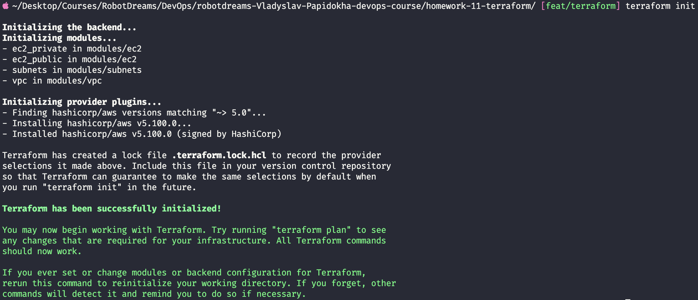

Terraform завантажив AWS provider та ініціалізував модулі.

**Застосування конфігурації:**

```bash
terraform apply
```

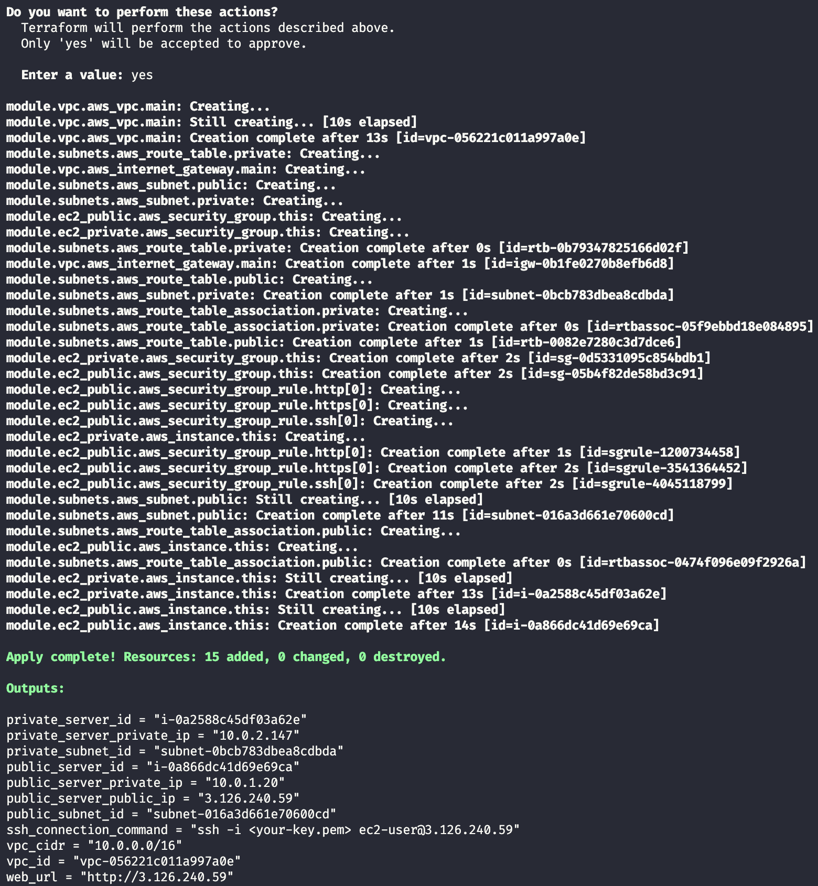

**Результат:** 15 ресурсів створено успішно!

**Перевірка веб-сервера:**

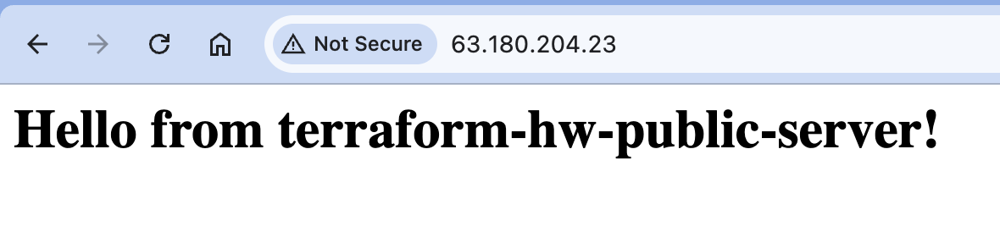

✅ Nginx працює і відповідає "Hello from terraform-hw-public-server!"

### 1.6 Результати в AWS Console

**VPC:**

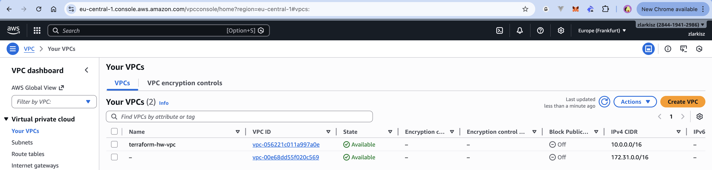

- terraform-hw-vpc з CIDR 10.0.0.0/16

**Subnets:**

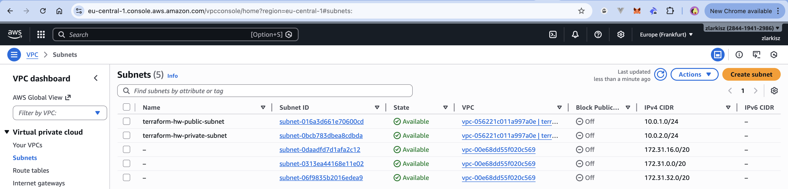

- terraform-hw-public-subnet (10.0.1.0/24)
- terraform-hw-private-subnet (10.0.2.0/24)

**Route Tables:**

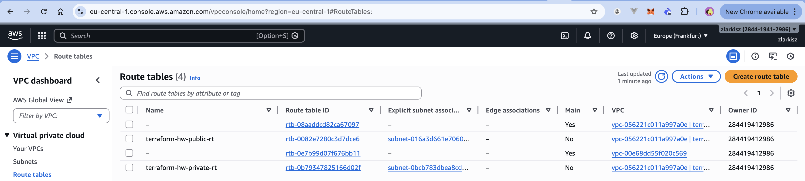

- terraform-hw-public-rt — з маршрутом в інтернет
- terraform-hw-private-rt — без маршруту в інтернет

**EC2 Instances:**

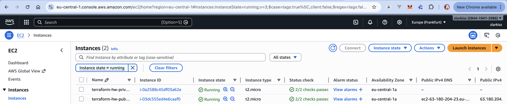

- terraform-hw-public-server — з публічним IP
- terraform-hw-private-server — без публічного IP

**Security Groups:**

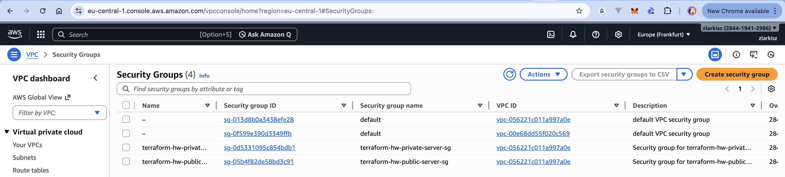

- terraform-hw-public-server-sg — відкриті порти 22, 80, 443
- terraform-hw-private-server-sg — тільки вихідний трафік

---

## Частина 2: Terraform Import

### 2.1 Створення ресурсу вручну

**Що таке Terraform Import?**

Команда для "підключення" існуючого ресурсу (створеного вручну) до Terraform. Це потрібно коли:

- Є legacy інфраструктура, створена до Terraform
- Хтось створив ресурс вручну через AWS Console
- Потрібно перевести інфраструктуру на Infrastructure as Code

**Створення S3 bucket вручну:**

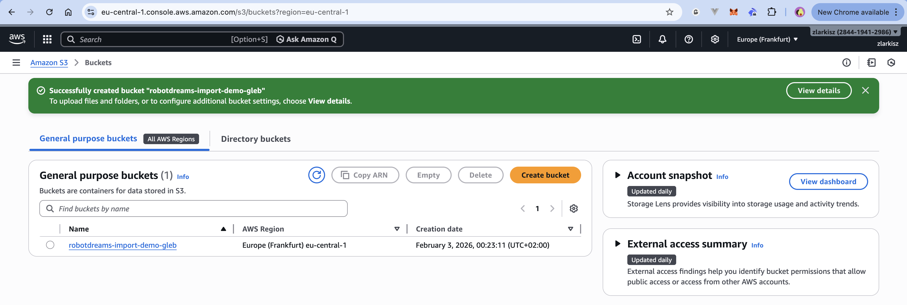

Bucket `robotdreams-import-demo-gleb` створено через AWS Console.

### 2.2 Імпорт в Terraform

**Команда імпорту:**

```bash
terraform import aws_s3_bucket.imported robotdreams-import-demo-gleb
```

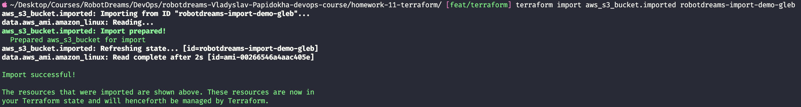

✅ Import successful!

**Перевірка плану:**

```bash
terraform plan
```

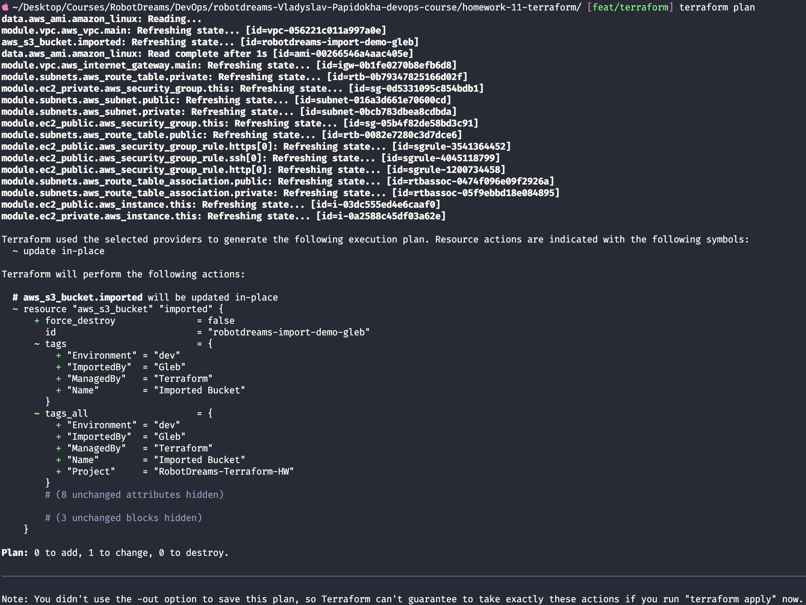

Terraform бачить імпортований bucket і хоче додати теги.

**Застосування змін:**

```bash
terraform apply
```

Terraform додав теги до bucket і тепер повністю керує цим ресурсом.

---

## Висновки

### Що було зроблено:

| Завдання             | Статус |
| -------------------- | ------ |
| Модуль VPC           | ✅     |
| Модуль Subnets       | ✅     |
| Модуль EC2           | ✅     |
| Інфраструктура в AWS | ✅     |
| Веб-сервер працює    | ✅     |
| Terraform Import     | ✅     |

### Ключові концепції:

1. **Terraform Modules** — перевикористовуваний код для інфраструктури (як функції)
2. **VPC** — ізольована мережа в AWS
3. **Public vs Private Subnet** — різниця в Route Table (маршрут до IGW)
4. **Security Groups** — файрвол для EC2
5. **Terraform Import** — підключення існуючих ресурсів до Terraform
6. **Infrastructure as Code** — керування інфраструктурою через код

---

## Корисні команди

```bash
# Ініціалізація Terraform
terraform init

# Перегляд плану (що буде створено/змінено)
terraform plan

# Застосування змін
terraform apply

# Видалення всіх ресурсів
terraform destroy

# Імпорт існуючого ресурсу
terraform import <resource_type>.<n> <resource_id>

# Форматування коду
terraform fmt -recursive

# Валідація конфігурації
terraform validate

# Перегляд state
terraform state list
terraform state show <resource>
```

---

## Використані технології

| Технологія        | Версія                   |
| ----------------- | ------------------------ |
| Terraform         | 1.5.7                    |
| AWS Provider      | 5.100.0                  |
| AWS Region        | eu-central-1 (Frankfurt) |
| EC2 Instance Type | t2.micro (Free Tier)     |
| AMI               | Amazon Linux 2023        |

---
