# Homework: AWS Basics — VPC, EC2, Elastic IP

## Зміст

- [1. Створення та налаштування VPC](#1-створення-та-налаштування-vpc)
  - [1.1 Створення VPC](#11-створення-vpc)
  - [1.2 Створення підмереж](#12-створення-підмереж)
  - [1.3 Створення Internet Gateway](#13-створення-internet-gateway)
  - [1.4 Налаштування Route Table](#14-налаштування-route-table)
- [2. Налаштування Security Groups та ACL](#2-налаштування-security-groups-та-acl)
  - [2.1 Створення Security Group](#21-створення-security-group)
  - [2.2 Network ACL](#22-network-acl)
- [3. Запуск інстансу EC2](#3-запуск-інстансу-ec2)
  - [3.1 Створення SSH Key Pair](#31-створення-ssh-key-pair)
  - [3.2 Запуск EC2 інстансу](#32-запуск-ec2-інстансу)
- [4. Призначення Elastic IP](#4-призначення-elastic-ip)
- [5. Перевірка SSH-підключення](#5-перевірка-ssh-підключення)

---

## Середовище

| Параметр | Значення |
|----------|----------|
| Регіон AWS | us-east-1 (N. Virginia) |
| VPC CIDR | 10.0.0.0/16 |
| Публічна підмережа | 10.0.1.0/24 (us-east-1a) |
| Приватна підмережа | 10.0.2.0/24 (us-east-1b) |
| AMI | Amazon Linux 2023 kernel-6.1 |
| Instance type | t2.micro (Free Tier) |
| Elastic IP | 107.22.169.91 |

---

## 1. Створення та налаштування VPC

### 1.1 Створення VPC

**Що таке VPC?**

VPC (Virtual Private Cloud) — ізольована приватна мережа всередині AWS. Це фундамент для всіх ресурсів — EC2 інстанси, бази даних, балансувальники навантаження живуть всередині VPC.

**Параметри VPC:**

| Параметр | Значення | Пояснення |
|----------|----------|-----------|
| Resources to create | VPC only | Створюємо тільки VPC, решту компонентів — вручну |
| Name tag | robotdreams-Vladyslav-Papidokha-devops-course-AWS-Basics | |
| IPv4 CIDR | 10.0.0.0/16 | Приватний діапазон на 65 536 адрес |
| IPv6 | No IPv6 CIDR block | Не потрібен для цього завдання |
| Tenancy | Default | Спільне обладнання (Free Tier) |

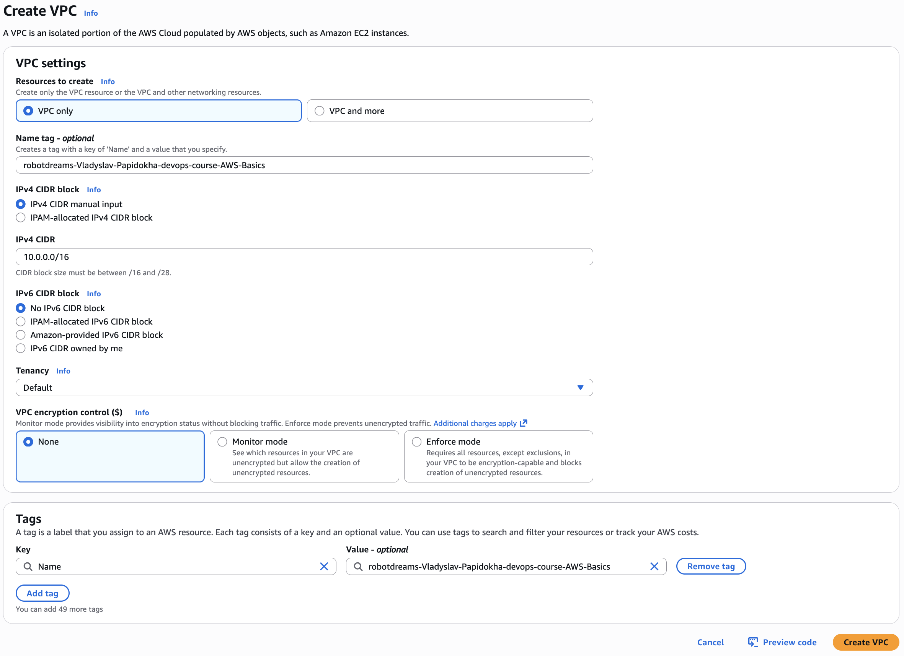

**Результат — VPC створено:**

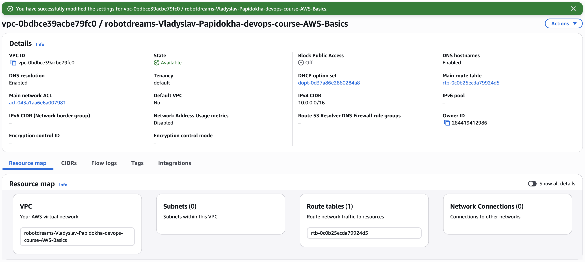

---

### 1.2 Створення підмереж

**Що таке підмережі?**

Підмережі (subnets) — сегменти всередині VPC з різним рівнем доступу:
- **Публічна підмережа** — має маршрут в інтернет через Internet Gateway. Для веб-серверів, які мають бути доступні ззовні.
- **Приватна підмережа** — без прямого доступу в інтернет. Для баз даних та внутрішніх сервісів.

**Параметри підмереж:**

| Підмережа | CIDR | Availability Zone | Доступних хостів |
|-----------|------|-------------------|------------------|
| public-subnet | 10.0.1.0/24 | us-east-1a | 251 |
| private-subnet | 10.0.2.0/24 | us-east-1b | 251 |

> **Чому 251, а не 256?** AWS резервує 5 адрес у кожній підмережі: адреса мережі, broadcast, та 3 для внутрішніх потреб (DNS, роутер, резерв).

> **Чому різні Availability Zones?** us-east-1a та us-east-1b — фізично різні дата-центри в одному регіоні. Це стандартна практика для стійкості до відмов.

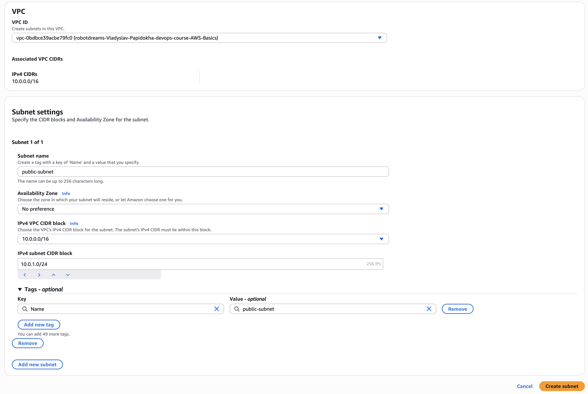

**Результат — обидві підмережі створені:**

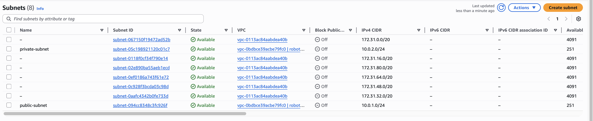

---

### 1.3 Створення Internet Gateway

**Що таке Internet Gateway?**

Internet Gateway (IGW) — "двері" з VPC в інтернет. Без нього ресурси у VPC повністю ізольовані від зовнішнього світу.

**Крок 1: Створення IGW**

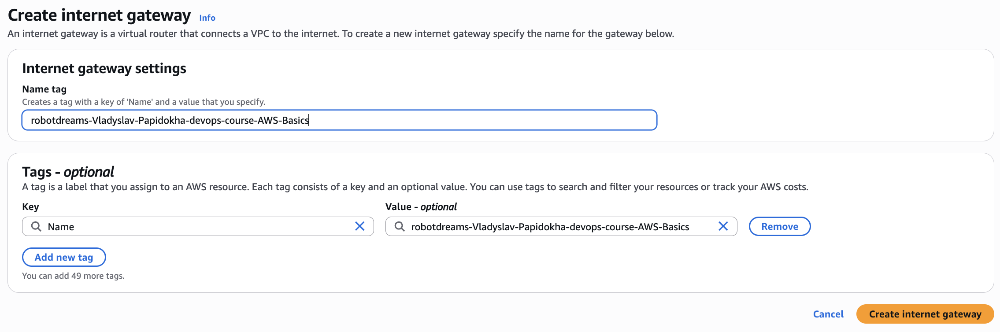

**Крок 2: Attach IGW до VPC**

Після створення IGW має стан "Detached". Потрібно прив'язати його до VPC через Actions → Attach to VPC.

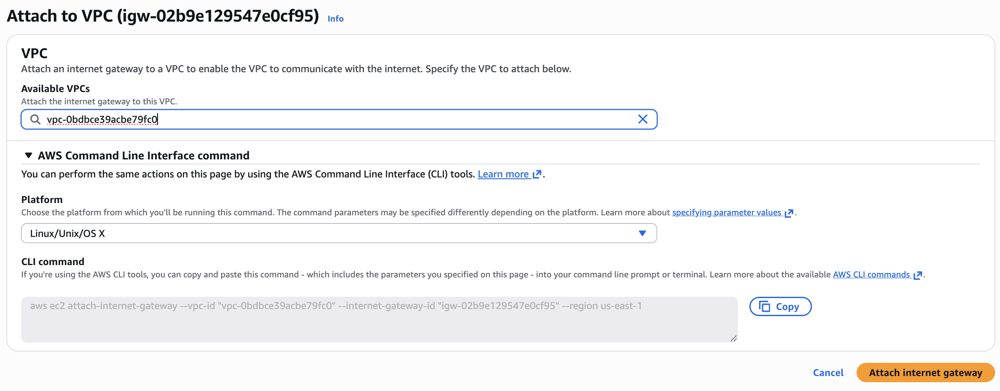

**Результат — IGW прив'язаний до VPC:**

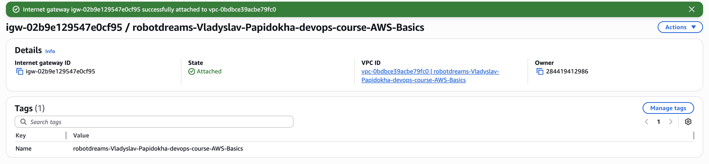

---

### 1.4 Налаштування Route Table

**Що таке Route Table?**

Route Table — "дорожні вказівники" для трафіку. Кожен пакет даних дивиться в таблицю маршрутизації щоб зрозуміти куди йти.

**Чому окрема Route Table?**

Main route table застосовується до всіх підмереж за замовчуванням. Якщо додати маршрут в інтернет туди — обидві підмережі отримають доступ, а приватна має бути ізольованою. Тому створюємо окрему route table тільки для публічної підмережі.

**Крок 1: Створення route table `public-rt`**

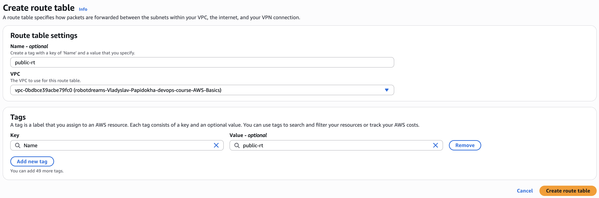

**Крок 2: Додавання маршруту в інтернет**

| Destination | Target | Пояснення |
|-------------|--------|-----------|
| 10.0.0.0/16 | local | Трафік всередині VPC |
| 0.0.0.0/0 | igw-02b9e129547e0cf95 | Весь інший трафік → через Internet Gateway |

`0.0.0.0/0` означає "будь-яка адреса, яка не збігається з іншими правилами" — тобто весь зовнішній трафік.

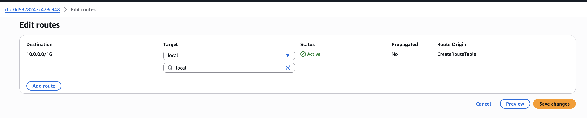

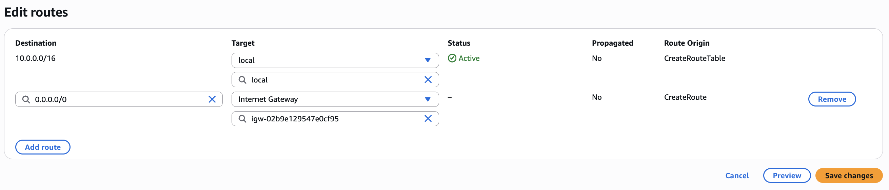

**Крок 3: Прив'язка route table до публічної підмережі**

Subnet associations → Edit → обираємо тільки public-subnet.

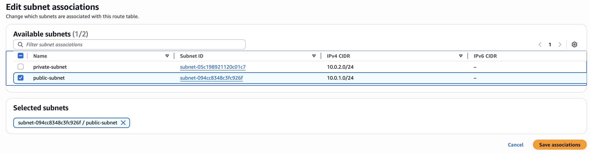

---

## 2. Налаштування Security Groups та ACL

### 2.1 Створення Security Group

**Що таке Security Group?**

Security Group — віртуальний файрвол для EC2 інстансів. Контролює який трафік може входити (inbound) і виходити (outbound). Працює за принципом "що не дозволено — заборонено" для вхідного трафіку.

**Параметри:**

| Поле | Значення |
|------|----------|
| Name | robotdreams-Vladyslav-Papidokha-devops-course-security-group |
| Description | Allow SSH and HTTP access |
| VPC | robotdreams-Vladyslav-Papidokha-devops-course-AWS-Basics |

**Inbound rules:**

| Type | Protocol | Port | Source | Призначення |
|------|----------|------|--------|-------------|
| SSH | TCP | 22 | 0.0.0.0/0 | Віддалений доступ по SSH |
| HTTP | TCP | 80 | 0.0.0.0/0 | Веб-трафік |

**Outbound rules:**

| Type | Protocol | Port | Destination |
|------|----------|------|-------------|
| All traffic | All | All | 0.0.0.0/0 |

> **Примітка:** `0.0.0.0/0` означає доступ з будь-якої IP-адреси. Для навчального проєкту це прийнятно, але в продакшені SSH зазвичай обмежують до конкретних IP.

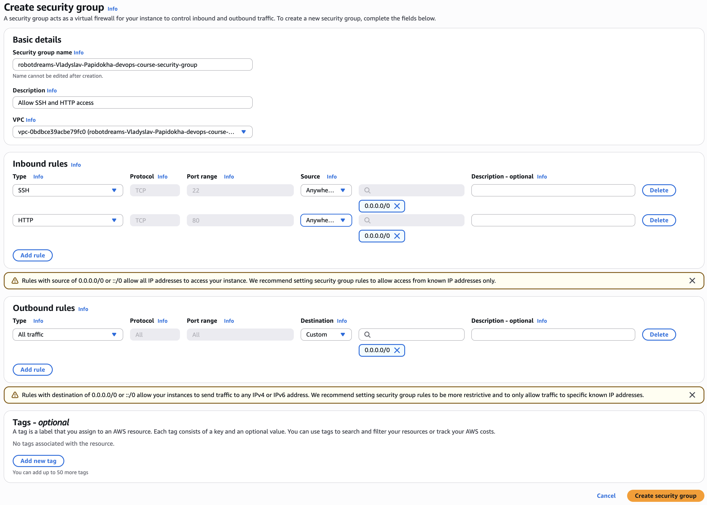

**Результат — Security Group створено:**

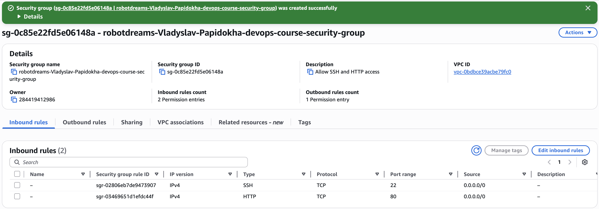

---

### 2.2 Network ACL

Network ACL (Access Control List) — додатковий рівень безпеки на рівні підмережі (Security Group працює на рівні інстансу).

Default ACL створюється автоматично разом з VPC і дозволяє весь трафік. Для цього завдання додаткове налаштування не потрібне.

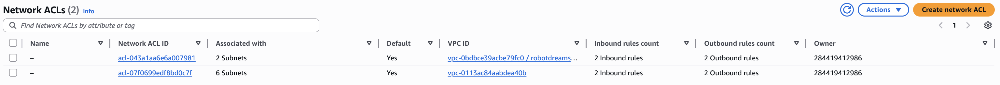

---

## 3. Запуск інстансу EC2

### 3.1 Створення SSH Key Pair

**Що таке Key Pair?**

SSH Key Pair — пара криптографічних ключів для безпечного доступу до інстансу. AWS зберігає публічний ключ, а приватний (.pem файл) зберігається локально.

| Параметр | Значення |
|----------|----------|
| Name | robotdreams-Vladyslav-Papidokha-devops-course-key |
| Type | RSA |
| Format | .pem (для macOS/Linux) |

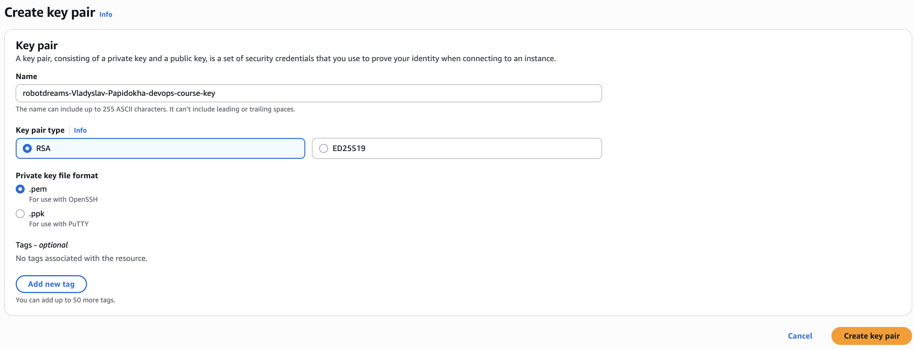

**Після завантаження — налаштування прав доступу:**

```bash
# Переміщення ключа в стандартну директорію SSH
mv ~/Downloads/robotdreams-Vladyslav-Papidokha-devops-course-key.pem ~/.ssh/

# Обмеження прав: тільки власник може читати
chmod 400 ~/.ssh/robotdreams-Vladyslav-Papidokha-devops-course-key.pem
```

> `chmod 400` — SSH відмовиться працювати з ключем, якщо права доступу занадто відкриті (захист від копіювання іншими користувачами).

---

### 3.2 Запуск EC2 інстансу

**Що таке EC2?**

EC2 (Elastic Compute Cloud) — віртуальний сервер в хмарі AWS. По суті — комп'ютер, на якому можна запускати будь-які додатки.

**Параметри інстансу:**

| Параметр | Значення | Пояснення |
|----------|----------|-----------|
| Name | robotdreams-Vladyslav-Papidokha-devops-course-ec2 | |
| AMI | Amazon Linux 2023 kernel-6.1 | Легкий Linux від AWS, username: ec2-user |
| Instance type | t2.micro | 1 vCPU, 1 GiB RAM, Free Tier |
| Key pair | robotdreams-Vladyslav-Papidokha-devops-course-key | |
| VPC | robotdreams-Vladyslav-Papidokha-devops-course-AWS-Basics | |
| Subnet | public-subnet (10.0.1.0/24, us-east-1a) | |
| Auto-assign public IP | Enable | Для SSH-доступу ззовні |
| Security Group | robotdreams-Vladyslav-Papidokha-devops-course-security-group | Existing SG |
| Storage | 8 GiB gp3 | |

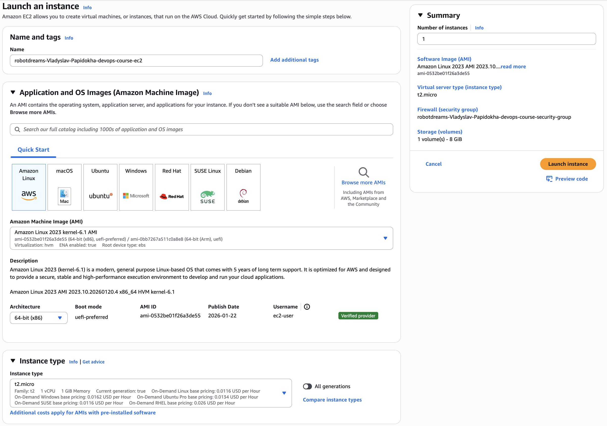

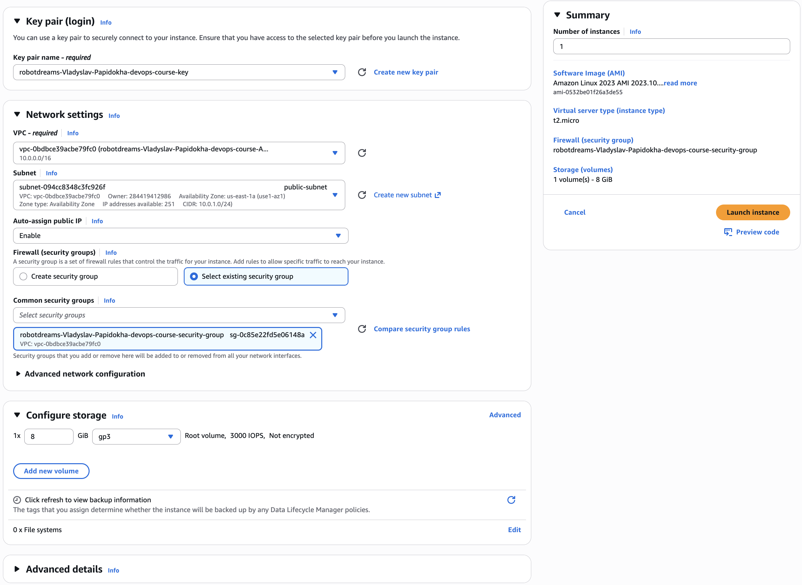

---

## 4. Призначення Elastic IP

**Що таке Elastic IP?**

Elastic IP (EIP) — постійна публічна IP-адреса. Звичайна публічна IP змінюється при кожному перезапуску інстансу, а EIP залишається закріпленою поки ви її не звільните.

**Крок 1: Allocate Elastic IP**

EC2 → Elastic IPs → Allocate Elastic IP address

**Крок 2: Associate EIP з EC2 інстансом**

| Параметр | Значення |
|----------|----------|
| Elastic IP | 107.22.169.91 |
| Resource type | Instance |
| Instance | i-0d604e935e1c9695b |

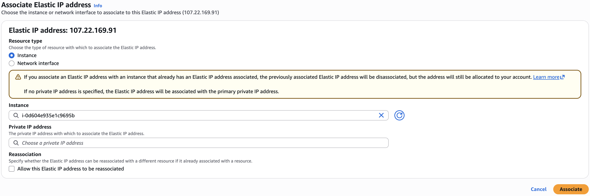

> **Важливо:** EIP безкоштовна поки прив'язана до запущеного інстансу. Непривʼязана EIP тарифікується — не забудьте звільнити після завершення.

---

## 5. Перевірка SSH-підключення

**Команда підключення:**

```bash
ssh -i ~/.ssh/robotdreams-Vladyslav-Papidokha-devops-course-key.pem ec2-user@107.22.169.91
```

| Параметр | Опис |
|----------|------|
| `-i` | Шлях до приватного ключа |
| `ec2-user` | Стандартний користувач для Amazon Linux |
| `107.22.169.91` | Elastic IP адреса інстансу |

**Результат — успішне підключення:**

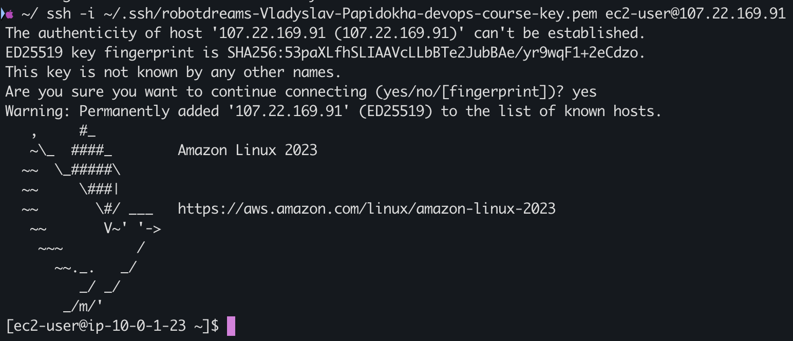

Приватна IP інстансу `10.0.1.23` підтверджує що він знаходиться в публічній підмережі `10.0.1.0/24`.

---

## Архітектура

```
                    Internet
                       │
                       ▼
              ┌─── Internet Gateway ───┐
              │   (igw-02b9e...)       │
              └────────┬───────────────┘
                       │
         ┌─────────────┴──────────────────┐
         │     VPC: 10.0.0.0/16           │
         │                                │
         │  ┌──────────────────────────┐  │
         │  │ public-subnet            │  │
         │  │ 10.0.1.0/24 (us-east-1a) │  │
         │  │                          │  │
         │  │  ┌────────────────────┐  │  │
         │  │  │ EC2 Instance       │  │  │
         │  │  │ Private: 10.0.1.23 │  │  │
         │  │  │ EIP: 107.22.169.91 │  │  │
         │  │  │ SG: SSH + HTTP     │  │  │
         │  │  └────────────────────┘  │  │
         │  └──────────────────────────┘  │
         │                                │
         │  ┌──────────────────────────┐  │
         │  │ private-subnet           │  │
         │  │ 10.0.2.0/24 (us-east-1b) │  │
         │  │ (no internet access)     │  │
         │  └──────────────────────────┘  │
         └────────────────────────────────┘
```

---

## Висновки

| Компонент | Статус |
|-----------|--------|
| VPC (10.0.0.0/16) | ✅ Створено |
| Публічна підмережа (10.0.1.0/24) | ✅ Створено |
| Приватна підмережа (10.0.2.0/24) | ✅ Створено |
| Internet Gateway | ✅ Attached до VPC |
| Route Table з маршрутом 0.0.0.0/0 → IGW | ✅ Налаштовано |
| Security Group (SSH + HTTP) | ✅ Створено |
| Network ACL | ✅ Default (Allow All) |
| EC2 Instance (t2.micro) | ✅ Запущено |
| Elastic IP | ✅ Призначено |
| SSH підключення | ✅ Працює |

### Ключові концепції

1. **VPC** — ізольована мережа в AWS, фундамент для всіх ресурсів
2. **Підмережі** — публічна (з інтернетом) та приватна (ізольована) для розділення рівнів доступу
3. **Internet Gateway** — забезпечує вихід в інтернет з публічної підмережі
4. **Route Table** — визначає куди направляти мережевий трафік
5. **Security Group** — файрвол на рівні інстансу (stateful — відповідний трафік дозволяється автоматично)
6. **Network ACL** — файрвол на рівні підмережі (stateless — потрібно явно дозволяти обидва напрямки)
7. **Elastic IP** — постійна публічна адреса, яка не змінюється при перезапуску

---

## Використані технології

- AWS VPC, EC2, Elastic IP
- Amazon Linux 2023
- SSH (OpenSSH)