# Homework 13: AWS EKS — Kubernetes Cluster

## Зміст

- [Мета завдання](#мета-завдання)
- [Середовище](#середовище)
- [Завдання 1: Створення EKS кластера](#завдання-1-створення-eks-кластера)
  - [1.1 Інструменти](#11-інструменти)
  - [1.2 Створення кластера через eksctl](#12-створення-кластера-через-eksctl)
  - [1.3 Що створив eksctl](#13-що-створив-eksctl)
- [Завдання 2: Налаштування kubectl](#завдання-2-налаштування-kubectl)
- [Завдання 3: Статичний вебсайт](#завдання-3-статичний-вебсайт)
  - [3.1 ConfigMap — вміст сайту](#31-configmap--вміст-сайту)
  - [3.2 Deployment — запуск nginx](#32-deployment--запуск-nginx)
  - [3.3 Service LoadBalancer — публічний доступ](#33-service-loadbalancer--публічний-доступ)
  - [3.4 Результат — сайт працює](#34-результат--сайт-працює)
- [Завдання 4: PersistentVolumeClaim + EBS](#завдання-4-persistentvolumeclaim--ebs)
  - [4.1 Встановлення EBS CSI Driver](#41-встановлення-ebs-csi-driver)
  - [4.2 PVC та Pod](#42-pvc-та-pod)
- [Завдання 5: Job](#завдання-5-job)
- [Завдання 6: Deployment httpd + ClusterIP](#завдання-6-deployment-httpd--clusterip)
- [Завдання 7: Namespace dev + Busybox](#завдання-7-namespace-dev--busybox)
- [Завдання 8: Очистка ресурсів](#завдання-8-очистка-ресурсів)
- [Висновки](#висновки)

---

## Мета завдання

Навчитися створювати кластер Kubernetes в AWS за допомогою EKS, розгортати застосунки та працювати з основними ресурсами Kubernetes: Pod, Deployment, Service, ConfigMap, PersistentVolumeClaim, Job, Namespace.

---

## Середовище

| Параметр      | Значення                     |
| ------------- | ---------------------------- |
| OS            | macOS (Apple Silicon M1 Pro) |
| AWS Region    | eu-north-1 (Stockholm)       |
| eksctl        | 0.222.0                      |
| kubectl       | v1.34.1                      |
| EKS версія    | v1.34.2                      |
| Node тип      | t3.medium (2 vCPU, 4 GB RAM) |
| Кількість нод | 2                            |

---

## Завдання 1: Створення EKS кластера

### 1.1 Інструменти

Для роботи з EKS потрібні три CLI-інструменти:

| Інструмент | Призначення                            |
| ---------- | -------------------------------------- |
| AWS CLI    | Спілкування з AWS API                  |
| eksctl     | Створення та керування EKS кластером   |
| kubectl    | Керування ресурсами всередині кластера |

**eksctl** — спеціалізована утиліта для EKS. Замість ручного створення десятків ресурсів (VPC, підмережі, IAM ролі, Security Groups), eksctl робить все однією командою через AWS CloudFormation.

### 1.2 Створення кластера через eksctl

```bash
eksctl create cluster \
  --name rd-cluster \
  --region eu-north-1 \
  --nodegroup-name rd-nodes \
  --node-type t3.medium \
  --nodes 2 \
  --nodes-min 2 \
  --nodes-max 2 \
  --managed
```

| Параметр         | Опис                      |
| ---------------- | ------------------------- |
| --name           | Назва кластера            |
| --region         | AWS регіон                |
| --nodegroup-name | Назва групи worker-нод    |
| --node-type      | Тип EC2 інстансу          |
| --nodes          | Кількість нод             |
| --managed        | AWS керує оновленнями нод |

### 1.3 Що створив eksctl

Eksctl створив два CloudFormation стеки:

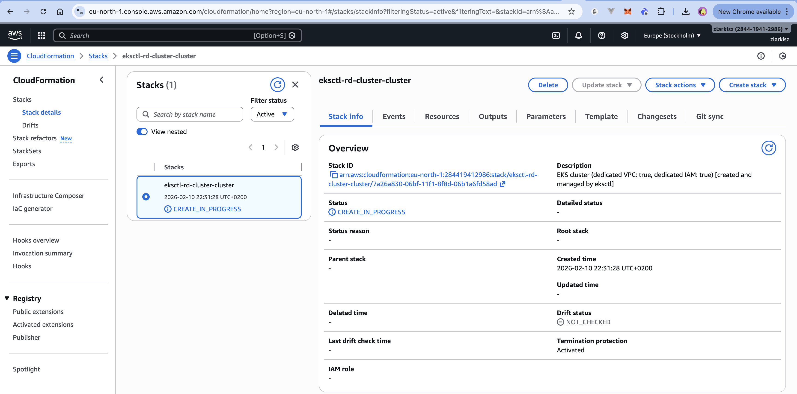

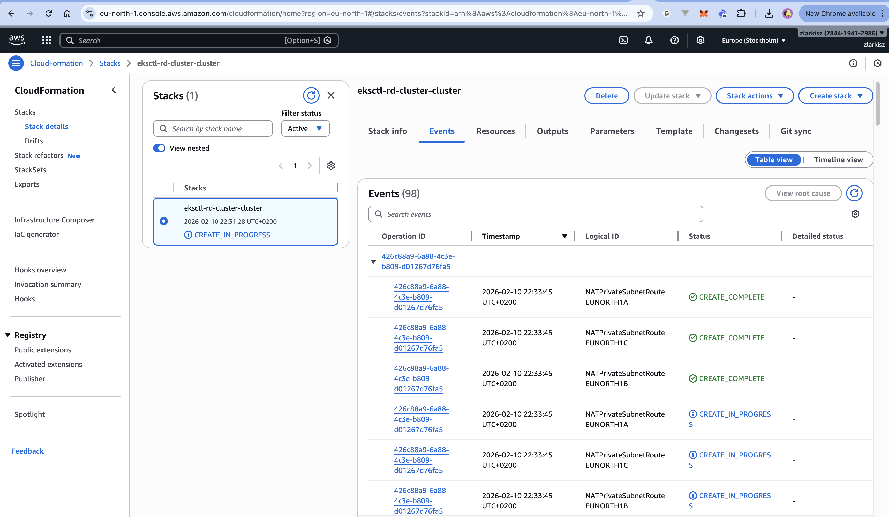

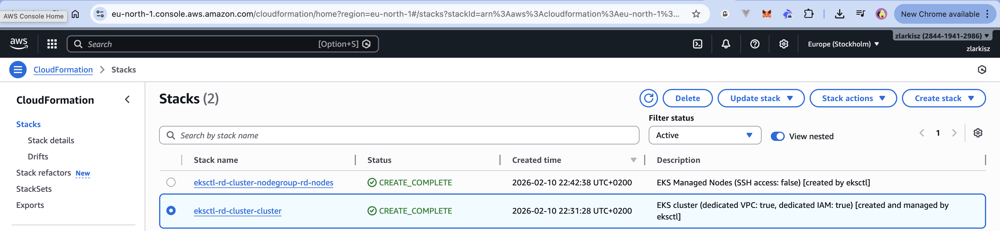

**Створена архітектура:**

```
AWS Cloud (eu-north-1)
├── VPC (dedicated)
│   ├── Public Subnet (AZ-1) ← Worker Node 1 (t3.medium)
│   ├── Public Subnet (AZ-2) ← Worker Node 2 (t3.medium)
│   ├── Private Subnets (3 AZ)
│   ├── Internet Gateway
│   ├── NAT Gateways
│   └── Route Tables
├── EKS Control Plane (managed by AWS)
├── IAM Roles (cluster + node group)
└── CloudFormation Stacks (2)
```

---

## Завдання 2: Налаштування kubectl

Eksctl автоматично налаштував kubeconfig. Перевірка підключення:

```bash
kubectl get nodes
```

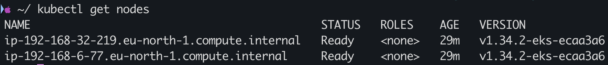

Дві worker-ноди зі статусом **Ready**, Kubernetes версія v1.34.2.

✅ **kubectl підключено до кластера**

---

## Завдання 3: Статичний вебсайт

### 3.1 ConfigMap — вміст сайту

**ConfigMap** — спосіб зберігати конфігураційні дані в Kubernetes. В нашому випадку — HTML-файл.

```yaml
apiVersion: v1
kind: ConfigMap
metadata:
  name: website-content
data:
  index.html: |
    <!DOCTYPE html>
    <html>
    <head><title>RobotDreams EKS</title></head>
    <body>
      <h1>Hello from EKS Cluster!</h1>
      <p>This is a static website running on Kubernetes (EKS)</p>
    </body>
    </html>
```

### 3.2 Deployment — запуск nginx

**Deployment** — контролер, який керує Pod'ами та гарантує потрібну кількість реплік.

```yaml
apiVersion: apps/v1
kind: Deployment
metadata:
  name: website
spec:
  replicas: 1
  selector:
    matchLabels:
      app: website
  template:
    metadata:
      labels:
        app: website
    spec:
      containers:
        - name: nginx
          image: nginx:latest
          ports:
            - containerPort: 80
          volumeMounts:
            - name: html
              mountPath: /usr/share/nginx/html
      volumes:
        - name: html
          configMap:
            name: website-content
```

### 3.3 Service LoadBalancer — публічний доступ

**Service LoadBalancer** — створює AWS Elastic Load Balancer з публічним DNS.

```yaml
apiVersion: v1
kind: Service
metadata:
  name: website-lb
spec:
  type: LoadBalancer
  selector:
    app: website
  ports:
    - port: 80
      targetPort: 80
```

Розгортання та перевірка:

```bash
kubectl apply -f manifests/configmap-website.yaml
kubectl apply -f manifests/deployment-website.yaml
kubectl apply -f manifests/service-website-lb.yaml
kubectl get all
```

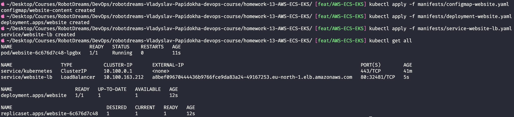

### 3.4 Результат — сайт працює

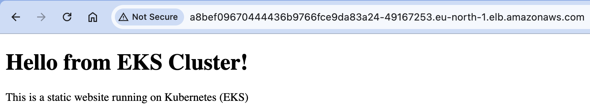

✅ **Статичний вебсайт доступний через AWS Load Balancer**

---

## Завдання 4: PersistentVolumeClaim + EBS

**PVC** — запит на постійне сховище. Kubernetes автоматично створює EBS volume в AWS.

### 4.1 Встановлення EBS CSI Driver

Для динамічного створення EBS дисків потрібен EBS CSI Driver:

```bash
# 1. Створити OIDC Provider (місток довіри між Kubernetes і AWS IAM)
eksctl utils associate-iam-oidc-provider \
  --region=eu-north-1 --cluster=rd-cluster --approve

# 2. Створити IAM Role з дозволами для EBS
eksctl create iamserviceaccount \
  --region eu-north-1 \
  --name ebs-csi-controller-sa \
  --namespace kube-system \
  --cluster rd-cluster \
  --role-name AmazonEKS_EBS_CSI_DriverRole \
  --role-only \
  --attach-policy-arn arn:aws:iam::aws:policy/service-role/AmazonEBSCSIDriverPolicy \
  --approve

# 3. Встановити EBS CSI Driver addon
eksctl create addon \
  --name aws-ebs-csi-driver \
  --cluster rd-cluster \
  --region eu-north-1 \
  --service-account-role-arn arn:aws:iam::284419412986:role/AmazonEKS_EBS_CSI_DriverRole \
  --force
```

### 4.2 PVC та Pod

**PVC (1Gi, gp2 SSD):**

```yaml
apiVersion: v1
kind: PersistentVolumeClaim
metadata:
  name: ebs-claim
spec:
  accessModes:
    - ReadWriteOnce
  storageClassName: gp2
  resources:
    requests:
      storage: 1Gi
```

**Pod з підключеним PVC:**

```yaml
apiVersion: v1
kind: Pod
metadata:
  name: pvc-test-pod
spec:
  containers:
    - name: app
      image: nginx:latest
      volumeMounts:
        - name: ebs-storage
          mountPath: /data
  volumes:
    - name: ebs-storage
      persistentVolumeClaim:
        claimName: ebs-claim
```

Спочатку PVC був у статусі Pending через відсутність EBS CSI Driver:

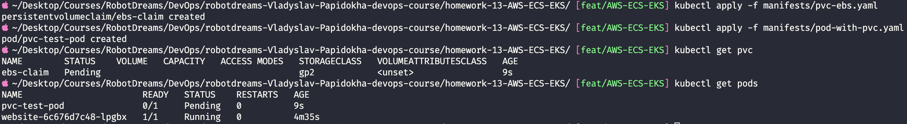

Після встановлення драйвера — PVC Bound, Pod Running:

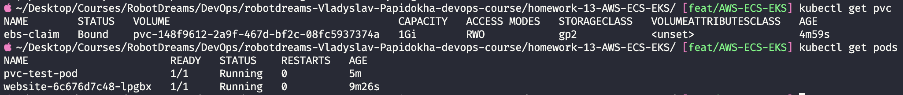

✅ **PVC створив EBS диск (1Gi) і підключив до Pod'а**

---

## Завдання 5: Job

**Job** — ресурс для одноразових завдань. Запускає Pod, виконує команду і завершується.

```yaml
apiVersion: batch/v1
kind: Job
metadata:
  name: hello-eks-job
spec:
  template:
    spec:
      containers:
        - name: hello
          image: busybox
          command: ["echo", "Hello from EKS!"]
      restartPolicy: Never
  backoffLimit: 3
```

```bash
kubectl apply -f manifests/job-hello.yaml
kubectl get jobs
kubectl logs job/hello-eks-job
```

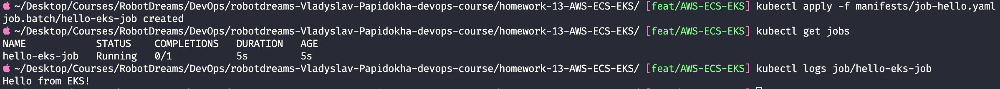

✅ **Job виконався успішно: "Hello from EKS!"**

---

## Завдання 6: Deployment httpd + ClusterIP

**ClusterIP** — Service доступний тільки всередині кластера (без публічного IP). Використовується для внутрішніх мікросервісів.

**Deployment з 2 репліками Apache HTTP Server:**

```yaml
apiVersion: apps/v1
kind: Deployment
metadata:
  name: httpd-app
spec:
  replicas: 2
  selector:
    matchLabels:
      app: httpd-app
  template:
    metadata:
      labels:
        app: httpd-app
    spec:
      containers:
        - name: httpd
          image: httpd:latest
          ports:
            - containerPort: 80
```

**Service ClusterIP:**

```yaml
apiVersion: v1
kind: Service
metadata:
  name: httpd-service
spec:
  type: ClusterIP
  selector:
    app: httpd-app
  ports:
    - port: 80
      targetPort: 80
```

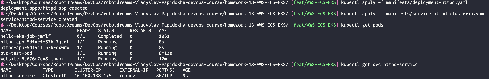

✅ **2 репліки httpd працюють, ClusterIP Service створено**

---

## Завдання 7: Namespace dev + Busybox

**Namespace** — віртуальний розділ для ізоляції ресурсів всередині кластера.

```yaml
apiVersion: v1
kind: Namespace
metadata:
  name: dev
```

**Deployment busybox (5 реплік) в namespace dev:**

```yaml
apiVersion: apps/v1
kind: Deployment
metadata:
  name: busybox-app
  namespace: dev
spec:
  replicas: 5
  selector:
    matchLabels:
      app: busybox-app
  template:
    metadata:
      labels:
        app: busybox-app
    spec:
      containers:
        - name: busybox
          image: busybox
          command: ["sleep", "3600"]
```

```bash
kubectl apply -f manifests/namespace-dev.yaml
kubectl apply -f manifests/deployment-busybox.yaml
kubectl get pods -n dev
```

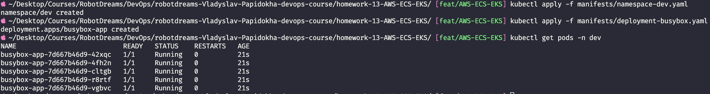

✅ **5 реплік busybox працюють у namespace dev**

---

## Завдання 8: Очистка ресурсів

```bash
# Видалення Kubernetes ресурсів
kubectl delete -f manifests/
kubectl delete namespace dev

# Видалення EKS кластера та всієї інфраструктури
eksctl delete cluster --name rd-cluster --region eu-north-1
```

---

## Висновки

| Завдання            | Ресурси                                      | Статус |
| ------------------- | -------------------------------------------- | ------ |
| EKS кластер         | 2× t3.medium worker nodes                    | ✅     |
| kubectl підключення | kubeconfig                                   | ✅     |
| Статичний вебсайт   | ConfigMap + Deployment + LoadBalancer        | ✅     |
| PVC + EBS           | PersistentVolumeClaim + Pod + EBS CSI Driver | ✅     |
| Job                 | busybox echo "Hello from EKS!"               | ✅     |
| httpd Deployment    | 2 репліки + ClusterIP Service                | ✅     |
| Namespace dev       | 5 реплік busybox (sleep 3600)                | ✅     |
| Очистка ресурсів    | eksctl delete cluster                        | ✅     |

### Ключові концепції

1. **EKS** — Managed Kubernetes від AWS (Control Plane керується AWS)
2. **eksctl** — CLI для створення EKS кластерів через CloudFormation
3. **ConfigMap** — зберігання конфігурацій та файлів
4. **Deployment** — контролер для керування Pod'ами з гарантією кількості реплік
5. **Service LoadBalancer** — публічний доступ через AWS ELB
6. **Service ClusterIP** — внутрішній доступ в кластері
7. **PersistentVolumeClaim** — запит на постійне сховище (EBS в AWS)
8. **Job** — одноразове завдання
9. **Namespace** — ізоляція ресурсів всередині кластера
10. **EBS CSI Driver** — плагін для динамічного створення EBS дисків

### Корисні команди

```bash
# Кластер
eksctl create cluster --name <name> --region <region>
eksctl delete cluster --name <name> --region <region>

# Ресурси
kubectl apply -f <file.yaml>          # Створити/оновити ресурс
kubectl get all                        # Показати всі ресурси
kubectl get pods -n <namespace>        # Pod'и в namespace
kubectl get pvc                        # PersistentVolumeClaims
kubectl get jobs                       # Jobs
kubectl get namespaces                 # Namespaces
kubectl logs <pod-name>                # Логи Pod'а
kubectl describe <resource> <name>     # Детальна інформація
kubectl delete -f <file.yaml>          # Видалити ресурс
```

---

## Використані технології

| Технологія    | Версія / Тип                                 |
| ------------- | -------------------------------------------- |
| AWS EKS       | Kubernetes v1.34.2                           |
| eksctl        | 0.222.0                                      |
| kubectl       | v1.34.1                                      |
| AWS Region    | eu-north-1 (Stockholm)                       |
| EC2           | t3.medium                                    |
| EBS           | gp2 (1Gi)                                    |
| Docker images | nginx, httpd, busybox                        |
| AWS Services  | EKS, EC2, ELB, EBS, VPC, IAM, CloudFormation |

---
