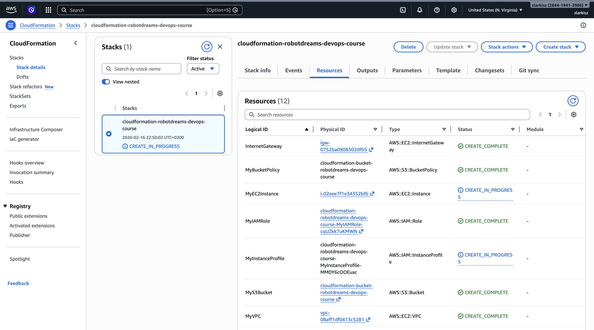
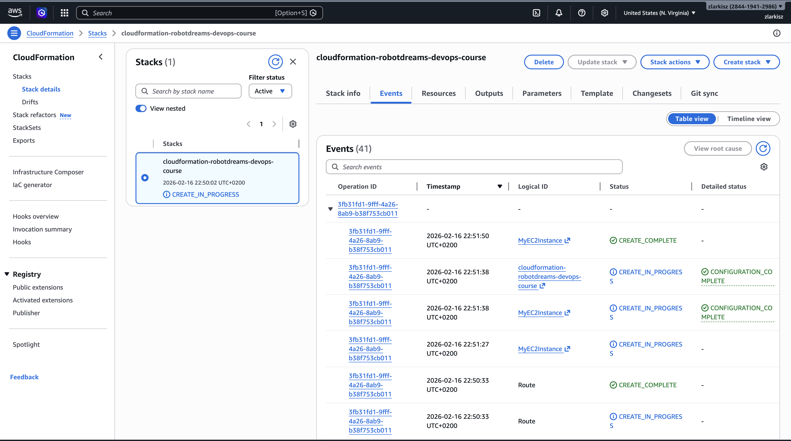
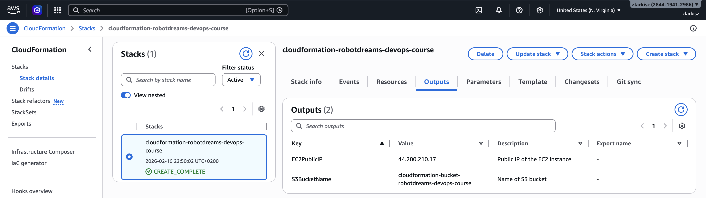
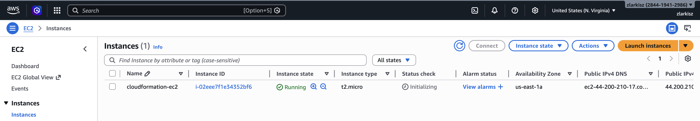
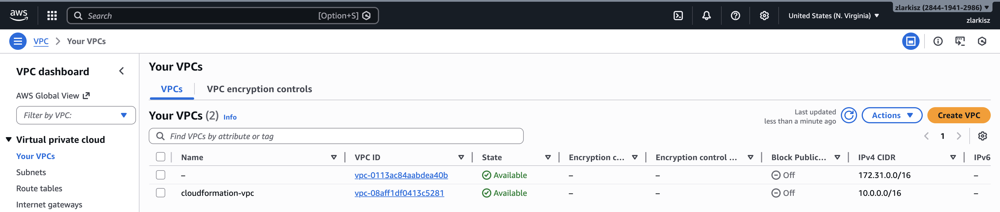
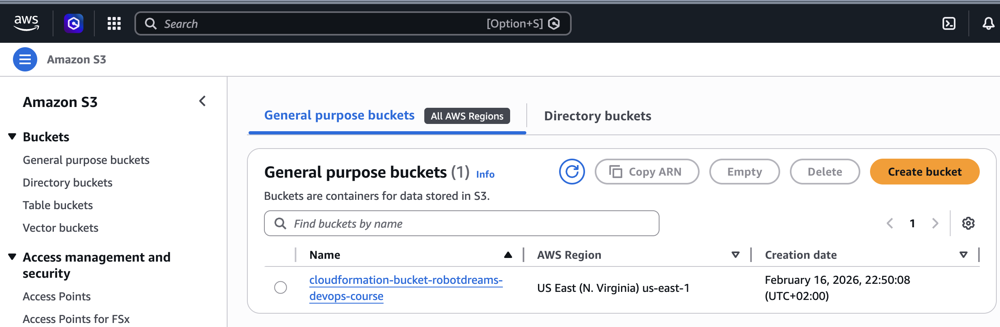
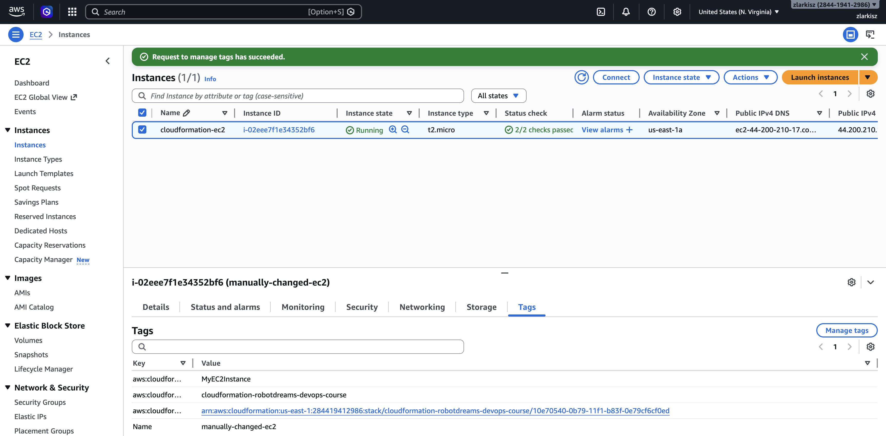
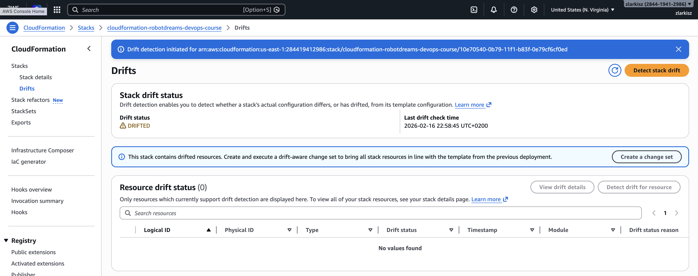
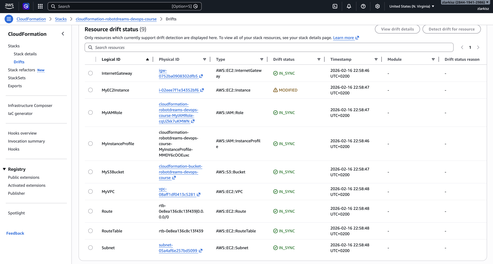
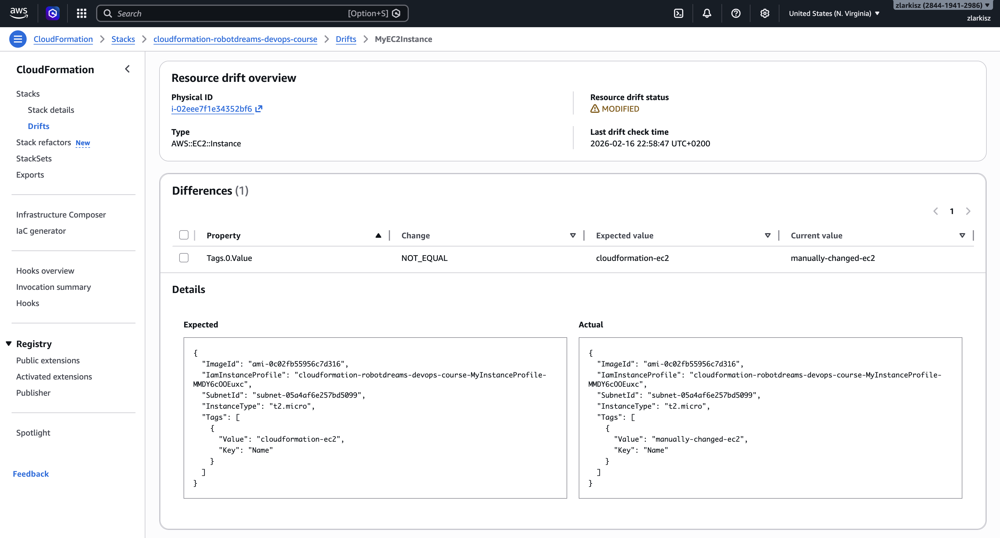

# Homework 16: AWS CloudFormation

## Зміст

- [Опис завдання](#опис-завдання)
- [Структура проєкту](#структура-проєкту)
- [Створені ресурси](#створені-ресурси)
- [Шаблон CloudFormation](#шаблон-cloudformation)
- [Деплой стеку](#деплой-стеку)
- [Результати](#результати)
  - [Створення стеку](#створення-стеку)
  - [Resources](#resources)
  - [Events](#events)
  - [Outputs](#outputs)
  - [EC2 Instance](#ec2-instance)
  - [VPC](#vpc)
  - [S3 Bucket](#s3-bucket)
- [Drift Detection](#drift-detection)
  - [Зміна ресурсу вручну](#зміна-ресурсу-вручну)
  - [Результат Drift Detection](#результат-drift-detection)
  - [Деталі Drift](#деталі-drift)
- [Видалення стеку](#видалення-стеку)
- [Висновки](#висновки)
- [Використані технології](#використані-технології)

---

## Опис завдання

Використовуючи AWS CloudFormation, створити інфраструктуру, яка включає VPC, EC2 інстанс, IAM Role та S3 Bucket. Додатково — перевірити Drift Detection.

---

## Структура проєкту

```
homework-16-cloudformation/
├── main.yaml          # CloudFormation шаблон
├── README.md
└── screenshots/
    ├── 01-stack-resources.png
    ├── 02-stack-events.png
    ├── 03-stack-outputs.png
    ├── 04-ec2-instance.png
    ├── 05-vpc.png
    ├── 06-s3-bucket.png
    ├── 07-ec2-tag-changed.png
    ├── 08-drift-status.png
    ├── 09-drift-resources.png
    ├── 10-drift-details.png
    └── 11-stack-deleted.png
```

---

## Створені ресурси

| #   | Ресурс                      | Тип                                   | Опис                                 |
| --- | --------------------------- | ------------------------------------- | ------------------------------------ |
| 1   | MyVPC                       | AWS::EC2::VPC                         | VPC з CIDR 10.0.0.0/16               |
| 2   | Subnet                      | AWS::EC2::Subnet                      | Публічна підмережа 10.0.1.0/24       |
| 3   | InternetGateway             | AWS::EC2::InternetGateway             | Шлюз для доступу до інтернету        |
| 4   | VPCGatewayAttachment        | AWS::EC2::VPCGatewayAttachment        | Прив'язка IGW до VPC                 |
| 5   | RouteTable                  | AWS::EC2::RouteTable                  | Таблиця маршрутів                    |
| 6   | Route                       | AWS::EC2::Route                       | Маршрут 0.0.0.0/0 → IGW              |
| 7   | SubnetRouteTableAssociation | AWS::EC2::SubnetRouteTableAssociation | Прив'язка RT до Subnet               |
| 8   | MyIAMRole                   | AWS::IAM::Role                        | Роль з AmazonS3ReadOnlyAccess        |
| 9   | MyInstanceProfile           | AWS::IAM::InstanceProfile             | Профіль для прикріплення ролі до EC2 |
| 10  | MyS3Bucket                  | AWS::S3::Bucket                       | S3 bucket з версіонуванням           |
| 11  | MyBucketPolicy              | AWS::S3::BucketPolicy                 | Політика доступу до bucket           |
| 12  | MyEC2Instance               | AWS::EC2::Instance                    | EC2 t2.micro з Amazon Linux 2        |

---

## Шаблон CloudFormation

Повний шаблон знаходиться у файлі [`main.yaml`](main.yaml) з детальними коментарями до кожного рядка.

Архітектура:

```
┌─────────────────────────────────────────────┐
│  ☁ AWS Cloud (us-east-1)                    │
│                                             │
│  ┌───────────────────────────────────────┐  │
│  │  VPC (10.0.0.0/16)                    │  │
│  │                                       │  │
│  │  ┌─────────────────────────────────┐  │  │
│  │  │  Public Subnet (10.0.1.0/24)    │  │  │
│  │  │                                 │  │  │
│  │  │   EC2 Instance (t2.micro)       │  │  │
│  │  │   + IAM Role (S3 ReadOnly)      │  │  │
│  │  │                                 │  │  │
│  │  └─────────────────────────────────┘  │  │
│  │            ↕                          │  │
│  │       Route Table (0.0.0.0/0 → IGW)   │  │
│  │            ↕                          │  │
│  │       Internet Gateway                │  │
│  └───────────────────────────────────────┘  │
│                 ↕                           │
│            Internet                         │
│                                             │
│  S3 Bucket (versioning enabled)             │
│  + Bucket Policy                            │
└─────────────────────────────────────────────┘
```

---

## Деплой стеку

```bash
# Перевірка AWS CLI
aws sts get-caller-identity

# Створення стеку
aws cloudformation create-stack \
  --stack-name cloudformation-robotdreams-devops-course \
  --template-body file://main.yaml \
  --capabilities CAPABILITY_IAM \
  --region us-east-1

# Очікування завершення
aws cloudformation wait stack-create-complete \
  --stack-name cloudformation-robotdreams-devops-course \
  --region us-east-1

# Перевірка Outputs
aws cloudformation describe-stacks \
  --stack-name cloudformation-robotdreams-devops-course \
  --region us-east-1 \
  --query "Stacks[0].Outputs"
```

---

## Результати

### Створення стеку

CloudFormation створив 12 ресурсів. Статус стеку — `CREATE_COMPLETE`.



### Resources

Усі 12 ресурсів створені успішно зі статусом `CREATE_COMPLETE`.

### Events

Послідовність створення ресурсів — CloudFormation автоматично визначив порядок через залежності (`!Ref` та `DependsOn`).



### Outputs

| Key          | Value                                           | Description                   |
| ------------ | ----------------------------------------------- | ----------------------------- |
| EC2PublicIP  | 44.200.210.17                                   | Public IP of the EC2 instance |
| S3BucketName | cloudformation-bucket-robotdreams-devops-course | Name of S3 bucket             |



### EC2 Instance

Інстанс `cloudformation-ec2` запущений: t2.micro, us-east-1a, Running, 2/2 checks passed.



### VPC

VPC `cloudformation-vpc` створений з CIDR 10.0.0.0/16, статус Available.



### S3 Bucket

Bucket `cloudformation-bucket-robotdreams-devops-course` створений у регіоні us-east-1 з увімкненим версіонуванням.



---

## Drift Detection

### Зміна ресурсу вручну

Для демонстрації Drift Detection тег Name інстансу EC2 було змінено вручну з `cloudformation-ec2` на `manually-changed-ec2` через AWS Console.



### Результат Drift Detection

Після запуску Drift Detection через **Stack actions → Detect drift**:

- Stack drift status: **DRIFTED**
- MyEC2Instance: **MODIFIED**
- Усі інші ресурси: **IN_SYNC**





### Деталі Drift

CloudFormation показав конкретну різницю між шаблоном та реальним станом:

| Property     | Expected           | Current              |
| ------------ | ------------------ | -------------------- |
| Tags.0.Value | cloudformation-ec2 | manually-changed-ec2 |



---

## Видалення стеку

```bash
# Видалення стеку (видаляє всі 12 ресурсів)
aws cloudformation delete-stack \
  --stack-name cloudformation-robotdreams-devops-course \
  --region us-east-1

# Перевірка видалення
aws cloudformation describe-stacks \
  --stack-name cloudformation-robotdreams-devops-course \
  --region us-east-1
# Результат: Stack does not exist
```

EC2 інстанс отримав статус Terminated, усі ресурси видалені.

---

## Висновки

| Вимога                                      | Статус |
| ------------------------------------------- | ------ |
| VPC з CIDR 10.0.0.0/16                      | ✅     |
| Публічна підмережа 10.0.1.0/24              | ✅     |
| Internet Gateway + Route Table              | ✅     |
| EC2 t2.micro з IAM Role                     | ✅     |
| IAM Role з AmazonS3ReadOnlyAccess           | ✅     |
| S3 Bucket з версіонуванням та Bucket Policy | ✅     |
| Outputs — Public IP та S3 Bucket Name       | ✅     |
| Drift Detection                             | ✅     |

### Ключові концепції

1. **CloudFormation** — нативний AWS IaC інструмент, стейт зберігається в AWS
2. **Stack** — одиниця управління, один шаблон = один стек, видалення стеку видаляє всі ресурси
3. **!Ref та !GetAtt** — функції для зв'язків між ресурсами та автоматичного визначення порядку створення
4. **DependsOn** — явне оголошення залежностей, коли CloudFormation не може визначити порядок автоматично
5. **Drift Detection** — виявлення розбіжностей між шаблоном та реальним станом ресурсів

---

## Використані технології

- AWS CloudFormation
- AWS CLI
- AWS EC2, VPC, S3, IAM
- YAML
