# Homework 15: Advanced Ansible

## Зміст

- [Середовище](#середовище)
- [Структура проєкту](#структура-проєкту)
- [Крок 1: Встановлення Ansible](#крок-1-встановлення-ansible)
- [Крок 2: Terraform — EC2 інстанси](#крок-2-terraform--ec2-інстанси)
- [Крок 3: Налаштування Ansible](#крок-3-налаштування-ansible)
- [Крок 4: Роль baseline](#крок-4-роль-baseline)
- [Крок 5: Роль firewall](#крок-5-роль-firewall)
- [Крок 6: Роль nginx](#крок-6-роль-nginx)
- [Крок 7: Dynamic Inventory для AWS](#крок-7-dynamic-inventory-для-aws)
- [Крок 8: Ansible Vault](#крок-8-ansible-vault)
- [Крок 9: Декілька Playbooks](#крок-9-декілька-playbooks)
- [Результат](#результат)

---

## Середовище

| Параметр   | Значення         |
| ---------- | ---------------- |
| MacBook    | Apple M1 Pro     |
| Ansible    | core 2.20.3      |
| Python     | 3.14.3           |
| AWS Region | eu-central-1     |
| EC2 AMI    | Ubuntu 24.04 LTS |
| EC2 Type   | t2.micro (x2)    |

---

## Структура проєкту

```
homework-15-Advanced-Ansible/
├── ansible.cfg                          # Головний конфіг Ansible
├── ansible/
│   ├── group_vars/
│   │   ├── all.yml                      # Змінні для всіх хостів
│   │   └── vault.yml                    # Зашифровані секрети (Ansible Vault)
│   ├── inventory/
│   │   ├── hosts.yml                    # Статичний inventory
│   │   └── aws_ec2.yml                  # Dynamic inventory для AWS
│   ├── playbooks/
│   │   ├── site.yml                     # Повне розгортання
│   │   ├── webservers.yml               # Тільки веб сервери
│   │   └── security.yml                 # Тільки безпека
│   └── roles/
│       ├── baseline/                    # Базові налаштування сервера
│       ├── firewall/                    # UFW правила
│       └── nginx/                       # Nginx + шаблони
└── terraform/
    └── ansible-lab/
        └── main.tf                      # EC2 інстанси для домашки
```

---

## Крок 1: Встановлення Ansible

Ansible встановлюємо через `pipx` — ізольоване середовище для Python утиліт:

```bash
brew install pipx
pipx ensurepath
pipx install ansible-core

# Встановлення необхідних колекцій
ansible-galaxy collection install ansible.posix
ansible-galaxy collection install community.general
ansible-galaxy collection install amazon.aws

# boto3 — AWS SDK для dynamic inventory
/Users/zlarkisz/.local/pipx/venvs/ansible-core/bin/python -m pip install boto3 botocore
```

**Перевірка:**

```bash
ansible --version
```
---

## Крок 2: Terraform — EC2 інстанси

Для домашки підніміємо 2 EC2 інстанси через Terraform.

**Ключові параметри `main.tf`:**

```hcl
resource "aws_instance" "web" {
  count         = 2
  ami           = data.aws_ami.ubuntu.id
  instance_type = "t2.micro"
  key_name      = "ansible-lab-key"

  tags = {
    Name    = "ansible-web-${count.index + 1}"
    Role    = "webserver"
    Ansible = "true"   # ← важливо для Dynamic Inventory!
  }
}
```

```bash
cd terraform/ansible-lab
terraform init
terraform plan
terraform apply
```

**Terraform створив:**

- `ansible-web-1` — IP: `3.120.229.30`
- `ansible-web-2` — IP: `3.120.131.139`
- Security Group: SSH (22), HTTP (80), HTTPS (443)

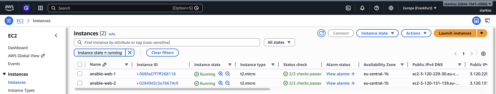

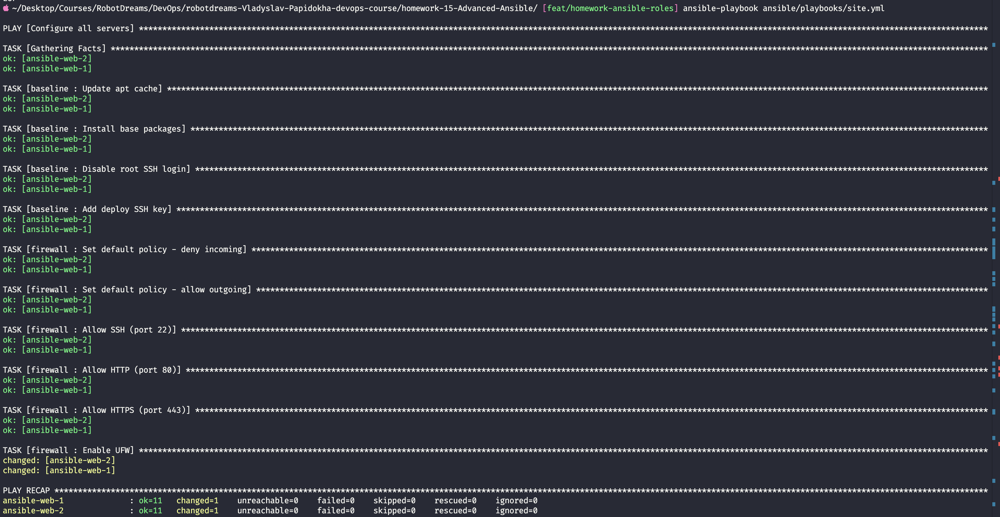

---

## Крок 3: Налаштування Ansible

### `ansible.cfg`

```ini
[defaults]
inventory            = ./ansible/inventory/aws_ec2.yml
remote_user          = ubuntu
private_key_file     = ~/.ssh/ansible_lab_key
host_key_checking    = False
result_format        = yaml
interpreter_python   = /usr/bin/python3
roles_path           = ./ansible/roles
deprecation_warnings = False
```

### Перевірка підключення

```bash
ansible all -m ping
```

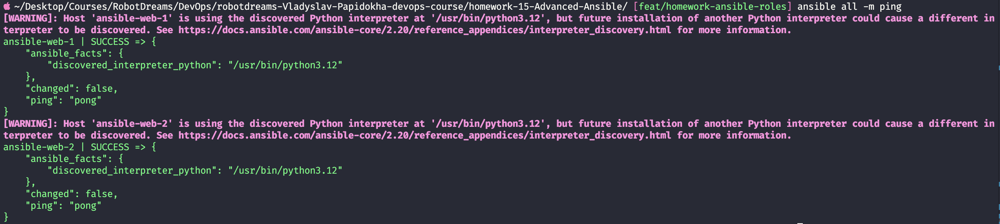

---

## Крок 4: Роль `baseline`

Базові налаштування кожного сервера — встановлення пакетів, налаштування SSH безпеки.

### `roles/baseline/tasks/main.yml`

```yaml
- name: Update apt cache
  apt:
    update_cache: yes
    cache_valid_time: 3600

- name: Install base packages
  apt:
    name: [vim, git, mc, ufw, curl, htop]
    state: present

- name: Disable root SSH login
  lineinfile:
    path: /etc/ssh/sshd_config
    regexp: "^PermitRootLogin"
    line: "PermitRootLogin no"
  notify: Restart SSH

- name: Add deploy SSH key
  authorized_key:
    user: ubuntu
    state: present
    key: "{{ deploy_ssh_public_key }}"
```

### Handler

```yaml
- name: Restart SSH
  service:
    name: ssh
    state: restarted
```

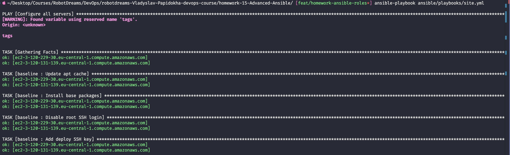

---

## Крок 5: Роль `firewall`

Налаштування UFW (Uncomplicated Firewall) — принцип "заборонено все що не дозволено явно".

### `roles/firewall/tasks/main.yml`

```yaml
- name: Set default policy - deny incoming
  ufw:
    default: deny
    direction: incoming

- name: Set default policy - allow outgoing
  ufw:
    default: allow
    direction: outgoing

- name: Allow SSH (port 22)
  ufw:
    rule: allow
    port: "22"
    proto: tcp

- name: Allow HTTP (port 80)
  ufw:
    rule: allow
    port: "80"
    proto: tcp

- name: Allow HTTPS (port 443)
  ufw:
    rule: allow
    port: "443"
    proto: tcp

- name: Enable UFW
  ufw:
    state: enabled
```

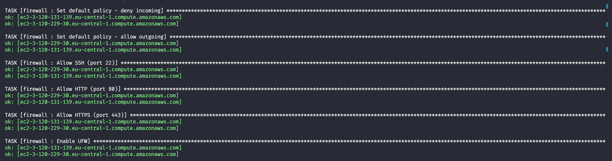

---

## Крок 6: Роль `nginx`

Встановлення Nginx з Jinja2 шаблонами — один шаблон генерує унікальну сторінку для кожного сервера.

### `roles/nginx/tasks/main.yml`

```yaml
- name: Install Nginx
  apt:
    name: nginx
    state: present

- name: Deploy Nginx config
  template:
    src: nginx.conf.j2
    dest: /etc/nginx/nginx.conf
  notify: Restart Nginx

- name: Deploy index.html
  template:
    src: index.html.j2
    dest: /var/www/html/index.html

- name: Ensure Nginx is started and enabled
  service:
    name: nginx
    state: started
    enabled: yes
```

### Шаблон `index.html.j2` (Jinja2)

```html
<h1>{{ site_title }}</h1>
<p>Server: {{ ansible_hostname }}</p>
<!-- унікальне для кожного сервера -->
<p>IP: {{ ansible_default_ipv4.address }}</p>
<p>OS: {{ ansible_distribution }} {{ ansible_distribution_version }}</p>
```

### Результат — один шаблон, два унікальних сервери:

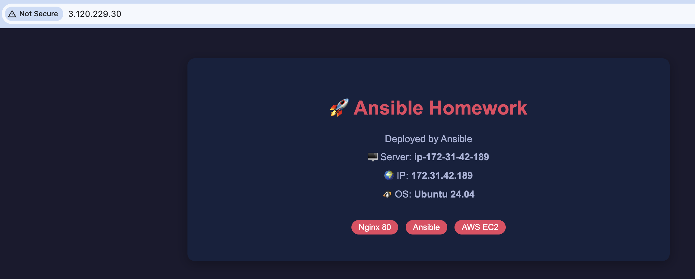

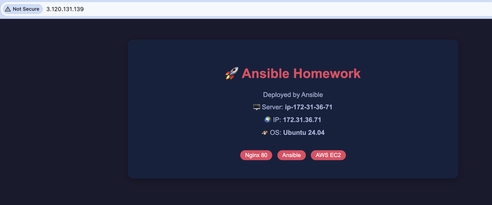

---

## Крок 7: Dynamic Inventory для AWS

Замість ручного прописування IP — Ansible сам запитує AWS API.

### `ansible/inventory/aws_ec2.yml`

```yaml
plugin: amazon.aws.aws_ec2

regions:
  - eu-central-1

filters:
  tag:Ansible: "true" # тільки наші сервери
  instance-state-name: running # тільки запущені

keyed_groups:
  - key: tags.Role # група за тегом Role
    prefix: role
    separator: "_"

compose:
  ansible_host: public_ip_address
```

```bash
ansible-inventory --graph
```

Ansible автоматично знайшов обидва сервери і згрупував їх у `role_webserver`:

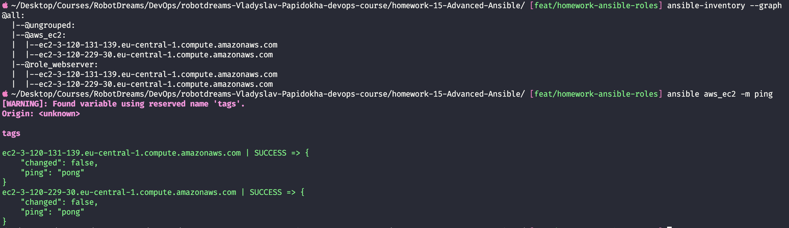

---

## Крок 8: Ansible Vault

Шифрування конфіденційних даних — зашифрований файл можна безпечно зберігати в Git.

```bash
# Шифруємо файл з секретами
echo 'vault_secret_password: "super_secret_123"
vault_db_password: "my_db_pass_456"' > /tmp/vault_tmp.yml

ansible-vault encrypt /tmp/vault_tmp.yml --output ansible/group_vars/vault.yml
```

**Зашифрований файл** (безпечно комітити в Git):

```
$ANSIBLE_VAULT;1.1;AES256
30653931386661636465326434383035...
```

**Розшифрований вміст** (тільки з паролем):

```yaml
vault_secret_password: "super_secret_123"
vault_db_password: "my_db_pass_456"
```

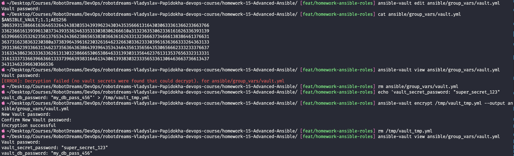

---

## Крок 9: Декілька Playbooks

### `playbooks/site.yml` — повне розгортання

```yaml
- name: Configure all servers
  hosts: webservers
  become: yes
  roles:
    - baseline
    - firewall
    - nginx
```

### `playbooks/security.yml` — тільки безпека

```yaml
- name: Configure security
  hosts: aws_ec2
  become: yes
  roles:
    - baseline
    - firewall
```

### `playbooks/webservers.yml` — тільки веб

```yaml
- name: Configure web servers
  hosts: role_webserver
  become: yes
  roles:
    - nginx
```

**Запуск `security.yml`:**

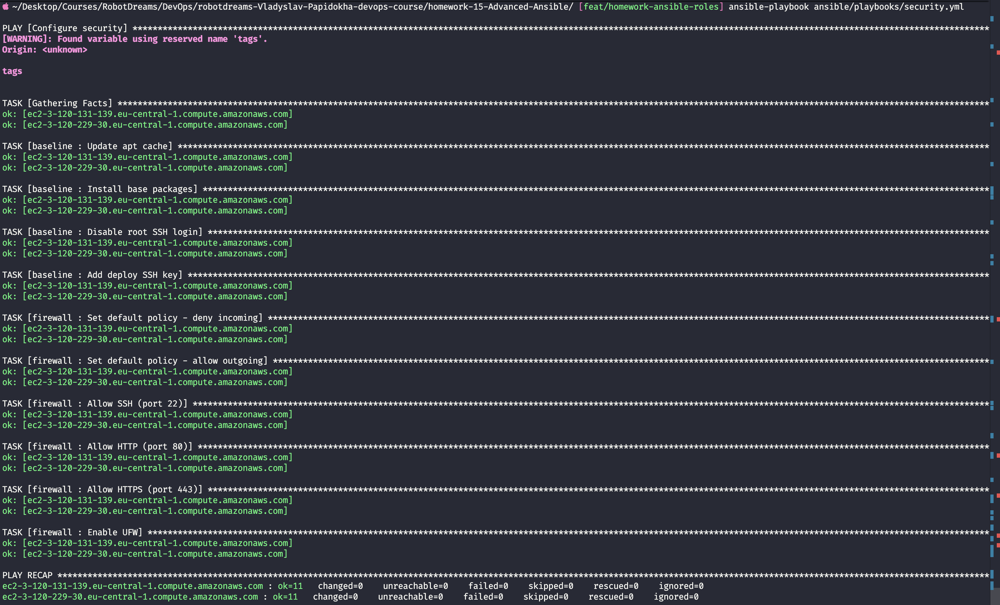

**Запуск `webservers.yml`:**

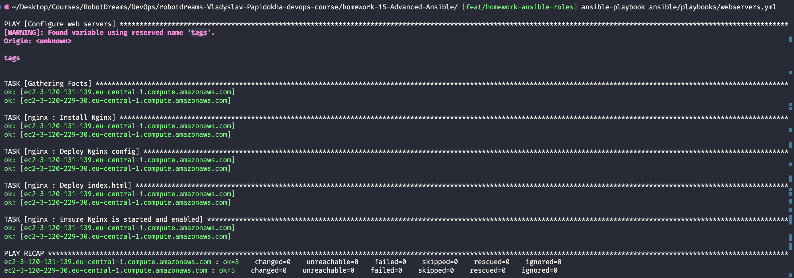

---

## Результат

| Завдання                              | Статус |
| ------------------------------------- | ------ |
| Роль `baseline` — SSH, базові пакети  | ✅     |
| Роль `firewall` — UFW правила         | ✅     |
| Роль `nginx` — Nginx + Jinja2 шаблони | ✅     |
| Dynamic Inventory для AWS EC2         | ✅     |
| Ansible Vault — шифрування секретів   | ✅     |
| Декілька playbooks                    | ✅     |

### Ключові концепції

1. **Idempotentність** — playbook можна запускати скільки завгодно разів, результат завжди однаковий
2. **Jinja2 шаблони** — один шаблон генерує унікальний контент для кожного сервера
3. **Dynamic Inventory** — Ansible сам знаходить сервери через AWS API по тегах
4. **Ansible Vault** — AES256 шифрування секретів, безпечне зберігання в Git
5. **Ролі** — перевикористовувані модулі (як Vue компоненти, але для серверів)

### Корисні команди

```bash
# Перевірка підключення до серверів
ansible all -m ping

# Перегляд inventory
ansible-inventory --graph

# Запуск повного розгортання
ansible-playbook ansible/playbooks/site.yml

# Тільки безпека
ansible-playbook ansible/playbooks/security.yml

# Тільки веб
ansible-playbook ansible/playbooks/webservers.yml

# Шифрування файлу
ansible-vault encrypt file.yml

# Перегляд зашифрованого файлу
ansible-vault view file.yml

# Редагування зашифрованого файлу
ansible-vault edit file.yml
```

---

## Використані технології

- Ansible Core 2.20.3
- AWS EC2 (Ubuntu 24.04 LTS, t2.micro)
- Terraform 6.35.0
- Nginx
- UFW (Uncomplicated Firewall)
- Ansible Vault (AES256)
- Jinja2 Templates
- Dynamic Inventory (amazon.aws.aws_ec2)
