# Homework 16: n8n Workflow Automation

## Зміст

- [Мета завдання](#мета-завдання)
- [Архітектура](#архітектура)
- [Крок 1: Розгортання n8n](#крок-1-розгортання-n8n)
- [Крок 2: Google Form](#крок-2-google-form)
- [Крок 3: Telegram Bot](#крок-3-telegram-bot)
- [Крок 4: n8n Workflow](#крок-4-n8n-workflow)
- [Тестування](#тестування)
- [Висновки](#висновки)

---

## Мета завдання

Побудувати workflow автоматизації, який:

1. Отримує відповіді з Google Forms
2. Обробляє дані (дедуплікація по email)
3. Надсилає структуроване повідомлення в Telegram
4. Зберігає статуси в базі даних PostgreSQL

---

## Архітектура

```
Google Form → Google Sheets → n8n Trigger
                                    ↓
                             PostgreSQL (перевірка дедуплікації)
                                    ↓
                               IF (exists?)
                              /           \
                           true           false
                            ↓               ↓
                         Telegram       (зупинка)
                            ↓
                      PostgreSQL (збереження статусу)
```

**Стек:**

| Компонент         | Технологія       |
| ----------------- | ---------------- |
| Automation engine | n8n v2.10.4      |
| Database          | PostgreSQL 15    |
| Orchestration     | Docker Compose   |
| Form              | Google Forms     |
| Storage           | Google Sheets    |
| Notifications     | Telegram Bot API |

---

## Середовище

| Параметр   | Значення              |
| ---------- | --------------------- |
| Host       | MacBook Pro M1 Pro    |
| Docker     | Docker Desktop        |
| n8n URL    | http://localhost:5678 |
| PostgreSQL | localhost:5432        |

---

## Крок 1: Розгортання n8n

### Структура файлів

```
homework-16-n8n-automation/
├── docker-compose.yml
├── .env
├── makefile
├── workflow.json
└── screenshots/
    ├── 01-n8n-setup-owner-account.png
    ├── 02-n8n-ui-welcome.png
    ├── 03-google-form-field-types.png
    ├── 04-google-form-completed.png
    ├── 05-google-sheets-connected.png
    ├── 06-google-oauth-access-blocked.png
    ├── 07-google-sheets-trigger-output.png
    ├── 08-postgres-deduplication-check.png
    ├── 09-if-node-condition.png
    ├── 10-telegram-node-config.png
    ├── 11-telegram-first-message.png
    ├── 12-postgres-save-status.png
    ├── 13-workflow-published.png
    ├── 14-workflow-final-canvas.png
    └── 15-telegram-deduplication-test.png
```

### docker-compose.yml

```yaml
version: "3.8"

volumes:
  n8n_data:
  postgres_data:

networks:
  n8n_network:

services:
  postgres:
    image: postgres:15-alpine
    restart: unless-stopped
    environment:
      POSTGRES_USER: ${POSTGRES_USER}
      POSTGRES_PASSWORD: ${POSTGRES_PASSWORD}
      POSTGRES_DB: ${POSTGRES_DB}
    volumes:
      - postgres_data:/var/lib/postgresql/data
    networks:
      - n8n_network
    healthcheck:
      test: ["CMD-SHELL", "pg_isready -U ${POSTGRES_USER}"]
      interval: 10s
      timeout: 5s
      retries: 5

  n8n:
    image: docker.n8n.io/n8nio/n8n:latest
    restart: unless-stopped
    ports:
      - "5678:5678"
    environment:
      DB_TYPE: postgresdb
      DB_POSTGRESDB_HOST: postgres
      DB_POSTGRESDB_PORT: 5432
      DB_POSTGRESDB_DATABASE: ${POSTGRES_DB}
      DB_POSTGRESDB_USER: ${POSTGRES_USER}
      DB_POSTGRESDB_PASSWORD: ${POSTGRES_PASSWORD}
      N8N_BASIC_AUTH_ACTIVE: "true"
      N8N_BASIC_AUTH_USER: ${N8N_BASIC_AUTH_USER}
      N8N_BASIC_AUTH_PASSWORD: ${N8N_BASIC_AUTH_PASSWORD}
      N8N_ENCRYPTION_KEY: ${N8N_ENCRYPTION_KEY}
      N8N_HOST: localhost
      N8N_PORT: 5678
      N8N_PROTOCOL: http
      WEBHOOK_URL: http://localhost:5678/
      GENERIC_TIMEZONE: Europe/Kyiv
    volumes:
      - n8n_data:/home/node/.n8n
    networks:
      - n8n_network
    depends_on:
      postgres:
        condition: service_healthy
```

> **Чому `depends_on` з `condition: service_healthy`?**
> n8n не запуститься поки PostgreSQL не буде готовий приймати з'єднання. Без цього n8n міг би стартувати раніше бази і впасти з помилкою підключення.

### Makefile

```makefile
.PHONY: up down restart logs ps clean help

.DEFAULT_GOAL := help

up: ## Start n8n and PostgreSQL in background
	docker compose up -d

down: ## Stop all services
	docker compose down

restart: ## Restart all services
	docker compose restart

logs: ## Follow logs (all services)
	docker compose logs -f

logs-n8n: ## Follow n8n logs only
	docker compose logs -f n8n

logs-db: ## Follow PostgreSQL logs only
	docker compose logs -f postgres

ps: ## Show running containers status
	docker compose ps

clean: ## Stop and remove containers + volumes
	docker compose down -v

help: ## Show this help
	@grep -E '^[a-zA-Z_-]+:.*?## .*$$' $(MAKEFILE_LIST) | \
		awk 'BEGIN {FS = ":.*?## "}; {printf "\033[36m%-15s\033[0m %s\n", $$1, $$2}'
```

### Запуск

```bash
make up
make logs-n8n
```

**n8n готовий коли в логах з'явиться:**

```
Editor is now accessible via:
http://localhost:5678
```

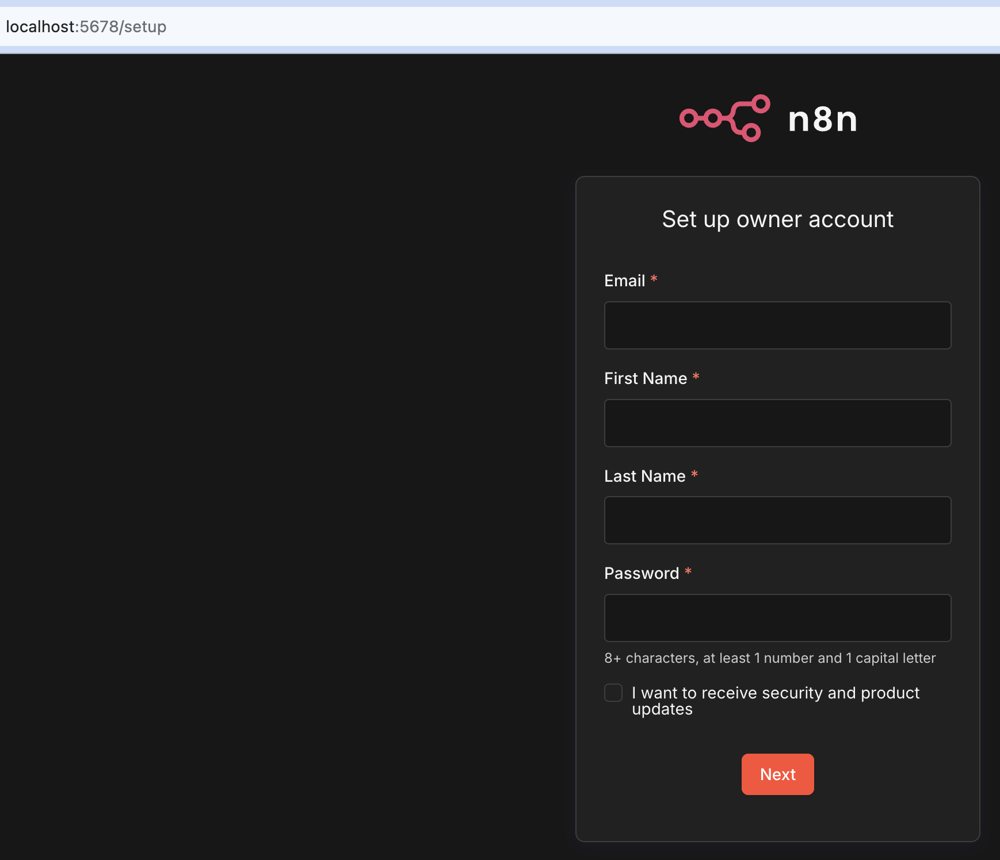

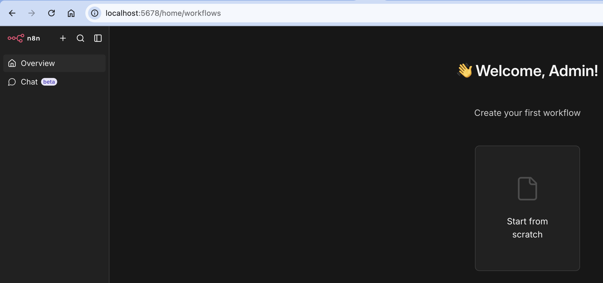

---

## Крок 2: Google Form

### Поля форми

| Поле                | Тип          | Обов'язкове |
| ------------------- | ------------ | ----------- |
| Name                | Short answer | ✅          |
| Email               | Short answer | ✅          |
| Problem description | Paragraph    | ❌          |
| Request type        | Dropdown     | ✅          |
| Priority            | Dropdown     | ✅          |

**Request type варіанти:** `Technical Issue`, `Billing`, `General Question`, `Feature Request`

**Priority варіанти:** `Low`, `Medium`, `High`

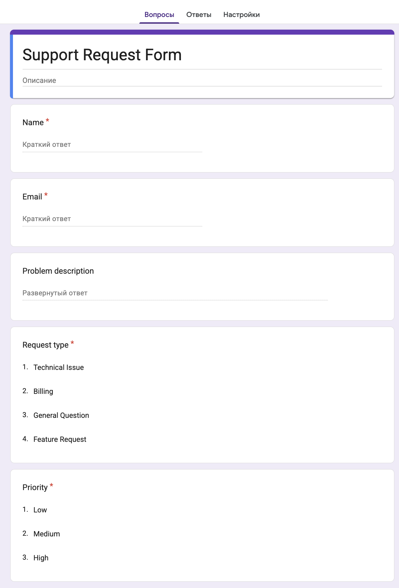

### Підключення Google Sheets

Вкладка "Ответы" → "Установить связь с Таблицами" → "Создать таблицу" → назва `Support Request Form (Responses)`

Кожна нова відповідь автоматично з'являється як новий рядок у таблиці.

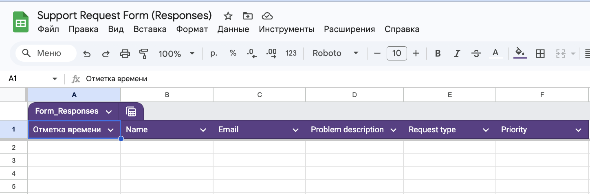

---

## Крок 3: Telegram Bot

### Створення бота через BotFather

```
1. Відкрий @BotFather у Telegram
2. /newbot
3. Bot Name: Support Request Bot
4. Username: devops_support_request_n8n_bot
5. Отримай Bot Token
```

### Отримання chat_id

```
1. Знайди бота @devops_support_request_n8n_bot
2. Натисни /start
3. Відкрий у браузері:
   https://api.telegram.org/bot<TOKEN>/getUpdates
4. Знайди поле "id" у секції "chat"
```

**Результат:**

```json
{
  "chat": {
    "id": 396976151,
    "username": "DungeonMasterGleb",
    "type": "private"
  }
}
```

---

## Крок 4: n8n Workflow

### Загальна структура

```
[Google Sheets Trigger] → [PostgreSQL: перевірка] → [IF: exists?]
                                                    true ↓
                                              [Telegram: send]
                                                         ↓
                                              [PostgreSQL: збереження]
```

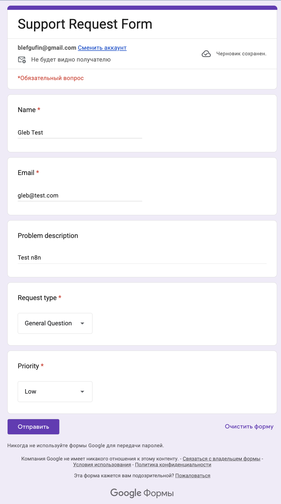

### Node 1: Google Sheets Trigger

**Налаштування:**

| Параметр   | Значення                         |
| ---------- | -------------------------------- |
| Trigger    | On row added                     |
| Document   | Support Request Form (Responses) |
| Sheet      | Ответы на форму (1)              |
| Poll Times | Every Minute                     |

> **Як це працює?** n8n кожну хвилину перевіряє таблицю — якщо з'явився новий рядок, запускає workflow. Це polling-підхід (опитування), на відміну від webhook (push-нотифікація).

**Підключення Google OAuth2:**

- Google Cloud Console → новий проект `n8n-homework`
- Увімкнути Google Sheets API + Google Drive API
- Створити OAuth Client ID (Web application)
- Authorized redirect URI: `http://localhost:5678/rest/oauth2-credential/callback`
- Додати email як Test User в Audience

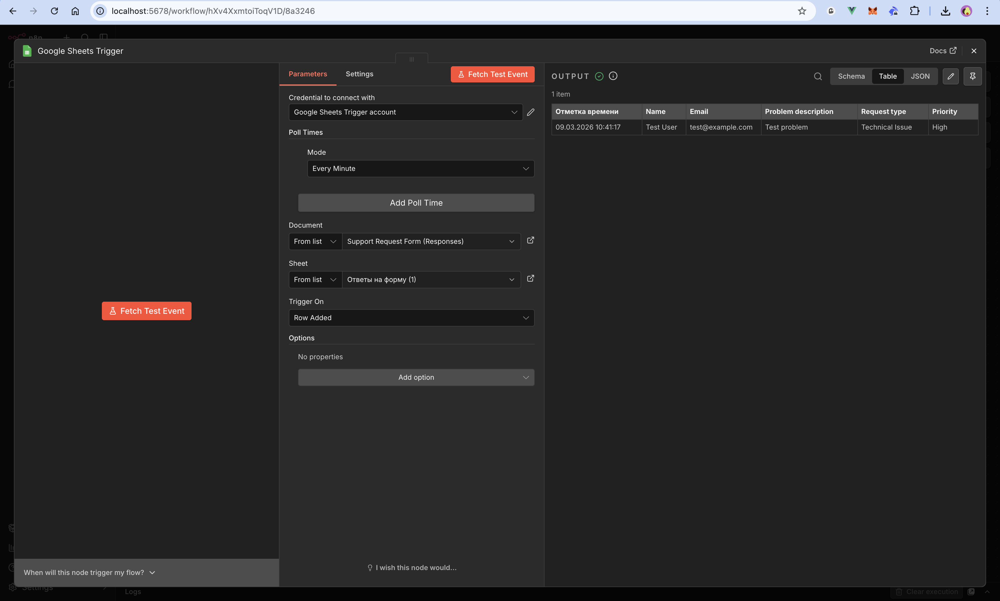

### Node 2: PostgreSQL — перевірка дедуплікації

**SQL Query:**

```sql
CREATE TABLE IF NOT EXISTS form_submissions (
  id SERIAL PRIMARY KEY,
  email VARCHAR(255) UNIQUE NOT NULL,
  name VARCHAR(255),
  request_type VARCHAR(100),
  priority VARCHAR(50),
  status VARCHAR(50) DEFAULT 'pending',
  created_at TIMESTAMP DEFAULT NOW()
);

SELECT EXISTS (
  SELECT 1 FROM form_submissions
  WHERE email = '{{ $json["Email"] }}'
) as "exists";
```

> **Чому `CREATE TABLE IF NOT EXISTS`?** При першому запуску таблиця створюється автоматично. При наступних запусках — пропускається. Не потрібно окремо ініціалізувати БД.

**Output:** `exists: false` (новий email) або `exists: true` (дублікат)

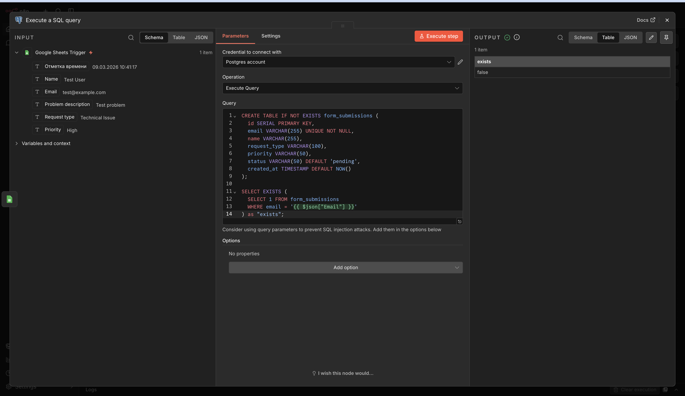

### Node 3: IF — розгалуження

**Умова:** `{{ $json.exists }} is false`

| Гілка        | Умова       | Дія               |
| ------------ | ----------- | ----------------- |
| True Branch  | email новий | Йти до Telegram   |
| False Branch | email існує | Зупинити workflow |

> **Дедуплікація:** якщо хтось відправив форму двічі з одним email — повідомлення в Telegram надійде тільки один раз.

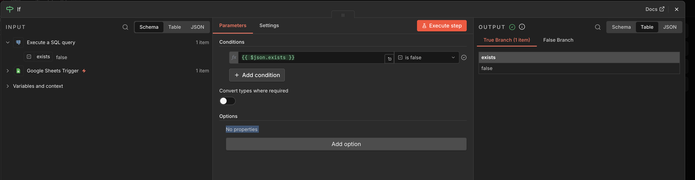

### Node 4: Telegram — відправка повідомлення

**Налаштування:**

| Параметр  | Значення     |
| --------- | ------------ |
| Chat ID   | 396976151    |
| Resource  | Message      |
| Operation | Send Message |

**Template повідомлення:**

```
🆕 New Support Request!

👤 Name: {{ $('Google Sheets Trigger').first().json['Name'] }}
📧 Email: {{ $('Google Sheets Trigger').first().json['Email'] }}
🔧 Type: {{ $('Google Sheets Trigger').first().json['Request type'] }}
📝 Description: {{ $('Google Sheets Trigger').first().json['Problem description'] }}
🚨 Priority: {{ $('Google Sheets Trigger').first().json['Priority'] }}
🕐 Time: {{ $('Google Sheets Trigger').first().json['Отметка времени'] }}
```

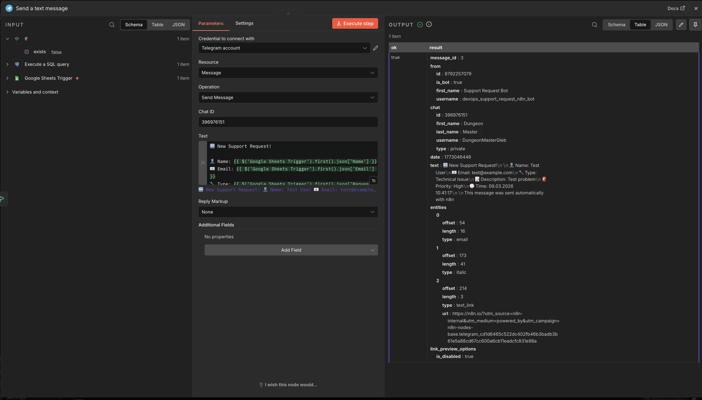

### Node 5: PostgreSQL — збереження статусу

**SQL Query:**

```sql
INSERT INTO form_submissions (email, name, request_type, priority, status)
VALUES (
  '{{ $('Google Sheets Trigger').first().json['Email'] }}',
  '{{ $('Google Sheets Trigger').first().json['Name'] }}',
  '{{ $('Google Sheets Trigger').first().json['Request type'] }}',
  '{{ $('Google Sheets Trigger').first().json['Priority'] }}',
  'sent'
)
ON CONFLICT (email) DO NOTHING;
```

> **`ON CONFLICT (email) DO NOTHING`** — додатковий захист від race condition на рівні бази даних. Якщо email вже існує — просто ігноруємо.

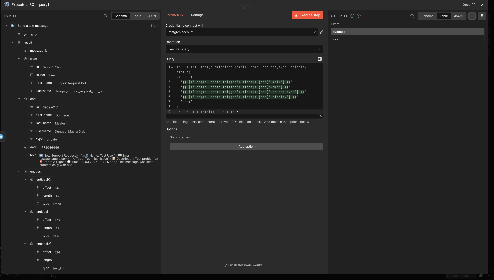

---

## Тестування

### Тест 1: Новий email

1. Заповнити форму з `gleb@test.com`
2. Зачекати до 1 хвилини
3. Перевірити Telegram

**Результат:** повідомлення прийшло ✅

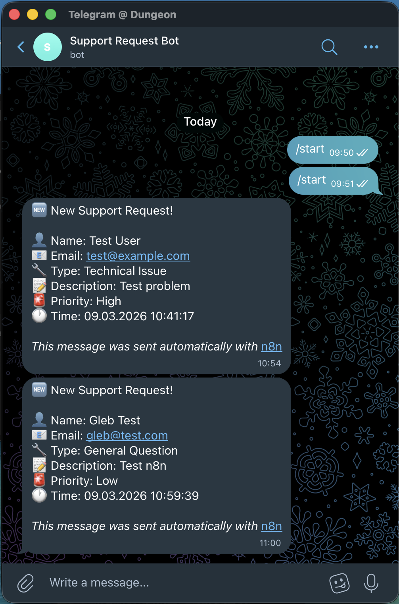

### Тест 2: Дедуплікація

1. Відправити форму повторно з тим самим email `gleb@test.com`
2. Зачекати 1 хвилину

**Результат:** повідомлення НЕ прийшло ✅ — дедуплікація працює

### Тест 3: End-to-end


---

## Висновки

| Завдання                                | Статус |
| --------------------------------------- | ------ |
| n8n розгорнуто через Docker Compose     | ✅     |
| Google Form створено з 5 полями         | ✅     |
| Google Sheets підключено як data source | ✅     |
| Telegram Bot створено і налаштовано     | ✅     |
| n8n Workflow побудовано і опубліковано  | ✅     |
| Дедуплікація по email працює            | ✅     |
| Статуси зберігаються в PostgreSQL       | ✅     |

### Ключові концепції

1. **n8n** — self-hosted платформа автоматизації workflows без написання коду
2. **Polling vs Webhook** — Google Sheets Trigger використовує polling (перевірка кожну хвилину), що підходить для локального середовища без публічного URL
3. **Дедуплікація** — перевірка унікальності по email на рівні БД запобігає дублюванню повідомлень
4. **Docker Compose** — оркестрація кількох сервісів (n8n + PostgreSQL) з health checks
5. **OAuth2** — стандартний протокол авторизації для підключення Google API

### Корисні команди

```bash
# Запуск
make up

# Логи
make logs-n8n

# Зупинка
make down

# Повне очищення (видаляє всі дані)
make clean

# Статус контейнерів
make ps
```

---

## Використані технології

- n8n 2.10.4
- PostgreSQL 15 (Alpine)
- Docker Desktop (Apple Silicon M1)
- Google Forms + Google Sheets API
- Google Cloud Console (OAuth2)
- Telegram Bot API (@BotFather)
