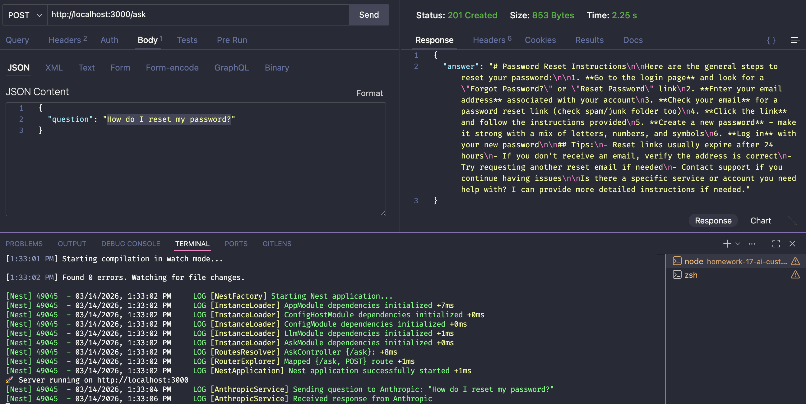
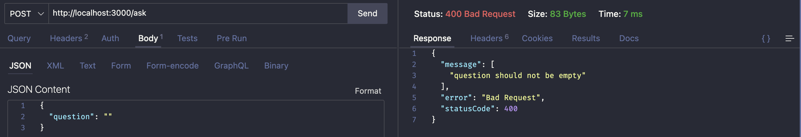
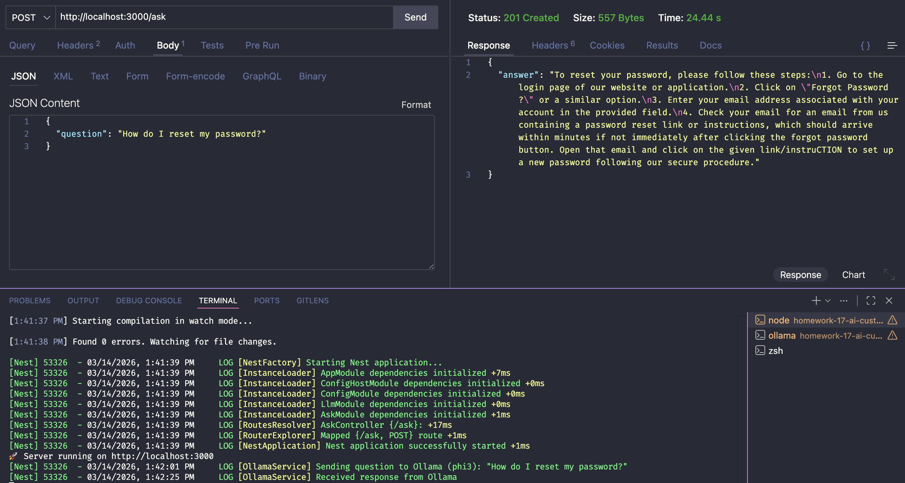
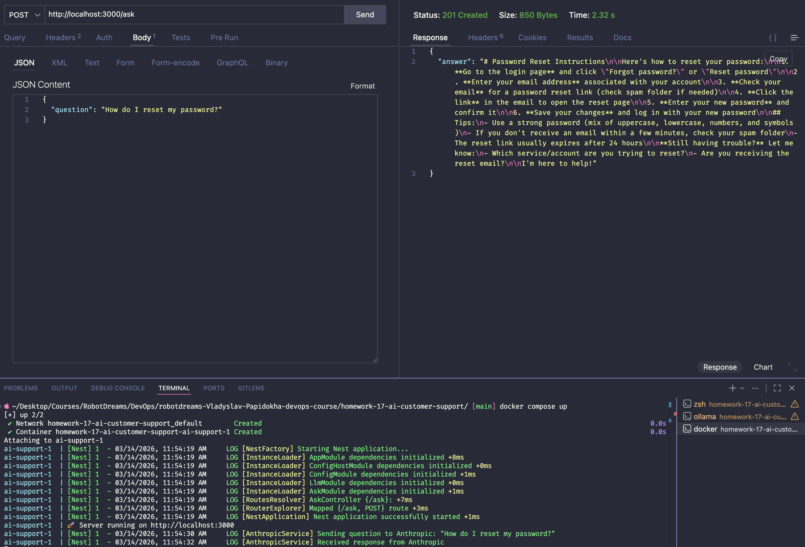

# Homework 17: AI Customer Support Service

## Зміст

- [Мета](#мета)
- [Архітектура](#архітектура)
- [Структура файлів](#структура-файлів)
- [Завдання 1: SaaS LLM API (Anthropic Claude)](#завдання-1-saas-llm-api-anthropic-claude)
- [Завдання 2: Self-Hosted модель (Ollama)](#завдання-2-self-hosted-модель-ollama)
- [Завдання 3: Docker](#завдання-3-docker)
- [Порівняння підходів](#порівняння-підходів)
- [Висновки](#висновки)

---

## Мета

Розробити AI-сервіс для відповіді на питання користувачів (Customer Support) з використанням двох різних архітектур:

1. **SaaS LLM API** — зовнішній API (Anthropic Claude)
2. **Self-hosted модель** — локальна модель на CPU через Ollama

Сервіс розгорнутий у Docker контейнері та підтримує перемикання між провайдерами через змінну середовища.

---

## Архітектура

```
HTTP запит
    │
    ▼
POST /ask
    │
    ▼
AskController
    │
    ▼
AskService
    │
    ▼
LlmService  ←── LLM_PROVIDER=anthropic|ollama
    │
    ├──── AnthropicService ──► Claude API (cloud)
    │
    └──── OllamaService ─────► Ollama API (local :11434)
```

**Strategy Pattern** — один інтерфейс, два провайдери. Перемикання між хмарою і локальною моделлю через `.env` без змін у коді.

---

## Середовище

| Параметр        | Значення                            |
| --------------- | ----------------------------------- |
| OS              | macOS (Apple M1 Pro)                |
| Runtime         | Node.js 22 (Alpine)                 |
| Framework       | NestJS 11                           |
| Package Manager | pnpm                                |
| SaaS LLM        | Anthropic Claude (claude-haiku-4-5) |
| Self-hosted LLM | Ollama + phi3 (3.8B параметрів)     |
| Контейнеризація | Docker + Docker Compose             |

---

## Структура файлів

```
homework-17-ai-customer-support/
├── src/
│   ├── main.ts                          # Точка входу, ValidationPipe
│   ├── app.module.ts                    # Кореневий модуль
│   ├── ask/
│   │   ├── ask.controller.ts            # POST /ask endpoint
│   │   ├── ask.service.ts               # Бізнес-логіка
│   │   ├── ask.module.ts                # Модуль /ask
│   │   └── ask.dto.ts                   # Валідація вхідних даних
│   └── llm/
│       ├── llm.service.ts               # Strategy — вибір провайдера
│       ├── llm.module.ts                # Модуль LLM
│       ├── anthropic/
│       │   └── anthropic.service.ts     # Інтеграція з Claude API
│       └── ollama/
│           └── ollama.service.ts        # Інтеграція з Ollama API
├── screenshots/
│   ├── 01-anthropic-success-request.png
│   ├── 02-validation-error.png
│   ├── 03-ollama-success-request.png
│   └── 04-docker-compose-anthropic.png
├── .env.example
├── Dockerfile
└── docker-compose.yml
```

---

## Завдання 1: SaaS LLM API (Anthropic Claude)

### Що таке SaaS LLM?

SaaS LLM (Software as a Service Large Language Model) — це AI модель яка працює у хмарі провайдера. Ти надсилаєш запит через API і отримуєш відповідь. Модель, сервери та інфраструктура — на стороні провайдера.

**Аналогія:** як використання Google Maps у браузері — ти не тримаєш карти у себе, просто звертаєшся до сервісу.

### Налаштування

**1. Отримати API ключ:**

Зареєструватись на [console.anthropic.com](https://console.anthropic.com) → API Keys → Create Key.

**2. Налаштувати `.env`:**

```env
LLM_PROVIDER=anthropic
ANTHROPIC_API_KEY=sk-ant-...
OLLAMA_BASE_URL=http://localhost:11434
OLLAMA_MODEL=phi3
PORT=3000
```

**3. Запустити сервіс:**

```bash
pnpm install
pnpm start:dev
```

### API

**Endpoint:** `POST /ask`

**Запит:**

```json
{
  "question": "How do I reset my password?"
}
```

**Відповідь:**

```json
{
  "answer": "To reset your password, go to the login page..."
}
```

### Результат — успішний запит до Claude API



**Час відповіді: ~2.25s**

### Валідація вхідних даних

Сервіс валідує вхідні дані через `class-validator`. Порожнє або відсутнє поле `question` повертає `400 Bad Request`.



---

## Завдання 2: Self-Hosted модель (Ollama)

### Що таке Self-Hosted LLM?

Self-hosted LLM — це AI модель яка запускається локально на твоєму комп'ютері або сервері. Дані не залишають машину, оплата відсутня, але потрібні ресурси (RAM, CPU/GPU).

**Ollama** — інструмент для запуску AI моделей локально. Аналогія з Docker:

| Docker              | Ollama              |
| ------------------- | ------------------- |
| `docker pull nginx` | `ollama pull phi3`  |
| `docker run nginx`  | `ollama run phi3`   |
| Образи контейнерів  | Моделі (~2GB файли) |
| `localhost:80`      | `localhost:11434`   |

### Встановлення Ollama

```bash
brew install ollama
```

### Запуск моделі

```bash
# Термінал 1 — запустити сервер
ollama serve

# Термінал 2 — завантажити модель phi3 (~2.2 GB)
ollama pull phi3
```

### Перемикання на Ollama

Змінити у `.env`:

```env
LLM_PROVIDER=ollama
```

Перезапустити сервіс — більше жодних змін у коді не потрібно.

### Результат — успішний запит до phi3



**Час відповіді: ~24.44s** (модель працює на Apple M1 Pro через Metal GPU)

---

## Завдання 3: Docker

### Dockerfile (Multi-stage build)

```dockerfile
FROM node:22-alpine AS builder
# Збірка TypeScript → JavaScript

FROM node:22-alpine AS production
# Тільки скомпільований код + prod залежності
```

**Навіщо два етапи?** Фінальний образ не містить TypeScript компілятора і dev-залежностей — менший і безпечніший.

### Збірка та запуск

```bash
# Збірка образу
docker build -t ai-customer-support .

# Запуск через Docker Compose
docker compose up
```

### Результат — сервіс у Docker контейнері



Сервіс запущений у контейнері, приймає запити на `localhost:3000`, звертається до Anthropic API.

---

## Порівняння підходів

| Параметр         | SaaS (Anthropic Claude) | Self-hosted (Ollama phi3)   |
| ---------------- | ----------------------- | --------------------------- |
| Час відповіді    | ~2.25s                  | ~24.44s                     |
| Вартість         | $$ (pay per token)      | Безкоштовно                 |
| Приватність      | Дані йдуть у хмару      | Дані залишаються локально   |
| Якість відповіді | Висока                  | Середня                     |
| Розмір моделі    | ~100B+ параметрів       | 3.8B параметрів             |
| Інтернет         | Обов'язковий            | Не потрібен                 |
| Масштабування    | Автоматичне             | Обмежено ресурсами          |
| Налаштування     | API ключ                | Встановлення + завантаження |

### Коли що використовувати?

**SaaS LLM підходить для:**

- Production сервісів з вимогами до якості
- Команд без DevOps ресурсів для підтримки моделей
- Задач де важлива швидкість відповіді

**Self-hosted підходить для:**

- Обробки конфіденційних даних (медицина, фінанси)
- Середовищ без доступу до інтернету
- Великих об'ємів запитів (немає cost per token)

---

## Висновки

| Завдання                         | Статус |
| -------------------------------- | ------ |
| SaaS LLM API (Anthropic Claude)  | ✅     |
| Валідація вхідних даних          | ✅     |
| Self-hosted модель (Ollama phi3) | ✅     |
| Docker контейнеризація           | ✅     |
| Порівняння підходів              | ✅     |

### Ключові концепції

1. **LLM (Large Language Model)** — AI модель що розуміє і генерує текст на основі мільярдів параметрів
2. **Strategy Pattern** — один інтерфейс, різні реалізації. Перемикання провайдера без змін у коді
3. **SaaS vs Self-hosted** — компроміс між зручністю/якістю і вартістю/приватністю
4. **Multi-stage Docker build** — менший і безпечніший образ через розділення збірки і запуску
5. **Ollama** — Docker для AI моделей, запуск LLM локально на CPU/GPU

### Корисні команди

```bash
# Локальна розробка
pnpm start:dev                    # Запуск з hot-reload

# Ollama
ollama serve                      # Запустити сервер
ollama pull phi3                  # Завантажити модель
ollama list                       # Список моделей

# Docker
docker build -t ai-customer-support .   # Збірка образу
docker compose up                       # Запуск контейнерів
docker compose down                     # Зупинка контейнерів

# Тестування API
curl -X POST http://localhost:3000/ask \
  -H "Content-Type: application/json" \
  -d '{"question": "How do I reset my password?"}'
```

---

## Використані технології

- NestJS 11 — серверний фреймворк
- Anthropic SDK — інтеграція з Claude API
- Ollama — локальний запуск LLM
- phi3 — Microsoft модель 3.8B параметрів
- Docker + Docker Compose — контейнеризація
- class-validator — валідація вхідних даних
- pnpm — менеджер пакетів
