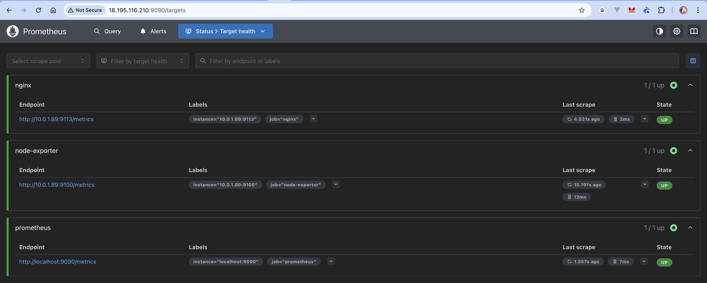
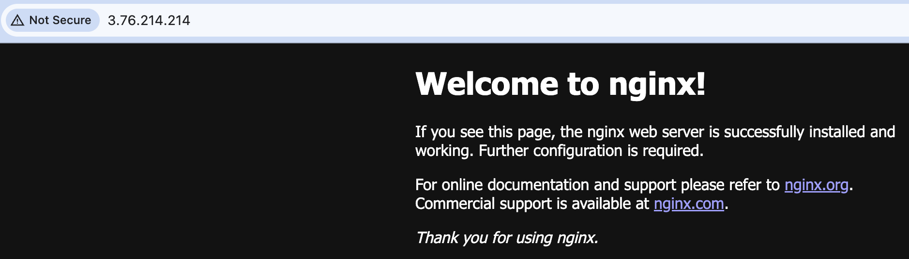
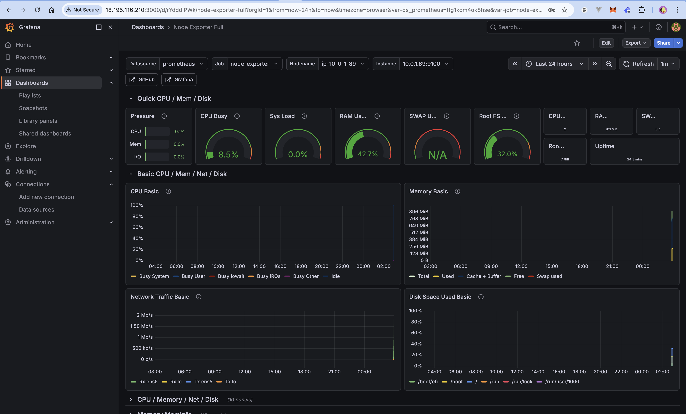
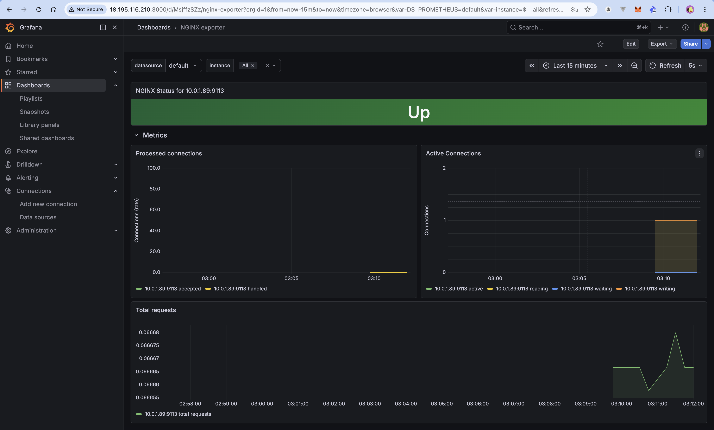
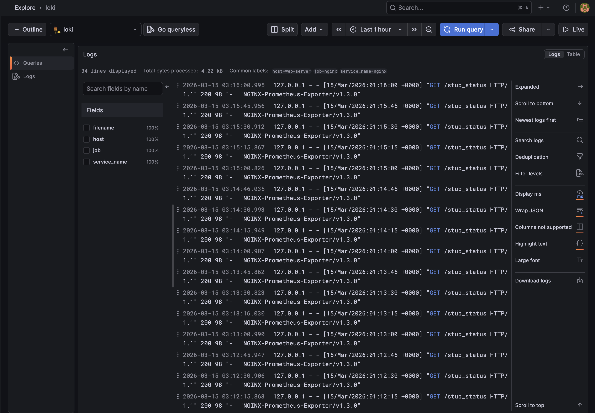
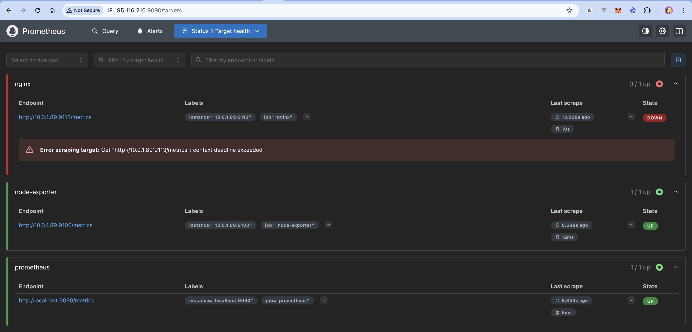

# Homework 18: Моніторинг з Prometheus, Grafana та Loki

## Зміст

- [Опис завдання](#опис-завдання)
- [Архітектура](#архітектура)
- [Інфраструктура (Terraform)](#інфраструктура-terraform)
- [Monitoring Server](#monitoring-server)
- [Web Server](#web-server)
- [Grafana дашборди](#grafana-дашборди)
- [Результати](#результати)

---

## Опис завдання

Розгортання повноцінної системи моніторингу для веб-сервера на базі AWS EC2 з використанням:

- **Prometheus** — збір метрик
- **Grafana** — візуалізація метрик і логів
- **Loki + Promtail** — збір і зберігання логів
- **Node Exporter** — системні метрики сервера
- **Nginx Prometheus Exporter** — метрики Nginx

---

## Архітектура

```
┌─────────────────── AWS VPC (10.0.0.0/16) ───────────────────────┐
│                                                                 │
│  ┌──────────── Public Subnet (10.0.1.0/24) ───────────────────┐ │
│  │                                                            │ │
│  │  ┌─────────────────────────┐  ┌──────────────────────────┐ │ │
│  │  │   monitoring-server     │  │      web-server          │ │ │
│  │  │   t3.small              │  │      t3.micro            │ │ │
│  │  │   18.195.116.210        │  │      3.76.214.214        │ │ │
│  │  │   (10.0.1.118)          │  │      (10.0.1.89)         │ │ │
│  │  │                         │  │                          │ │ │
│  │  │  Prometheus  :9090      │  │  Nginx          :80      │ │ │
│  │  │  Grafana     :3000      │  │  Node Exporter  :9100    │ │ │
│  │  │  Loki        :3100      │  │  Nginx Exporter :9113    │ │ │
│  │  │  Promtail               │  │  Promtail                │ │ │
│  │  └─────────────────────────┘  └──────────────────────────┘ │ │
│  └────────────────────────────────────────────────────────────┘ │
└─────────────────────────────────────────────────────────────────┘
```

### Потік даних

```
Метрики:
Node Exporter :9100  ──────────────────────────────┐
Nginx Exporter :9113 ──────> Prometheus :9090 ──────> Grafana :3000
Prometheus self      ──────────────────────────────┘

Логи:
Nginx /var/log/nginx/ ──> Promtail ──> Loki :3100 ──> Grafana :3000
```

---

## Інфраструктура (Terraform)

### Структура файлів

```
terraform/
├── main.tf          # VPC, Subnet, IGW, Security Groups, EC2
├── variables.tf     # Змінні (регіон, key name, IP)
├── outputs.tf       # Вивід IP адрес після apply
└── terraform.tfvars # Значення змінних
```

### Ресурси

| Ресурс                          | Тип    | Опис                          |
| ------------------------------- | ------ | ----------------------------- |
| `aws_vpc.main`                  | VPC    | 10.0.0.0/16                   |
| `aws_subnet.public`             | Subnet | 10.0.1.0/24, eu-central-1a    |
| `aws_internet_gateway.igw`      | IGW    | Вихід в інтернет              |
| `aws_security_group.monitoring` | SG     | Порти 22, 9090, 3000, 3100    |
| `aws_security_group.web`        | SG     | Порти 22, 80, 9100, 9113      |
| `aws_instance.monitoring`       | EC2    | t3.small — сервер моніторингу |
| `aws_instance.web`              | EC2    | t3.micro — веб-сервер         |

### Розгортання

```bash
cd terraform/
terraform init
terraform plan
terraform apply
```

---

## Monitoring Server

### Docker Compose стек

На monitoring server запущено 4 контейнери через Docker Compose:

```
monitoring/
├── docker-compose.yml
├── prometheus/
│   └── prometheus.yml       # scrape configs
├── loki/
│   └── loki-config.yml      # налаштування зберігання
└── promtail/
    └── promtail-config.yml  # збір системних логів
```

### Prometheus конфігурація

```yaml
scrape_configs:
  - job_name: "prometheus"
    static_configs:
      - targets: ["localhost:9090"]

  - job_name: "node-exporter"
    static_configs:
      - targets: ["10.0.1.89:9100"] # web server private IP

  - job_name: "nginx"
    static_configs:
      - targets: ["10.0.1.89:9113"] # nginx exporter
```

> Prometheus використовує **private IP** web server — трафік іде всередині VPC без виходу в інтернет.

### Запуск

```bash
cd ~/monitoring
docker compose up -d
docker compose ps
```

---

## Web Server

### Встановлені компоненти

| Компонент                 | Версія    | Порт | Запуск  |
| ------------------------- | --------- | ---- | ------- |
| Nginx                     | системний | 80   | systemd |
| Node Exporter             | v1.8.2    | 9100 | systemd |
| Nginx Prometheus Exporter | v1.3.0    | 9113 | systemd |
| Promtail                  | v3.0.0    | 9080 | systemd |

### Nginx stub_status

Для збору метрик Nginx увімкнено вбудовану сторінку статистики:

```nginx
server {
    listen 8080;
    location /stub_status {
        stub_status on;
        allow 127.0.0.1;
        deny all;
    }
}
```

Nginx Prometheus Exporter читає цю сторінку і конвертує в формат Prometheus:

```bash
nginx-prometheus-exporter --nginx.scrape-uri=http://localhost:8080/stub_status
```

### Promtail конфігурація

```yaml
clients:
  - url: http://10.0.1.118:3100/loki/api/v1/push # monitoring server private IP

scrape_configs:
  - job_name: "nginx-logs"
    static_configs:
      - labels:
          job: nginx
          host: web-server
          __path__: /var/log/nginx/*.log
```

---

## Grafana дашборди

### Налаштування Datasources

| Datasource | URL                      | Призначення |
| ---------- | ------------------------ | ----------- |
| Prometheus | `http://prometheus:9090` | Метрики     |
| Loki       | `http://loki:3100`       | Логи        |

> Використовуються імена контейнерів — Grafana знаходиться в тій самій Docker мережі.

### Імпортовані дашборди

| ID    | Назва              | Datasource | Що показує              |
| ----- | ------------------ | ---------- | ----------------------- |
| 1860  | Node Exporter Full | Prometheus | CPU, RAM, Disk, Network |
| 12708 | NGINX exporter     | Prometheus | З'єднання, запити Nginx |
| 13639 | Loki Logs App      | Loki       | Логи Nginx              |

---

## Результати

### Prometheus Targets — всі UP



### Nginx Welcome Page



### Node Exporter Full Dashboard



### NGINX Exporter Dashboard



### Loki — реальні логи Nginx



### Процес налагодження — nginx DOWN (порт 9113 не відкритий)



**Вирішення:** Додано ingress правило в Security Group для порту 9113 через `terraform apply`.

---

## Підсумок

| Компонент                                               | Статус |
| ------------------------------------------------------- | ------ |
| Terraform VPC + 2 EC2                                   | ✅     |
| Docker Compose (Prometheus + Grafana + Loki + Promtail) | ✅     |
| Nginx веб-сервер                                        | ✅     |
| Node Exporter (CPU, RAM, Disk, Network)                 | ✅     |
| Nginx Prometheus Exporter                               | ✅     |
| Promtail → Loki (логи Nginx)                            | ✅     |
| Grafana дашборди                                        | ✅     |

## Використані технології

- **AWS**: EC2 (t3.small, t3.micro), VPC, Security Groups, eu-central-1
- **Terraform**: v6.36.0 провайдер hashicorp/aws
- **Docker**: v29.3.0, Docker Compose v5.1.0
- **Prometheus**: latest
- **Grafana**: latest
- **Loki**: v3.0.0
- **Promtail**: v3.0.0
- **Node Exporter**: v1.8.2
- **Nginx Prometheus Exporter**: v1.3.0
- **Nginx**: Ubuntu 24.04 системний пакет
